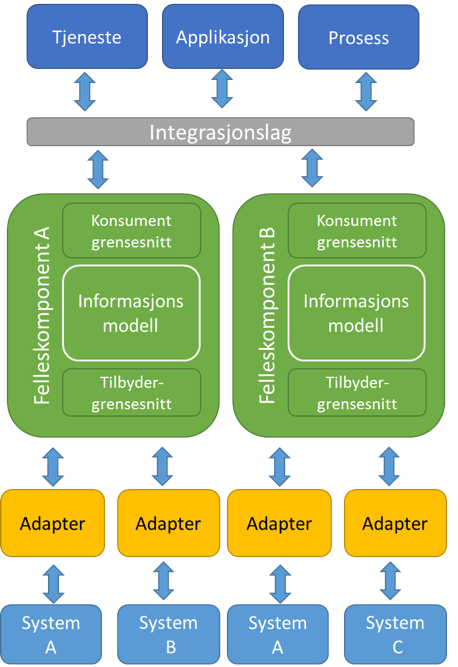

# Arkitektur

Arkitekturmodellen til FINT er komponentbasert og delt inn i forskjellige nivåer. Øverste nivå representerer tjenester, applikasjoner og prosesser som er konsumenter av informasjon fra felleskomponentene. Felleskomponentene består av en standardisert felles informasjonsmodell som benyttes i konsument- og tilbydergrensesnittet. Fagsystemene oversetter sine informasjonsmodeller i adaptere til informasjonsmodellen i tilbydergrensesnittet.

***

## Felleskomponent

### Informasjonsmodell

Informasjonsmodellen er kjernen i de ulike grensesnittene som er definert i modellen. Informasjonsmodellen gjør det mulig å beholde løse koblinger fordi de ulike grensesnittene (tilbydergrensesnitt og tjenestegrensesnitt) forholder seg til en standardisert informasjonsmodell. Det er informasjonsmodellen som tilgjengeliggjøres i tjenestegrensesnittet slik at applikasjoner, prosesser og tjenester kan konsumere informasjonen. Samtidig implementerer fagsystemer denne informasjonsmodellen ved bruk av et adapter i tilbydergrensesnittet.

### Tjenestegrensesnitt

Grensenitt for konsumenter av informasjon fra felleskomponentene. Konsumenter kan motta informasjon fra og sende informasjon til felleskomponentene. All informasjon som utveksles er i henhold til informasjonsmodellen. Tjenestegrensesnittet brukes normalt ved utvikling av tjenester med behov for tilgang til informasjon fra fagsystemer.

### Tilbydergrensesnitt

Grensesnitt for tilbydere av informasjon til felleskomponentene. Tilbydere kan sende informasjon til og motta informasjon fra felleskomponentene. All informasjon som utveksles er i henhold til informasjonsmodellen. Tilbydergrensenittet brukes normalt av fagsystemer innenfor områder som HR, økonomi og arkiv for å gi tilgang til informasjon.

## Adapter

Et adapter er først og fremst en «oversetter» mellom to ulike standarder eller teknologiplattformer. Adaptere skal benyttes for å lage en leverandør-spesifikk-tilpasning til en felleskomponent. Adapteret skal understøtte en teknologiuavhengig modell og håndtere implementasjonsdetaljer i kommunikasjonen mellom felleskomponenten og fagsystemet. Et adapter skal fortrinnsvis utvikles, eies og forvaltes av leverandøren av fagsystemet som adapteret skal virke mot.
