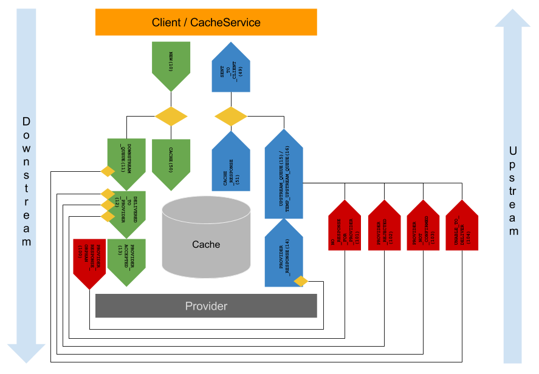

# Arkitektur

Arkitekturmodellen til FINT er komponentbasert og delt inn i forskjellige nivåer. Øverste nivå representerer tjenester, applikasjoner og prosesser som er konsumenter av informasjon fra felleskomponentene. Felleskomponentene består av en standardisert felles informasjonsmodell som benyttes i konsument- og tilbydergrensesnittet. Fagsystemene oversetter sine informasjonsmodeller i adaptere til informasjonsmodellen i tilbydergrensesnittet.

***

## Felleskomponent

### Informasjonsmodell

Informasjonsmodellen er kjernen i de ulike grensesnittene som er definert i modellen. Informasjonsmodellen gjør det mulig å beholde løse koblinger fordi de ulike grensesnittene (tilbydergrensesnitt og tjenestegrensesnitt) forholder seg til en standardisert informasjonsmodell. Det er informasjonsmodellen som tilgjengeliggjøres i tjenestegrensesnittet slik at applikasjoner, prosesser og tjenester kan konsumere informasjonen. Samtidig implementerer fagsystemer denne informasjonsmodellen ved bruk av et adapter i tilbydergrensesnittet.

### Tjenestegrensesnitt

Grensenitt for konsumenter av informasjon fra felleskomponentene. Konsumenter kan motta informasjon fra og sende informasjon til felleskomponentene. All informasjon som utveksles er i henhold til informasjonsmodellen. Grensesnittet brukes normalt av tjenester som har behov for å hente ut informasjon fra fagsystemer.

### Tilbydergrensesnitt

Grensesnitt for tilbydere av informasjon til felleskomponentene. Tilbydere kan sende informasjon til og motta informasjon fra felleskomponentene. All informasjon som utveksles er i henhold til informasjonsmodellen. Grensenittet brukes normalt av fagsystemer som har behov for å levere ut informasjon.

## Adapter

Et adapter er først og fremst en «oversetter» mellom to ulike standarder eller teknologiplattformer. Adaptere skal benyttes for å lage en leverandør-spesifikk-tilpasning til en felleskomponent. Adapteret skal understøtte en teknologiuavhengig modell og håndtere implementasjonsdetaljer i kommunikasjonen mellom felleskomponenten og fagsystemet. Et adapter skal fortrinnsvis utvikles, eies og forvaltes av leverandøren av fagsystemet som adapteret skal virke mot.

## FINT innvendig (in english)

The Common API has two main services:

* Cache service
* Event service

### Cache Service

The cache service has the following responsibility:

* Store data from the business applications for all the organisations using the Common API
* Populate the cache
* Keeps track of which data has changed since the last time the cache was populated

### Event service

The internals in the Common API is event based. An event is created by:

* Cache Service
* Client

When a client hits a endpoint in the Consumer API the Common API is generating an event and sends it to the Cache Service. An event from the client will never go all the way down to the adapter.

When the Cache Service need to update the cache it sends an event down to the adapter through the Provider.

All events are logged at all stages.

### Vocabulary

| English term         | Norwegian term       |
|----------------------|----------------------|
| Common API           | Felleskomponent      |
| Business application | Fagsystem            |
