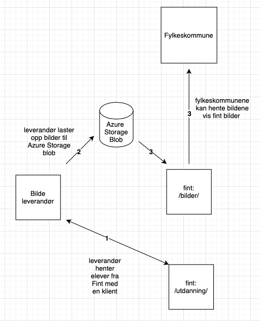

# Tjenestekatalog

FINT tilbyr en rekke tjenester. Katalogen gir en oversikt og en kortfattet beskrivelse av hver enkelt tjeneste. Ta kontakt med FINT for ytterligere informasjon, se [kontaktinformasjon](contact.md).

## FINT Felleskomponenter

Utvikling og forvaltning av felleskomponentene er kjernevirksomheten til FINT. Felleskomponentene er tekniske og semantiske lag som muliggjør felles integrasjoner mot fagsystemer innen utdanning, HRM, arkiv, økonomi med mer. I sentrum for alt står informasjonsmodellen. For mer informasjon, se [arkitektur](architecture.md).

Bruk av felleskomponentene bør vurderes ved anskaffelser - som en del av kravspesifikasjon - og generelt i prosjekter som omfatter digitalisering og digital transformasjon.

### Kundeportal

Organisasjoner tilknyttet FINT får tilgang til kundeportalen. I kundeportalen administrerer hver enkelt organisasjon integrasjoner som går gjennom FINT. Kundeportalen har funksjonalitet for å opprette klienter for adaptere og API-er, utføre helsesjekker, utforske hendelseslogger, sende inn supportsaker med mer.

### REST API

Programerbare grensesnitt som gjenspeiler informasjonsmodellen til FINT og legger til rette for felles integrasjoner mot ulike fagsystemer. HTTP og (HAL) JSON basert.

### GraphQL

Spørrespråk over ovennevnte REST API. GraphQL forenkler uthenting av data og gir klienter mulighet for å spørre etter akkurat den informasjonen de trenger og ikke mer. Spørringer følger informasjonmodellen og er JSON basert.

## FINT Tjenester

Tjenester med den fellesnevner at de i stor grad baserer seg på bruk av felleskomponentene til FINT. Dette gjør det mulig å tilby - litt forenklet - én og samme tjeneste til alle tilknyttede organisasjoner.

### Betaling

Betaling er en sluttbrukertjeneste for massefakturering av elever i videregående opplæring. Tjenesten lar sluttbruker velge elever basert på informasjon fra skoleadministrativt system og varer basert på informasjon i vareregister fra økonomisystem. Tjenesten oppretter ordrer eller bestillinger som i sin tur produserer fakturagrunnlag for hver enkelt elev og sender disse til økonomisystem for videre prosessering. Tjenesten har også funksjonalitet for å slette og sjekke status og historikk på eksisterende ordrer.

### IMS OneRoster

IMS OneRoster er en internasjonal standard for utveksling av informasjon om elever og lærere, gruppetilhørigheter og resultater og karakterer. FINT tilbyr en tjeneste som har implementert støtte for standarden, en såkalt REST Provider med støtte for modulen Rostering. Tjenesten blir i hovedsak brukt mot Microsoft School Data Sync og itslearning.

### Den kulturelle skolesekken

Den kulturelle skolesekken (DKS) er en nasjonal ordning som sørger for at alle skoleelever i Norge får oppleve profesjonell kunst og kultur hvert år. FINT har utviklet en skreddersydd tjeneste til DKS som tilgjengeliggjør informasjon fra skoleadministrativt system på et hensiktsmessig nivå og format. Tjenesten skal bidra til å effektivisere dagens manuelle håndtering av informasjon om skoler, elevtall, trinn, klasser med mer i DKS sim portal og fagsystem.

### Profilbilde

Tjenesten tilbyr en sentral og sikker lagringsplass der leverandører kan laste opp profilbilder. Tjenesten tilbyr også et felles API hvor skoleadaministrative systemer og andre kan hente ned profilbilder.

**Forutsettning: organisasjonen har avtale med en fotograf/bildeleverandør som kan laste opp bildene til fint.**

1. Bildeleverandør henter elev/skoledata fra utdanningskomponeneten i Fint
2. Bildeleverandøren laster opp bildene til en Azure Storage Blob i Fint's Azure
3. Organisasjonen kan hente ut bilder via profilbilde komponenten i Fint

### Digisak

Digisak er Riksantikvarens nye fagsystem for saksbehandling av tilskudds- og dispensasjonssøknader innenfor kulturminneforvaltningen. Oppgaver innenfor kulturminneforvaltningen blir overført fra Riksantikvaren til fylkeskommunen, og fagsystemet skal understøtte søknadsbehandlingen fra søknad til vedtak og utbetalinger. FINT sørger for at sakene går i riktig arkiv.

### Drosjeløyve

Tjeneste utviklet i forbindelse med nytt drosjeregelverk som trådte i kraft 1. november 2020. Tjenesten henter nye søknader fra Altinn, sender ut samtykker via Altinn og sender til slutt komplette søknader til arkivet.

### Personalmapper

Tjeneste for automatisk opprettelse og oppdatering av personalmapper. Tjenesten oppretter personalmapper for ansatte basert på et sett med konfigurerbare kriterier, for eksempel personalressurskategori. Tjenesten oppdaterer personalmapper ved endringer i arbeidssted, leder med mer.

## FINT Adapter

Et adapter utvikles og forvaltes som hovedregel av leverandør av et fagsystem. FINT tilbyr adaptere på utvalgte områder, med hovedvekt på arkiv og Noark 5.

* Elements og Ephorte (Sikri)

* Public 360˚ (TietoEVRY)

* KS SvarUt

* PIFU-IMS (IST Extens/Sats)

## SLA avtale

Her finner du SLA avtalen for FINT 
>[SLA mellom Vigo IKS og fylkeskommunene om tjenesten FINT](_media/SLA-mellom-VigoIKS-og-fylkeskommunene-om-tjenesten-FINT.pdf ':ignore')
