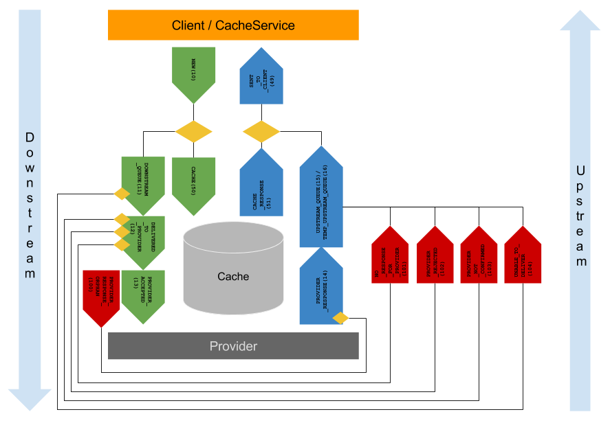

# Understanding the API


## Information Model at the Center

In FINT, the information model defines how the APIs are structured and how they function.

### Types of classes

The FINT information model has four types of classes:

1. Main classes (`hovedklasse`)
1. Abstract classes
1. Complex datatypes
1. References

Only main classes are directly accessible from FINT APIs, and every main class in the model has an API endpoint.

?>A main class is equivalent to a resource in REST

All other types are used to construct the main classes, either by abstraction of common fields, or to represent fields in the classes.

### Identity

Main classes have identity, and can be referred to using an identifier value. This is represented by attributes of the type `Identifikator`. All main classes have at least one attribute of this type, but it's perfectly legal to have more than one identifying attribute.

If the class has multiple identifying attributes, any of the identifying attributes can be used to reference it, and the FINT API exposes endpoints to refer to the class by all of the identifying attributes.

For instance, `Personalressurs` can be identified by both `ansattnummer`, `brukernavn` and `systemId`.

### Relations

Relations can be added to main classes, either directly or in an abstract base class.  In addition, attributes of the class can be complex datatypes, which also can have relations.

The name of the relation represents the relationship from the source to the target, and has often the same name as the class of the target.

Relations can be optional or mandatory, single-value or multi-value.  In any case, they are always represented in the same form.

All relations are in the `_links` attribute on the class it links from.  Remember, this can be an inner complex datatype.  

The `_links` attribute is an object where the name of the relation is used as the property name.  The property is an array of objects with a `href` attribute containing the URI to the target resource.

All relations to other resources in the information model *always* refer to a main class using one of the identifiable fields.

The FINT model also includes references to resources outside the model.  These are represented by a special type of relation called `Referanse`.  They are also represented as URIs.

### Attributes

Attributes in the resources can either be complex datatypes or any of the primitive types:

- string
- integer
- float
- dateTime

Attributes can be optional or mandatory, single-value or multi-value.  Multi-value attributes are always represented as an array, even if there is only a single value.

#### Date

Dates are represented in ISO 8601 form with UTC +0 (Z) time zone.

Example: `2019-06-05T09:48:23Z`.

The adapter is responsible for all date data to UTC +0. The consumer is responsible for changing date data to a usefull timesone for the application.

Example:

Here you can se what a Date of birth can look like:

- In a HRM system: '2000-02-14T00:00:00+1'
- In FINT: '2000-02-13T23:00:00Z'
- In Consumer application: '2000-02-14T00:00:00+1'

## Naming convention

FINT information objects are named based on the packaging structure in the information model:

- Administrasjon `/administrasjon`
  - Fullmakt `/administrasjon/fullmakt`
  - Kodeverk `/administrasjon/kodeverk`
  - Organisasjon `/administrasjon/organisasjon`
  - Personal `/administrasjon/personal`
- Utdanning `/utdanning`
  - Elev `/utdanning/elev`
  - Kodeverk `/utdanning/kodeverk`
  - Timeplan `/utdanning/timeplan`
  - Utdanningsprogram `/utdanning/utdanningsprogram`
  - Vurdering `/utdanning/vurdering`

For every package, classes of the stereotype `hovedklasse` are accessible through the FINT API.
As an example, for the package *Personal* within the domain *Administrasjon*, the following classes
are currently `hovedklasse`:

- Personalressurs `/personalressurs`
- Arbeidsforhold `/arbeidsforhold`
- Fravær `/fravar`
- Fastlønn `/fastlonn`
- Fasttillegg `/fasttillegg`
- Variabellønn `/variabellonn`

Norwegian characters are translated according to the following scheme:

| Original | Replacement |
| -------- | ----------- |
| æ        | a           |
| ø        | o           |
| å        | a           |

## Common operations

These operations are available for all classes in the FINT information model.

### Get all objects of a given class

`/domain/package/class`, i.e. `/administrasjon/personal/personalressurs`

This operation fetches all objects of a given class from the FINT cache. The response looks
like this:

```json
{
  "_embedded": {
    "_entries": [
      {

      },
      {

      }
    ]
  },
  "_links": {
    "self": [
      {
          "href": "..."
      }
    ]
  },
  "total_items": 111
}
```

### Pagination

`/domain/package/class?size=X&offset=Y`, i.e. `/administrasjon/personal/personalressurs?size=10000&offset=20000`

The complete list of resources could be very long, and the FINT API supports pagination in order to enable clients to
consume parts of the data.

Pagination is enabled by providing a `size` request parameter.  The response then looks like this:

```json
{
  "_embedded": {
    "_entries": [
      {

      },
      {

      }
    ]
  },
  "_links": {
    "self": [
      {
        "href": ".../?offset=20000&size=10000"
      }
    ],
    "prev": [
      {
        "href": ".../?offset=10000&size=10000"
      }
    ],
    "next": [
      {
        "href": ".../?offset=30000&size=10000"
      }
    ]
  },
  "total_items": 1800000,
  "offset": 20000,
  "size": 10000
}
```

The `prev` and `next` links will only appear if there are additional pages before or after this page, respectively.

In addition, the `total_items` attribute indicates the total size of the dataset, and the `offset` and `size` parameters 
correspond to the ones in the `self` link.

### Fetch individual item by identifier

`/domain/package/class/field/value`, i.e. `/administrasjon/personal/personalressurs/ansattnummer/123456`

Given an identifier field name (any field of type `Identifikator`) and the identifier value, try
fetching the individual item.

### Size of cache for a given class

`/domain/package/class/cache/size`, i.e. `/administrasjon/personal/personalressurs/cache/size`

Return the size of the cache for a given class.  The response looks like this:

```json
{
  "size": 10632
}
```

### Timestamp for when cache was last updated

`/domain/package/class/last-updated`, i.e. `/administrasjon/personal/personalressurs/last-updated`

Return a timestamp indicating when the cache was last updated.  The response looks like this:

```json
{
  "lastUpdated": "1559551091034"
}
```

### Get objects updated since timestamp

`/domain/package/class?sinceTimeStamp=<time>`, i.e. `/administrasjon/personal/personalressurs?sinceTimeStamp=1559551091034`

Returns a collection of all objects that have been updated (added or modified) later than the
provided timestamp.  The response looks like this:

```json
{
  "_embedded": {
    "_entries": [
      {

      },
      {

      }
    ]
  },
  "_links": {
    "self": [
      {
          "href": "..."
      }
    ]
  },
  "total_items": 2
}
```

If `total_items` is `0`, this indicates that there are no new updates since the given timestamp.

The general algorithm for continuously retrieving updates are this:

1. Maintain a `timestamp` variable, initially set to `0`.
2. Fetch the `.../last-updated` value, and store this in a _new_ variable.
3. Fetch resources, using the request parameter `sinceTimeStamp=<timestamp>`
4. Update the `timestamp` variable with the value retrieved from step 2.
5. Repeat as often as you find necessary.

__NOTE:__ This algorithm can be combined with pagination.  In this case, step 3 becomes a loop where resources
are fetched until the response no longer contains a `next` link.

### Health Check

`/domain/package/admin/health`, i.e. `/administrasjon/personal/admin/health`

Triggers a health check towards the adapter providing data.  The response indicates whether the adapter is connected and responding.

## General guidelines

To get the most value from FINT APIs, some guidelines to follow.

### Information is a Graph

FINT resources have relatively few attributes, but more relations.  Every resource only has the attributes that are
directly relevant for the resource.  Everything else is represented as relations (links) to other resources.
As an example, the class `Personalressurs`, representing an employee, does not have the employee's name.  Instead there is
a link to `Person`, representing a private person, where you find the properties of the employee as a private person.

### Refer, not Replicate

Information always changes.  Stale data is often worse than not having any data at all.  The FINT API is based on the principle that information should be fetched from the source when needed, not replicated beforehand.

### References are Stable

Resources in FINT are represented using URIs.  These URIs are constructed by the API based on attributes that can be used to identify the resource, represented by the type `Identifikator`.

As long as the identifiable attribute does not change, neither does the URI representing the resource.

### Everything is a Resource

All classes in the FINT information model is represented in the exact same way, as resources with URIs and references using URIs to other classes it refers to.

The type of the resource is explicit from the URI of the resource.  For instance, from the URI `/administrasjon/personal/personalressurs`, the type of the resource is always `Personalressurs`.

## Updating information using FINT

Updates use HTTP operations to create, modify and delete information.  It builds upon the "everything
is a resource" principle, so when updating information the resource URI is central.

### Asynchronous operations

Since the updates must propagate via the FINT component and an adapter before being processed by the
back-end system, updates might take some time to complete.  For this, FINT APIs use asynchronous
operations as described in <http://restcookbook.com/Resources/asynchroneous-operations/.>

The process is as follows:

1. The client initiates an update operation.
1. The FINT API validates the syntax of the operation and responds with status code [`202`](https://http.cat/202) and a `Location` 
   header referring to a `/status/<uuid>` resource
1. The client fetches the *Status* resource.
   - If the operation is still pending, the FINT API keeps responding with status code `202`.
1. If the operation has completed, the FINT API responds with the final status of the update:
   - If successful, status [`201`](https://http.cat/201) with a `Location` referring to the resource that has been
     created or updated, and a payload with the updated resource.
   - _Note:_ If the operation is a deletion, the status code is [`204`](https://http.cat/204) instead.
   - If rejected by the back-end system, status [`400`](https://http.cat/400) with a response body indicating the error.
   - If the update is in conflict with other updates or data in the back-end system, the status
     is [`409`](https://http.cat/409) and the response body contains the original information the update conflicts with.
   - If there was a temporary failure processing the request, status [`500`](https://http.cat/500) with the
     error message.
      In this case the client can retry the request.

The *Status* resource is valid for 30 minutes after initiating the original request.

### Creating new objects

`POST /domain/package/class`, i.e. 
`POST /administrasjon/personal/fravar`

The body must be a complete resource to be created, including `_links` to other resources it refers to.

Internal identifiers controlled by the back-end system can be omitted.

### Modifying existing objects

`PUT /domain/package/class/field/value`, i.e. `PUT /administrasjon/personal/personalressurs/ansattnummer/123456`

The resource to be modified is identified by the identifiable field and value.
Any field of type `Identifikator` can be used to identify the resource.

The body must be the complete resource after modification.
Attributes that can be modified are indicated in the information model.

### Deleting objects

`DELETE /domain/package/class/field/value`, i.e. `DELETE /administrasjon/personal/fravar/systemid/abcdef1234`

Not all information classes support deletion.
If deletion is not supported, the operation is rejected with status `400`.

## API Internals

All FINT APIs have two common services:

* Cache service
* Event service

### Cache Service

Cache services are created for each main object in the FINT information model, and are grouped per component.
The cache services have the following responsibility:
- Store data from the business applications for all the organisations using the Common API
- Populate the cache at regular intervals
- Maintain a last updated timestamp for each object in the cache
- Serve all `GET` requests from _Common operations_ above.

The Cache Service source code can be found here: https://github.com/FINTLabs/fint-cache

Internally, the Cache Service operates as lists, one per main object type and organization ID, meaning data from
different organizations are separated, in addition to the separation per object type.

The ordering of this list is determined by two things:

1. The ordering of data supplied by the adapter, and
1. updates to data between cache refresh intervals.

At cache rebuilds, the cache service compares the cache with the updates provided by the adapter.  If the contents of 
an object is identical to the cached version, the last updated timestamp is not modified.  But for all objects where the
content has changed, a new last updated timestamp is set.

During cache rebuilds, the cache is purged of objects that are no longer provided by the adapter.  As this works on object
contents, a modified object appears as a new one, and the previous version is purged as it no longer exists.

Whenever information is updated (added or modified) using the _Updating information using FINT_ operations mentioned above,
the updated version of the object is _added_ to the cache _without_ removing the original version.  This means the cache will
contain _multiple_ versions of the same object, until the next cache rebuild cycle.  As the cache behaves as a list, these 
updated versions are added to the _end_ of this list.

The multiple versions of this object is handled by the API in the following manner:

1. For _get by ID_ operations, the cache service returns the most recent object matching the requested identifier.
1. For _get since timestamp_ operations, only the version(s) modified _after_ that timestamp are returned.
1. For _get all_ operations, all versions of the object are returned, in the order they were modified.

__NOTE:__ Make note of the third case here - where multiple versions of the same object can occur!

Since the cache behaves as a list, the order in which objects are returned for a _get all_ operation corresponds to the
order in which they were added to the cache.  This means that the duplicate versions can be handled by the client by only
processing the _last_ object having the given set of identifiers.

*TIP!* The easiest way to avoid dealing with multiple instances of an object is to use the algorithm described in
_Get objects updated since timestamp_ above, as only the modified version will be returned.

### Event service

The internals of the Common API is events based. An event is created by:

* Cache Service
* Client (REST API)

When a client hits a endpoint in the Consumer API the Common API generates an event that propagates through the FINT core
stack.  Whether the event is forwarded to the adapter depends on the type of event, as well as the source of the event.

All events are logged at all stages, and can be viewed through the [FINT Customer Portal](https://kunde.felleskomponent.no/).

