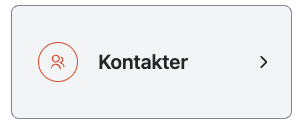
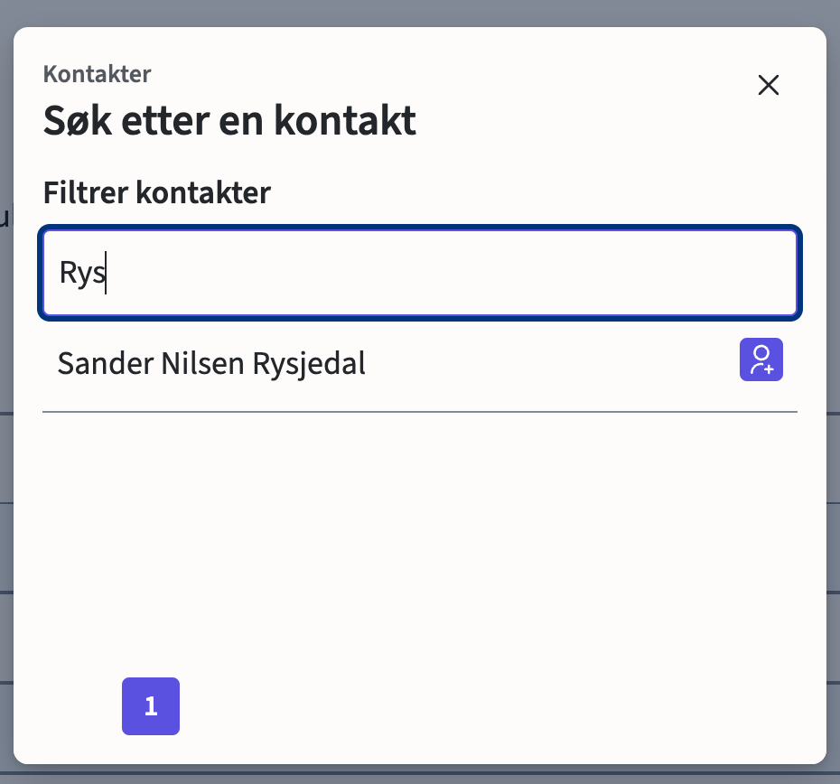
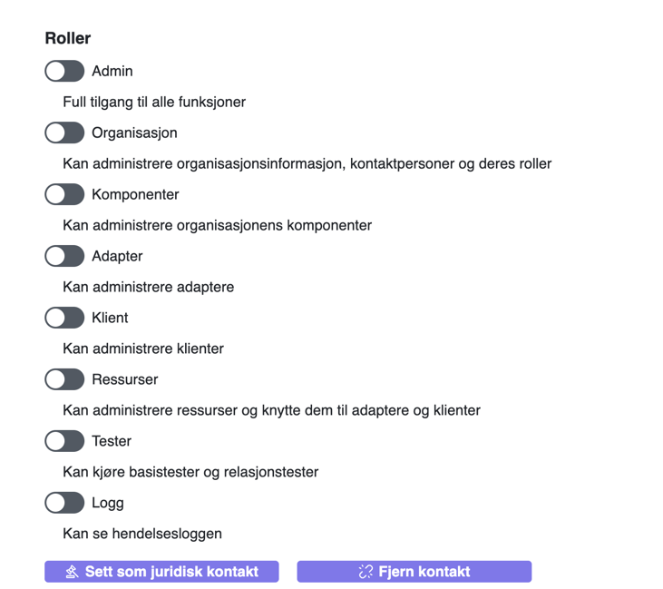

# Kontakter

Gå til Kontakter

Klikk på det **Legg til** knappen.

Her kan du søke etter personer. Søk må gjøres på etternavn. Fulle navnet kommer opp i listen.

!>Nye brukere blir per nå automatisk satt som admin. Dette vil endres i nær fremtid. 

Deretter trykk på det ikonet med en pluss.
Der kan du, dersom du er juridisk teknisk kontakt, legge inn de tekniske kontaktene du ønsker skal ha tilgang til kundeportalen.
Dersom kontakten du ønsker skal ha tilgang til kundeportalen ikke finnes i listen, ber du dem opprette en bruker i selv-registreringen vår.

# Roller
Du kan trykke på en bruker for å administrere rollene.
Du kan velge spesifikke roller ved å huke av de du trenger, 
eller du kan velge admin for å få alle rollene.

 - **Admin** : Admin har tilgang til all funksjonalitet i kundeportalen.
 - **Organisasjon** : Med Organisasjon aktivert har man tilgang til å endre organisasjonsinformasjon, brukerenes kontaktpersoner og rollene brukerene i deres organisasjon har tilgang til. 
 - **Komponenter** : Gir tilgang til å administrere komponenter i din organisasjon. For mer informasjon om komponenter, [klikk her.](portal/komponenter.md)
 - **Adapter** : Gir tilgang til å administrere adaptere i din organisasjon. For mer informasjon om adaptere, [klikk her.](portal/adapter.md)
 - **Klient** : Gir tilgang til å administrere klienter i din organisasjon. For mer informasjon om klienter,[klikk her.](portal/klient.md)
 - **Ressurser** : Gir tilgang til å administrere ressurser i din organisasjon, og koble dem med adaptere og klienter. 
 - **Tester** : Gir tilgang til å kjøre basistester og relasjonstester. For mer informasjon trykk på [basistest](portal/basistest.md) eller [relasjonstest](portal/relasjonstest.md).
 - **Logg** : Gir tilgang til å se hendelsesloggen. 