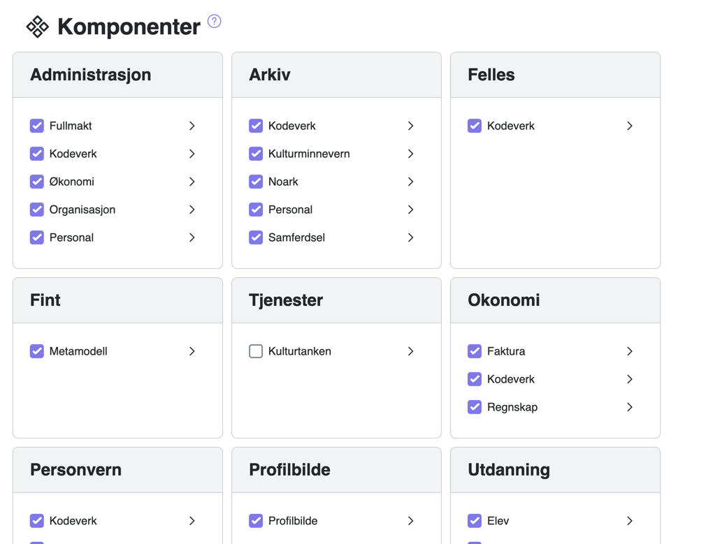
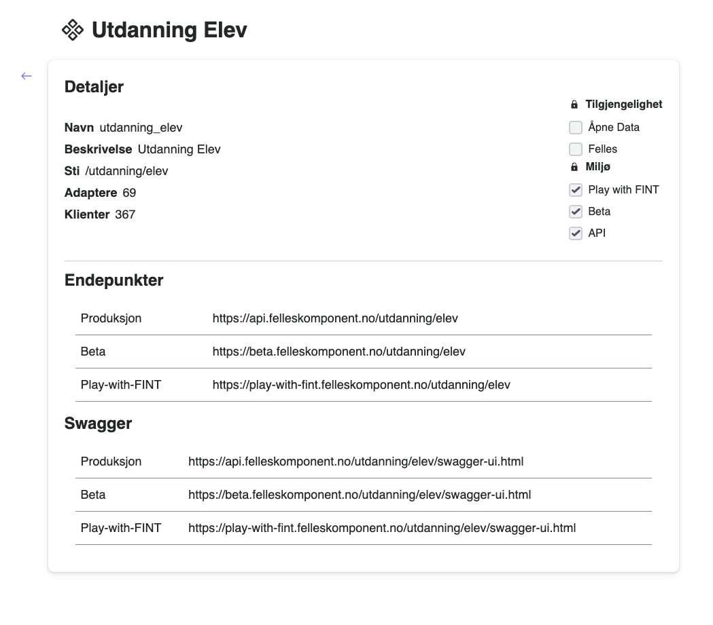

# Komponenter

Her velger man hvilke komponenter man ønsker å gjøre tilgjengelig for sin organisasjon (hvilken organisasjon man har valgt vises i top menyen). Man kan huke av for å legge til eller fjerne komponenten. Hvis man klikker på pilen, vil man få opp et vindu som viser informasjon om komponenten.

