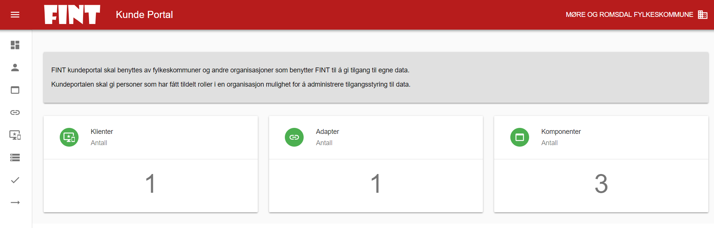

## Kundeportal

Vi anbefaler å lese gjennom hele veiledningen før Kundeportalen tas i bruk. Det er viktig å vite forskjellen mellom Adapter og Klient, og hva som brukes til hva. Vi har prøvd å holde teksten til et minimum, men det betyr også at alt som står skrevet er relevant og bør leses grundig.

Du finner kundeportalen på <https://kunde.felleskomponent.no>.

Hver fylkeskommune har fått i oppgave å sende inn personaldata på en person hver, som FINT prosjektet legger inn som bruker av portalen. Hvis du ikke får logget inn, må du ta kontakt med din fylkeskommunes LIP for å få vite hvem som har fått tilgang. Du kan eventuelt purre på dem, dersom de ikke har sendt personaldata til FINT-prosjektet. Den som har tilgang, kan gi andre tilgang.

### Startsiden

Når man har logget inn på kundeportalen, kommer man inn til et dashboard. Her kan man se antall klienter, adaptere og komponenter.



* `Komponent`: Inneholder alle felleskomponenter som er tilgjengelige. Her kan den enkelte fylkeskommune velge hvilke komponenter som skal være tilgjengelig for sin fylkeskommune. En felleskomponent må være aktivert for fylket for å kunne benyttes av klienter og adaptere.
* `Adapter`: Angir påloggingsinformasjon for adaptere som er installert av leverandøren til et av fylkeskommunens fagsystem. For eksempel må det opprettes et adapter i kundeportalen, slik at adapteret mot HR-systemet får korrekt påloggingsinformasjon, til komponenten som inneholder HR-informasjon.
* `Klient`: Her angis pålogginsinformasjon til komponenten som kan brukes av integrasjonsmotor, klient, applikasjon eller annen komponent i en arbeidsprosess. F.eks. må det opprettes en klient for at VIS skal få tilgang til ansattinformasjonen fra FINTs Felleskomponenter.


Her illustreres hvor klient, komponent og adapter er i dataflyten.

### Så hva er det vi nå skal gjøre?

* Vi skal opprette klienter i Kundeportalen for alle klienter som trenger tilgang til Felleskomponentene, og vi velger hvilke komponenter denne klienten skal ha tilgang til.
* Vi skal opprette adapter i Kundeportalen for alle fagsystemer som trenger tilgang til Felleskomponentene, og vi velger hvilke komponenter dette adapteret skal ha tilgang til.

For å opprette sitt oppsett, følger man valg i menystrukturen, som vises med symboler, på venstre side.

Første menypunkt, vist med blå sirkel i bildet under, er hvor man setter opp tekniske kontaktpersoner.

### Kontaktpersoner

Gå til Kontakter (1), og klikk på det grønne ikonet med en svart pluss i (2). Deretter trykk på det røde ikonet med en pluss i som kommer i vinduet som åpner seg (3). Der kan du, dersom du er juridisk teknisk kontakt, legge inn de tekniske kontaktene du ønsker skal ha tilgang til kundeportalen. Dersom kontakten du ønsker skal ha tilgang til kundeportalen ikke finnes i listen, ber du dem opprette en bruker.


### Komponenter


Her velger man hvilke komponenter man ønsker å gjøre tilgjengelig for sin organisasjon (hvilken organisasjon man har valgt vises i øvre høyre hjørne, i eksemplene vil det være Møre og Romsdal). De som har et grønt symbol med et pluss i, er komponenter som du kan legge til. De med rødt symbol med en minus i, er komponenter som allerede er lagt til. Man klikker på symbolet for å legge til eller fra komponenten. Hvis man klikker på tannhjulet bak det røde eller grønne symbolet, vil man få opp et vindu som viser informasjon om komponenten.


### Adapter

Når man har koblet komponentene til organisasjonen så går man videre til tredje menypunkt som er Adapter.

Oppsettet som genereres her skal brukes i konfigurasjon av FINT-adapter.


Man klikker på det store grønne symbolet med en svart pluss i, for å legge til et adapter. Da vil man få opp følgende bilde:


Først fyller du ut brukernavn til adapteret. Hvis vi velger brukerennavnet `mrfylke_test_adapter`, vil det automatisk legges på orginisasjonsdomene bak brukernavnet. Som eksempel blir brukernavnet `mrfylke_test_adapter` endret til `mrfylke_test_adapter.mrfylke.no` for Møre og Romsdal. I feltet Kort beskrivelse legger du inn navnet som vil vises i listen over Adaptere. Man kan endre beskrivelsen senere.  Når man har lagt inn en Note, kan man legge til adapteret, og det kommer opp i listen.

Deretter klikker du på edit-symbolet (en grå blyant) bak adapteret i listen, og får opp dette bildet:


Her kan man endre på beskrivelse og Note, hvis man ønsker.  Ved å klikke på “Komponenter” i toppmenyen, kommer man til følgende bilde:


Her finner du igjen de komponentene vi valgte i sted, og kan koble dem til adapteret. Klikk på grønt symbol med en pluss for å koble til, eller et rødt symbol med en minus for å koble fra. Det vil si at en tilkoblet komponent vises med rødt symbol. Deretter går man videre i toppmenyen til Autentisering.


Her kommer informasjonen som skal inn i konfigfilene til adapteret. Det er denne informasjonen som skal sendes til den som installerer FINT-adapteret i deres miljø. Dette er ikke denne informasjonen som skal sendes til VISMA for oppsett i VIS. Det skal man sette opp en klient for. Husk å trykke på symbolene bak Passord og Klient Hemmelighet for å generere disse første gangen. Hvis man genererer opp passord på nytt senere, må man endre i konfigfilene til adapteret også, hvis ikke vil adapteret feile ved oppkobling mot FINT. Klient Hemmeligheten vil hentes fra FINTs OAuth-server og vil ikke endres selv om han henter verdien på nytt.

Når man har generert opp Passord og hentet Klient Hemmelighet, kan man kopiere informasjonen ut i JSON-format, ved å klikke på knappen `KOPIER AUTENTISERINGSINFORMASJON`. Da kommer det på dette formatet:

```json
{
  “username”: “mrfylke_test_client@mrfylke.no”,
  “password”: “<fjernet>”,
  “clientId”: “<fjernet>”,
  “openIdSecret”: “<fjernet> “,
  “assetIds”: [ “mrfylke.no” ]
}
```

NB: Hvis passordet er “topseceret”, har du glemt å generere passordet. Dette er et default passord som ikke fungerer ved pålogging til adapteret. Da må du oppdatere passordet ved å klikke på oppdateringssymbolet (en pil formet som en sirkel).

Bruker som lages for å benytte FINT-adapteret, blir ikke opprettet som en domenebruker hos fylkeskommunen. Denne finnes bare i FINT-sammenheng.

### Klienter

Menyvalgene Adapter og Klienter fungerer på samme måte, men skilles på hvilket grensesnitt i felleskomponenten det gis tilgang til. Adaptere får tilgang til Provider-grensesnittet og kan levere data til felleskomponenten, mens Klienter får tilgang til Consumer-grensesnittet og kan hente ut data fra felleskomponenten. Adaptere leverer vanligvis til èn komponent, mens klienter kan hente fra flere. Dvs at det er konfigurasjonen som ble satt opp for adapter, som brukes for å oppdatere FINT-adapterets konfigfiler. Det oppsettet vi skal lage nå, skal brukes for å logge på FINT test klient.

Man skal opprette en klient for hvert formål, dvs. ikke gjenbruke den samme klienten til forskjellige oppgaver. En for å kjøre testene som ligger på kundeportalen, en for testing i testklienten til FINT, og ikke minst en egen klient for å koble VIS mot fylkeskommunens egne data. Autentiseringsinformasjonen for den klienten som opprettes for VIS (Visma InSchool), må på et tidspunkt oppgis til Visma for å få tilgang til VIS.


For å legge til en klient så klikker man på det store grønne symbolet med en svart plus i.


Fremgangsmåten her er ganske lik den som var for Adapter. Man legger til et brukernavn, som får ditt fylkes domenenavn bak. Den vi lager på bildet, er i første omgang en klient for å kjøre tester, så vi har kalt den basictestclient@mrfylke.no for Møre og Romsdal. Det er viktig at denne ikke blir gitt samme brukernavn som ble brukt i adapteroppsettet. Den korte beskrivelsen, er det som kommer opp som navn på klienten, i listen over klienter. Fyll ut og legg til.

Deretter klikker man på det grå edit-symbolet, som er en blyant, for å sette opp innstillingene til klienten.


På første fane kan kan endre beskrivelse og Note.


På fanen Komponenter kan man legge til de komponentene som skal kobles til klienten. For en testklient velger man alle komponenter som skal testes. Her klikker man på grønt symbol med en pluss for å koble til, eller et rødt symbol med en minus for å koble fra. Deretter går man videre til Autentisering.


På samme måte som for Adapter, må Passord og Klient Hemmelighet genereres manuelt, ved å klikke på symbolene nest bakerst på linjen. Disse autentiseringsdataene må man oppgi til de som skal teste FINT med f.eks. FINTs testklient (<https://www.fintlabs.no/#/test-klient).> Det er ikke denne informasjonen som brukes for å sette opp adapteret mot f.eks HR. Da må du bruke informasjonen fra adapteroppsettet.

### Endre konfig for FINT adapteret

Når dette er gjort, er man klar for å endre i konfigfilene til FINT adapteret.

Det er kontaktperson i kundeportalen som har opprettet tilgangen og autentiseringsinformasjonen, men som oftest en representant fra leverandøren som har ansvaret for konfigurasjonsfilene. Kontakt derfor denne representanten fra leverandøren for å legge til autentiseringen i konfigurasjonsfilene.

NB! Det er autentiseringsinformasjonen for adapteret, ikke klienten, som skal inn i konfigfilene for adapteret.

For Visma finnes en konfigfil for hver Service som kjøres, og alle må oppdateres. Pr i dag er det organisasjon, personal, fullmakt og kodeverk, altså 4 konfigfiler. For Agresso må ligger alle konfigurasjonene i en fil.

For å endre i konfigfilene til FINT adapteret så må man inn på serveren som adapteret er installert på. Finn mappen adapterinstallasjonen ligger på, og finn filene der.

Endre konfigfilen for hver av de servicene som kjører. Når endringen er gjort må servicene startes på nytt og man kan gå inn i loggfilene som ligger sammen med konfigfilen og sjekke at adapteret klarer å koble seg opp mot FINTs felleskomponenter.

*Alternantiv A: Konfigurasjon av adapter for Visma Enterprise*

Dette skal over i Konfigfilene til FINT adapteret (per i dag 3 stk konfigfiler) og settes i verdiene som tilsvarer for Vismas FINT adapter:

```shell
fint.oauth.username=mrfylke_test_client@mrfylke.no
fint.oauth.password=<password>
fint.oauth.access-token-uri=https://idp.felleskomponent.no/nidp/oauth/nam/token
fint.oauth.client-id=<clientId>
fint.oauth.client-secret=<openIdSecret>

fint.adapter.organizations=mrfylke.no
orgIdToCompanyMap={“mrfylke.no”:”1″}
```

Det er en verdi til her som dere ser og det er: fint.oauth.access-token-uri, det er viktig at også denne blir satt riktig.

Vi kommer tilbake til dette etter vi har satt opp en klient som ligger i neste menypunkt.

*Alternativ B: Konfigurasjon av adapter for UWB/Agresso*

Agresso-adapter har en konfigurasjonsfil som heter appsettings.json. Der finnes det en seksjon, som må fylles ut med opplysningene over:

```json
“OAuthTokenService”: {
“AccessTokenUri”: “https://idp.felleskomponent.no/nidp/oauth/nam/token”,
“ClientId”: “<clientId>“,
“ClientSecret”: “<openIdSecret>“,
“Username”: “<username>“,
“Password”: “<password>“,
“Scope”: “fint-client”,
“OAuthEnabled”: “true”
},
```

Deretter går man inn i kundeportalen og kjører testene. I basic-testen vil man kunne se om adapterene kjører, og hvilke objekter som har mottatt data. Det vil ta ca. 30 min fra FINT-adapter-servicene er startet til de er data er lastet. Når data er innlastet så kan kan gå videre til relasjonstesten.

### Basic test

I kundeportalen ligger det to typer tester som skal brukes for å teste integrasjonene med FINT adapteret.

Den første er en basistest, der du kan sjekke helsestatusen til hver komponent. Test-klienten må ha aktivert felleskomponenten som den skal kjøre basistest mot.


Her velger du hvilken komponent du ønsker å sjekke, hvilket miljø og hvilken klient du bruker for å kjøre testen.
Det er viktig å ha en egen testklient for å kjøre testene, som ikke brukes til noen annet, da passordet bli regenerert hver gang.

For å kjøre testen klikker du på det grønne symbolet med en hvit trekant i.


Resultatet av testen sier noe om helsen til komponenten, og hvor ferske dataen som ligger der er.
På bildet over ser man en test, som viser en komponent, som kjører og som har oppdaterte data. Komponentene som har oppdaterte data vises med grønt symbol. Her ser man også at det er noen ressurser som ikke er oppdaterte. I dette tilfellet er det fordi disse kompnentene ikke er aktivert i trinn 1 av adapteret.

Man kan også få tilfeller der helsestatusen er grønn, men cachestatusen er oransje. Eller at helsestatus er rød.


Hvis helsestatus er grønn og cache er orange, kan det være adapteret nylig har restartet, og man kan vente ca. 15 minutter for å sjekke igjen. Hvis problemet vedvarer, eller om helsestatus er rød, bør man inn på serveren som adapteret er installert på, og restarte tjenestene. Hvis ikke dette hjelper, kan må man kontakte FINT-prosjektet for å undersøke at alt er ok på den siden. I kundeportalen kan du opprette og fylle ut en supportsak fra menyen på venstre side.

### Relasjonstest

FINTs relasjonstest kontrollerer alle utgående relasjoner fra en type ressurs.
Det vil si at fra ressursen Person, vil relasjonstesten kontrollere relasjonene til Kjønn, Landkode, Språk, Kontaktperson, Elev og Personalressurs, og kontrollere at relasjonen peker til en ressurs som eksisterer.


Starte relasjonstest
Opprett ny relasjonstest, og fyll ut følgende dialogboks:


Komponent-, Miljø- og Klientvalgene er like som for Basistest, mens Ressursvalget indikerer hvilken ressurs innenfor komponenten du ønsker å teste.

Relasjonstesten kan ta litt tid å gjennomføre, og det kan være mange testresultater. På oversiktsbildet viser Kundeportalen om testen pågår eller er fullført, og angir gjenstående tester før testen er ferdig.
Etter at testen er fullført vil oversikten indikere om testen er vellykket, eller om den har funnet feil i noen av relasjonene.
Ved å klikke på testen i oversikten, vises en oppsummering av relasjonstesten, og alle testresultatene kan lastes ned som en CSV-fil.
