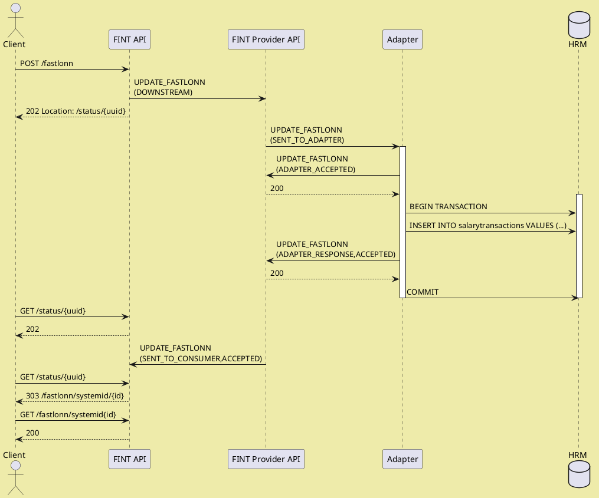
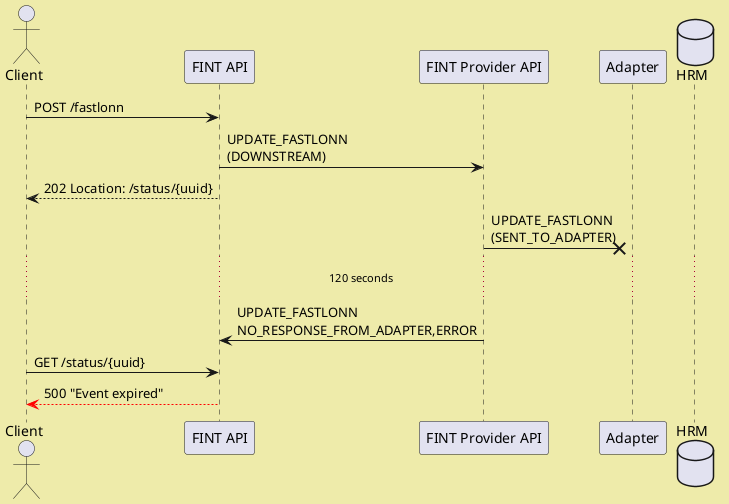
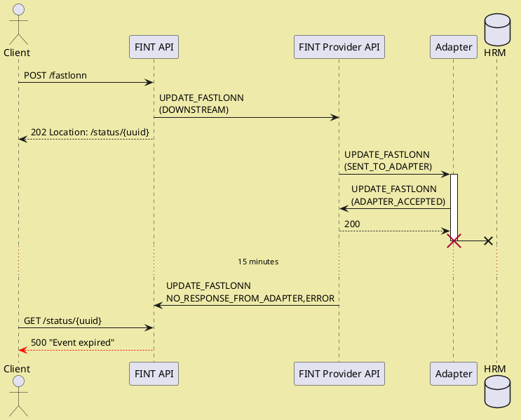
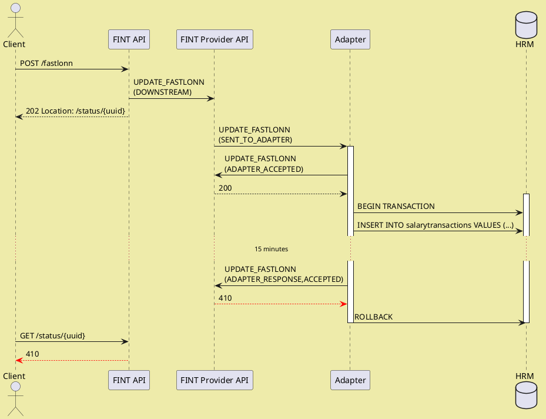
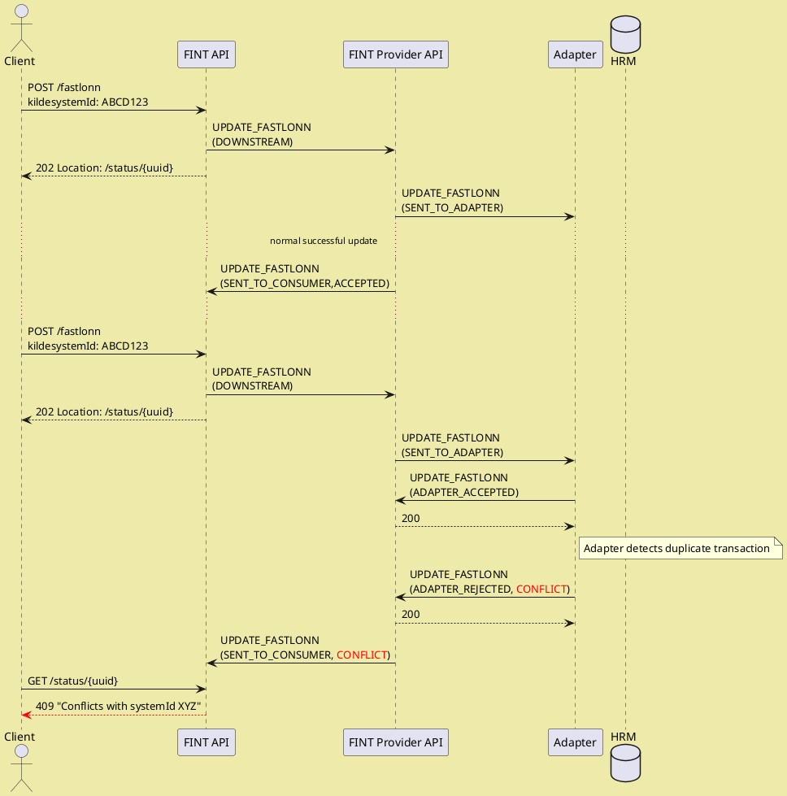

# Utvikling av en adapter

## Kom i gang

Et godt utgangspunkt kan være å se våre Java eller .NET hurtigguider:

* [Java](integrate/provide/core1-java-adapter.md)
* [C Sharp/.NET](integrate/provide/core1-dotnet-adapter.md)

Bruk en av våre maler til å sette opp ditt adapter:

* Java-mal - <https://github.com/fintlabs/fint-sse-adapter-skeleton>
* C'#'/.NET-mal - <https://github.com/fintlabs/Fint.Sse.Adapter.Skeleton>

## Hva gjør malen og hva trenger du å gjøre?

Malen håndterer **tilkobling**, **autorisasjon** og **kommunikasjon** med FINT.

Din oppgave som utvikler av en adapter er å:

1. Svare på `events` sendt fra FINT
2. Interagere med ditt baksystem
3. Kartlegge dine data til FINT
4. Sende tilbake informasjonen som er etterspurt i `event`

## Datamodell

FINTs informasjonsmodell er tilgjengelig som klasser i Java og C#. Navngivningen av klassene følger navngivningen av klassene i informasjonsmodellen. Modellklasser er tilgjengelige her:

* Java -- <https://github.com/FINTmodels/fint-information-model-java>
* C# -- <https://github.com/FINTmodels/FINT.Information.Model>

### Biblioteker fra Maven eller NuGet 

Bibliotekene er distribuert til [repo.fintlabs.no](https://repo.fintlabs.no/) og [NuGet](https://www.nuget.org/profiles/FINTLabs) for hver komponent, for eksempel `administrasjon`, `utdanning`, `arkiv`, `økonomi`. Versjonen av biblioteket er den samme som modellversjonen. De følger denne navngivningskonvensjonen:

* Java -- `fint-<component>-resource-model-java`, i.e. `fint-administrasjon-resource-model-java`.
* C# -- `FINT.Model.Resource.<Compponent>`, i.e. `FINT.Model.Resource.Administrasjon`.

## Lenker i ressurser

FINT APIer her en funksjon som sikrer at lenker mellom ressurser følger navnekonvensjonene og plasseringene for våre API-endepunkter. Ved å bygge opp lenker på denne måten sikres det at alle URI-er er gyldige.

Lenkene bygges opp etter følgende mønster:

* `${<component>[.<package>].<class>}/<field>/<identifier>`
* `${felles.person}/fodselsnummer/12345678901`
* `${administrasjon.personal.personalressurs}/ansattnummer/12345`
* `${utdanning.elev.skoleressurs}/systemid/ABCD123`

I Java- og C#-bibliotekene er lenker representert ved hjelp av en `Link`-klasse. Denne klassen har statiske konstruktører som kan brukes til å opprette gyldige relasjoner.

Java:
```java
Link.with(Person.class, "fodselsnummer", "12345678901");
```

C#:
```cs
Link.with(typeof(Person), "fodselsnummer", "12345678901");
```

## Hendelser

Den generelle flyten mellom FINT og adaptere er som følger:

1. Adapter abonnerer på hendelser ved hjelp av SSE-endepunktet.
2. FINT leverer hendelser på SSE-strømmen.
3. Adapteren aksepterer hendelsen ved å `POST`e til statusendepunktet. Det er en tidsbegrensning på 2 minutter for å akseptere hendelser. Hvis du bruker adaptermalen, er dette allerede håndtert.
4. Adapteren svarer på hendelsen ved å `POST`e til svar-endepunktet. Det er en tidsbegrensning på 20 minutter for å svare på hendelser (90 minutter for lønnstransaksjoner).


### Årsaker til generering av hendelser i FINT

FINT-komponenter produserer hendelser av tre grunner:

* Forespørsler om helsestatus
* Periodiske cache-oppdateringshendelser hvert 15. minutt, som utløser `GET_ALL_*`-hendelser.
* Innkommende POST/PUT-forespørsler fra klienter. Hver forespørsel produserer nøyaktig én hendelse.

FINT forventer nøyaktig én status og ett svar på hver leverte hendelse. Ytterligere svar vil bli avvist med [`410 GONE`](https://http.cat/410).

### Typer hendelser

FINT-adaptører må kunne håndtere fire forskjellige typer hendelser:

  1. Forespørsel om systemets helsetilstand
  2. Forespørsler om å hente alle instanser av en klasse fra FINT Consumer Cache Service
  3. Forespørsler om å hente et enkelt element av en klasse fra FINT Consumer API.
  4. Forespørsler om å oppdatere (opprette, endre eller slette) et enkelt element av en klasse fra FINT Consumer API.

FINT Consumer vil sende hendelsene til FINT Provider for den relevante `assetID`, og FINT Provider vil distribuere hendelsen til alle tilkoblede og registrerte adaptere for denne `assetID`.

Dette muliggjør scenarioer med distribuerte eller redundante adaptere der flere adaptører deler arbeidsbelastningen med å håndtere hendelser. Adapterkjøretidsinstansene må koordinere seg imellom hvilken instans som skal svare på en hendelse, siden leverandøren bare vil akseptere ett sett med svar for enhver gitt hendelse.

Arbeidsbelastninger kan distribueres ved hjelp av to forskjellige strategier, som også kan kombineres:

  1. Divide and conquer: Forskjellige adaptere håndterer forskjellige handlinger for en gitt komponent. For eksempel, for `/administrasjon/personal`, kan et adapter håndtere `Personalressurs` og `Arbeidsforhold`, og et annet adapter kan håndtere `Fastlønn`, `Variabellønn`, etc.
  1. Aktiv og passiv: Flere adaptere er konfigurert til å svare på samme hendelse, men koordinerer internt for å bestemme hvilken av instansene som skal svare.

Enhver adapterinstans registrert med asset ID kan håndtere hendelser på tre måter:

  1. Aksepter hendelsen og svar med data. Consumeren håndterer dataene fra svaret. Andre adaptere som forsøker å svare, vil motta en [`410`](https://http.cat/410) status fra provideren.
  2. Avvis hendelsen. Consumeren ignorerer alle data fra svaret. Andre adaptere som forsøker å svare, vil motta en [`410`](https://http.cat/410) status fra provideren.
  3. Ignorer hendelsen, under antagelse av at en annen instans håndterer den. Hvis ingen andre adaptere håndterer hendelsene, vil leverandøren la hendelsen utløpe etter 120 sekunder.

### Helsestatus (`HEALTH`)

Hver FINT Consumer har et helse-endepunkt (`/admin/health`) som klienter kan `GET` fra for å
forespørre helsestatus.

Adaptere har 30 sekunder på å svare på denne helsehendelsen. Forespørselslasten inneholder en matrise
av helsestatusstrukturer, og svaret bør inneholde det samme, med ett ekstra element
for statusen til adaptøren og tilkoblingen til baksystem/datakilde.

Helsestatusstrukturen ser slik ut:

```json
{
  "component": "adapter",
  "status": "APPLICATION_HEALTHY",
  "timestamp": 1571327388028,
  "time": "2019-10-17T15:49:48.028Z"
}
```

`timestamp` er i millisekunder siden Unix-epoken, `time` i ISO 8601.

`status` bør være `APPLICATION_HEALTHY` eller `APPLICATION_UNHEALTHY` avhengig av tilstanden til bakapplikasjonen.

### Hente alle instanser av en klasse (`GET_ALL_`_type_)

FINT Consumer Cache Service utsteder normalt disse hendelsene hvert 15. minutt for å oppdatere consumerens in-memory cache med alle elementer av typen.

Adaptere forventes å hente alle aktive elementer fra baksystemet og legge inn dataene i respons-hendelsen.

Svaret må inneholde en matrise av individuelle informasjonselementer i JSON-format, i samsvar med FINT-informasjonsmodellen.

### Hente en enkelt instans av en klasse etter ID (`GET_`_type_)

FINT Consumer APIer utsteder disse hendelsene i tilfeller der klienter ønsker den nyeste versjonen av et gitt element, og venter på at adapteret skal svare før data returneres til klienten.

Hendelsens `query`-attributt inneholder `Identifikator` feltets navn og feltverdi for å identifisere elementet i formen _`field/value`_, akkurat som URIen til elementet i Consumer API.

For eksempel, for `Personalressurs` med et `ansattnummer` ID på `12345`, ville URIen være `/administrasjon/personal/personalressurs/ansattnummer/12345`, og `query`-attributtet ville da være `ansattnummer/12345`.

Adapteret forventes å trekke ut `query`-attributtet, søke i baksystemet etter den nyeste versjonen av det forespurte elementet.

Svaret må inneholde et enkelt element i JSON-format, i samsvar med informasjonsmodellen.

For feilsituasjoner kan adapteret kontrollere HTTP-responsen som returneres til klienten ved hjelp av følgende:

| `responseStatus` | `statusCode`   | HTTP-resultat           |
| ---------------- | -------------- |-------------------------|
| `ERROR`          | (any)          | [`500`](https://http.cat/500)            |
| `REJECTED`       | `"GONE"`       | [`410`](https://http.cat/410)            |
| `REJECTED`       | `"NOT_FOUND"`  | [`404`](https://http.cat/404)            |
| `REJECTED`       | (other values) | [`400`](https://http.cat/400)            |

### Opprette et nytt element, eller oppdatere et eksisterende element etter ID (`UPDATE_`_type

FINT Consumer APIer utsteder disse hendelsene for `POST`, `PUT` og `DELETE`-forespørsler for en gitt type, i henhold til følgende:

| REST-operasjon                     | `operation` | `query`       |
|------------------------------------| ----------- | ------------- |
| `POST /path/to/type`               | `CREATE`    | (empty)       |
| `POST /path/to/type?validate=true` | `VALIDATE`  | (empty)       |
| `PUT /path/to/type/field/value`    | `UPDATE`    | `field/value` |
| `DELETE /path/to/type/field/value` | `DELETE`    | `field/value` |

Adapteret forventes å håndtere de ulike operasjonene i henhold til følgende:

  - `VALIDATE`: Lasten må underlegges en semantisk validering i henhold til forretningsregler, men ikke lagres i baksystemet. Svaret må enten være `ACCEPTED` eller `REJECTED` for å indikere om lasten er gyldig eller ikke, eller `ERROR` hvis valideringen ikke kan utføres og bør prøves på nytt.
  - `CREATE`: Lasten må underlegges en semantisk validering i henhold til forretningsregler, tilføres en `systemId` `Identifikator` (hvis relevant), og lagres i baksystemet. Svaret må oppdateres for å svare til den endelige versjonen som er lagret i baksystemet. Svaret må være `ACCEPTED`, `REJECTED` eller `CONFLICT` for å indikere om lasten var gyldig eller ikke, eller om opprettelsen er i konflikt med andre data i systemet. Svaret `ERROR` indikerer en forbigående feil, og at opprettelsen kan prøves på nytt.
  - `UPDATE`: Det eksisterende elementet, identifisert av `query`-feltet, skal oppdateres i henhold til forretningsregler og hvilke felt som er `skrivbare` i FINT-informasjonsmodellen. Svaret må inkludere den endelige versjonen som er lagret i baksystemet. Svarstatus som ovenfor.
  - `DELETE`: Det eksisterende elementet, identifisert av `query`-feltet, skal fjernes fra baksystemet hvis dette er gyldig i henhold til forretningsreglene. Ingen payload forventes i svaret, men svarstatus som ovenfor.

Hendelser *må* svares med en `responseStatus`-innstilling som indikerer resultatet av operasjonen:

| `responseStatus` | HTTP status sendt til klienten   | Svartype      | Beskrivelse                                                                                                                                                               |
| ---------------- |----------------------------------|---------------|---------------------------------------------------------------------------------------------------------------------------------------------------------------------------|
| `CREATED`        | [`201`](https://http.cat/201)                     | FINT-objekt   | Operasjonen ble akseptert og fullført vellykket. Basert på forespørselstype, produserer FINT APIet en `Location`-header som refererer til den nylig opprettede ressursen. |
| `ACCEPTED`       | [`202`](https://http.cat/202)                     |               | Operasjonen behandles som en asynkron forespørsel og er akseptert. Sjekk statusen til den er enten vellykket (200) eller mislykket.                                       |
| `REJECTED`       | [`400`](https://http.cat/400)                     | Error details | Operasjonen ble avvist. `message`, `statusCode` og `problems` feltene inneholder forklaringer på hvorfor.                                                                 |
| `ERROR`          | [`500`](https://http.cat/500)                     | Error details | En feil oppstod under behandlingen av hendelsen. Klienten kan prøve samme operasjon senere.                                                                               |
| `CONFLICT`       | [`409`](https://http.cat/409)                     | FINT object   | Operasjonen er i konflikt med annen aktivitet. Svaret inneholder en oppdatert versjon av ressursen slik at klienten kan oppdatere sin egen tilstand.                      |

?> Hvis svaret er en `202 ACCEPTED`, betyr det at forespørselen behandles asynkront. Du bør da bruke en backoff-strategi for å sjekke om operasjonen er fullført. Perioden du venter mellom hver sjekk bør øke og du bør vente til du får et annet svar. Dette kan ta opptil 20 minutter.

Hvis skriveoperasjoner ikke støttes eller er tillatt, må hendelsen avvises ved å poste `ADAPTER_REJECTED` i `/status`-fasen.

Svaret må være et enkelt element som representerer den nåværende tilstanden til informasjonen, i samsvar med informasjonsmodellen. Det håndteres i henhold til følgende, avhengig av `responseStatus`:

- `ACCEPTED`: Oppdatert informasjon returneres til klienten, og oppdatert i FINT.
- `REJECTED`: Oppdatert informasjon blir ignorert.
- `ERROR`: Oppdatert informasjon blir ignorert.
- `CONFLICT`: Nyeste informasjon returneres til klienten, og oppdatert i FINT.

Merk det siste tilfellet. For `CONFLICT` er det meningen at adapteren skal levere den mest oppdaterte versjonen av informasjonen, slik at klienter og FINT-cachet kan oppdateres.

## Hvordan håndtere feil

Siden `UPDATE_`-hendelser involverer flere komponenter og er basert på hendelser, er det uunngåelig at feil vil oppstå.

### Konflikt ved oppdatering

Noen ganger kan oppdateringen som forsøkes være i konflikt med andre data i baksystemet. Dette kan for eksempel være:

 - Forsøk på å opprette data med identifikatorer som refererer til eksisterende informasjon.
 - Modifikasjoner som skaper ulovlig tilstand når de kombineres med eksisterende informasjon.

I begge tilfeller må adapteret avvise oppdateringen med `CONFLICT` som responsstatus. Videre må svaret inneholde det som er den opprinnelige oppdateringen er i konflikt med.

Dette gjør det mulig for klienten å oppdatere sin informasjon og muligens modifisere oppdateringen før et nytt forsøk gjøres.

### Tapt hendelser

Oppdateringshendelser kan gå tapt på flere stadier i flyten. For å bedre illustrere hvor dette skjer, la oss først beskrive det vellykkede scenarioet.


#### Vellykket tilfelle

Følgende sekvensdiagram illustrerer det vellykkede tilfellet, der informasjon oppdateres, og klienten mottar vellykket bekreftelse på oppdateringen.



#### Hendelsen går tapt før den når adapteren

Dette er det enkleste feilscenarioet å håndtere. Ingen blir informert om oppdateringen, og oppdateringen kan trygt prøves på nytt etter at den opprinnelige oppdateringen har utløpt.



#### Hendelsen bekreftes av adapteren, men ikke oppdatert i backend-systemet

Dette scenarioet er veldig likt det ovenfor - den eneste forskjellen er tiden det tar for hendelsen å utløpe.



#### Hendelsen bekreftes og oppdateres i backend-systemet, men klienten blir ikke varslet

Dette er det vanskeligste scenarioet. Siden backend-systemet er oppdatert, kan hendelsen ikke trygt prøves på nytt, selv om klienten ikke vet dette. Det er hovedsakelig to måter å løse dette problemet på.

Hvilken av disse som er bedre, avhenger av backend-systemets evne til å registrere og rulle tilbake ventende modifikasjoner.

##### Rull tilbake modifikasjonen slik at den trygt kan prøves på nytt



For at dette tilfellet skal være mulig, må tilkoblingen mellom
adapteren og backend-systemet støtte transaksjonsrullering
eller lignende kompenserende operasjoner.

##### Bruk konfliktdeteksjon for å avvise et nytt forsøk med `CONFLICT`-status.



I dette siste tilfellet kreves det støtte fra klienten for at
tilstanden til oppdateringen skal synkroniseres riktig mellom klienten og
backend-systemet. For at dette skal fungere, er det avgjørende at
adapteren responderer korrekt på `CONFLICT` med en svarlast
som indikerer den nåværende tilstanden til informasjonen i
backend-systemet, og at klienten håndterer `409`-statusen korrekt og
oppdaterer sin ventende transaksjon med denne informasjonen.
