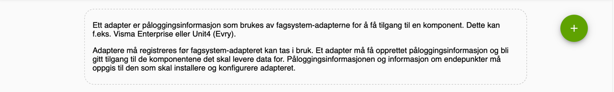
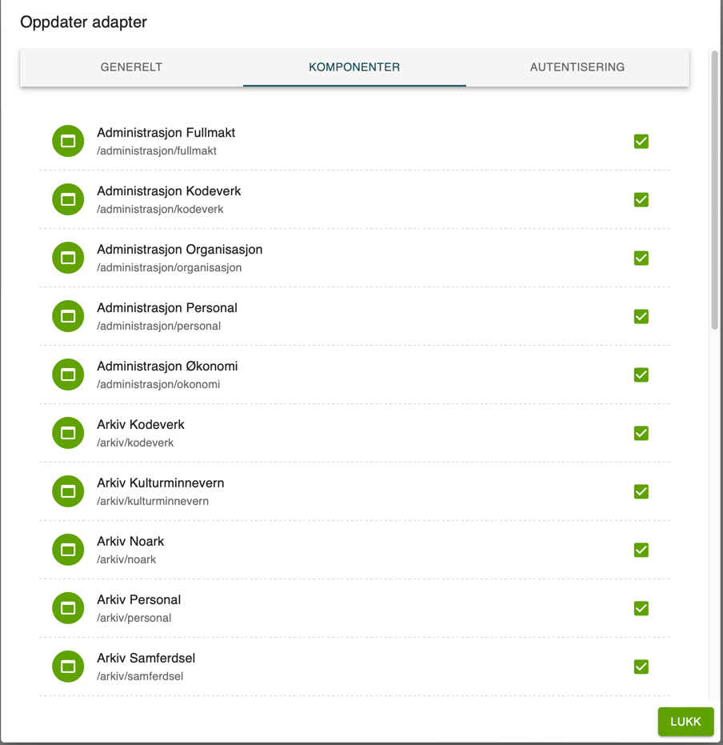

# Registrer et adapter for core 2


1. Registrer deg på https://kunde.felleskomponent.no
   1. I kunde portalen må du registrere et adapter med å trykke på plussikonet på adapter siden
   
   2. Når du har registrert adapteret, kan du velge komponentene det skal ha tilgang til.
   
   3. Nå kan du gå til autentisering-tabben og hente authetiserings-infoen


2. Bruk autentiserings cridentialsene til å hente et token


3. Nå når du har fått token, og registrert adapter i kunde portalen må du sende en kontrakt til FINT.
Du må sende denne boddyen til https://alpha.felleskomponent.no/provider/register, husk å bytte ut feltene i requesten,
og endre linken til riktig miljø.

<ins> NB: heartbeatIntervalInMinutes kan ikke være mer en 5! </ins>

```json
{
"adapterId": "Adapter-id fra kundeportalen",
"orgId": "organisasjons id",
"username": "adapter-brukernavn",
"heartbeatIntervalInMinutes": 2,
"capabilities": [
    {
    "domainName": "utdanning",
    "packageName": "vurdering",
    "resourceName": "elevfravær",
    "fullSyncIntervalInDays": 0,
    "deltaSyncInterval": "IMMEDIATE",
    "component": "string",
    "entityUri": "string"
    }
],
"time": 0
}
```

4. Heartbeat sendes til https://alpha.felleskomponent.no/provider/heartbet og ser slik ut:
 ```json
    {
    "adapterId": "string",
    "username": "string",
    "orgId": "string",
    "time": 0
    }
   ```