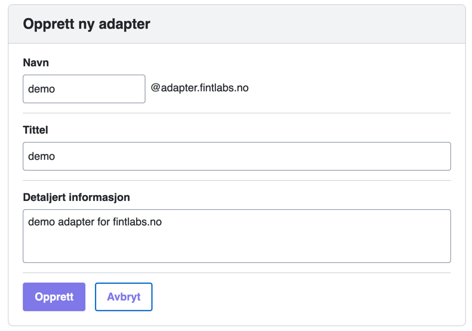
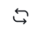

# Adapter

Et adapter leverer data til FINT. Oppsettene du oppretter i kundeportalen, gir et FINT-adapter tilgang til å kommunisere med FINT.

## Opprette et nytt adapter

1. Logg inn på kundeportalen.

2. Klikk på **Adapter** i menyen (fjerde ikon fra toppen).  
   

3. Klikk på det store grønne symbolet med et pluss-tegn for å legge til et nytt adapter.  
   

4. Fyll ut feltene for brukernavn, kort beskrivelse og beskrivelse.
   - **Brukernavn**: Beskriv hva adapteret skal brukes til (f.eks. visma-hrm).
   - **Kort beskrivelse**: Dette vises i listen over adaptere.
   - **Beskrivelse**: Legg til en mer detaljert forklaring av adapterets funksjon.
   

5. Klikk på **Legg til**.

6. Finn adapteret som nettopp ble opprettet, og klikk på endre-symbolet.   
   

7. Klikk på **Komponenter** og huk av de komponentene som adapteret skal ha tilgang til.
   

   ?>Enkelte adaptere må kunne lese fra FINT, i tillegg til å levere data. I så fall må det opprettes en egen klient for adapteret. Rettigheten som settes gjelder kun det som adapteret skal kunne levere data for. 
 
8. Klikk så på **Autentisering**.
   

9. Klikk på oppdater-ikonet til høyre for **Passord** for å generere et nytt passord.  
   

10. Klikk på nedlasting-ikonet til høyre for **Klient Hemmelighet** for å hente hemmeligheten for klienten.  
   

11. Klikk på **Kopier autentiseringsinformasjon**. Påloggingsinformasjonen kan nå limes inn der du vil benytte den. Den kommer i dette formatet:

    ```json
    {
      “username”: “<klientnavn>@adapter.<fylke>.no”,
      “password”: “<fjernet>”,
      “clientId”: “<fjernet>”,
      “openIdSecret”: “<fjernet>“,
      “assetIds”: [“<fylke>.no”]
    }
    ```

**Tips:**
- Hvis passordet er `**********`, har du glemt å generere passord. Dette vil ikke fungere (se punkt 8).
- Selv om brukernavnet ser ut som en vanlig e-postadresse, er dette kun en tilgang i FINT-sammenheng og bør ikke forveksles med en domenebruker.
- Tenk på sikkerhet når autentiseringsinformasjonen skal videresendes. Den bør ikke sendes som klartekst i for eksempel en epost.

### Endre konfig for FINT adapteret

Når dette er gjort, er man klar for å endre i konfigfilene til FINT adapteret.

Det er kontaktperson i kundeportalen som har opprettet tilgangen og autentiseringsinformasjonen, men som oftest en representant fra leverandøren som har ansvaret for konfigurasjonsfilene. Kontakt derfor denne representanten fra leverandøren for å legge til autentiseringen i konfigurasjonsfilene.

NB! Det er autentiseringsinformasjonen for adapteret, ikke klienten, som skal inn i konfigfilene for adapteret.

For Visma finnes en konfigfil for hver Service som kjøres, og alle må oppdateres. Pr i dag er det organisasjon, personal, fullmakt og kodeverk, altså 4 konfigfiler. For Agresso må ligger alle konfigurasjonene i en fil.

For å endre i konfigfilene til FINT adapteret så må man inn på serveren som adapteret er installert på. Finn mappen adapterinstallasjonen ligger på, og finn filene der.

Endre konfigfilen for hver av de servicene som kjører. Når endringen er gjort må servicene startes på nytt og man kan gå inn i loggfilene som ligger sammen med konfigfilen og sjekke at adapteret klarer å koble seg opp mot FINTs felleskomponenter.

*Alternantiv A: Konfigurasjon av adapter for Visma Enterprise*

Dette skal over i Konfigfilene til FINT adapteret (per i dag 3 stk konfigfiler) og settes i verdiene som tilsvarer for Vismas FINT adapter:

```shell
fint.oauth.username=mrfylke_test_client@mrfylke.no
fint.oauth.password=<password>
fint.oauth.access-token-uri=https://idp.felleskomponent.no/nidp/oauth/nam/token
fint.oauth.client-id=<clientId>
fint.oauth.client-secret=<openIdSecret>

fint.adapter.organizations=mrfylke.no
orgIdToCompanyMap={“mrfylke.no”:”1″}
```

Det er en verdi til her som dere ser og det er: fint.oauth.access-token-uri, det er viktig at også denne blir satt riktig.

Vi kommer tilbake til dette etter vi har satt opp en klient som ligger i neste menypunkt.

*Alternativ B: Konfigurasjon av adapter for UWB/Agresso*

Agresso-adapter har en konfigurasjonsfil som heter appsettings.json. Der finnes det en seksjon, som må fylles ut med opplysningene over:

```json
“OAuthTokenService”: {
“AccessTokenUri”: “https://idp.felleskomponent.no/nidp/oauth/nam/token”,
“ClientId”: “<clientId>“,
“ClientSecret”: “<openIdSecret>“,
“Username”: “<username>“,
“Password”: “<password>“,
“Scope”: “fint-client”,
“OAuthEnabled”: “true”
},
```

Deretter går man inn i kundeportalen og kjører testene. I basic-testen vil man kunne se om adapterene kjører, og hvilke objekter som har mottatt data. Det vil ta ca. 30 min fra FINT-adapter-servicene er startet til de er data er lastet. Når data er innlastet så kan kan gå videre til relasjonstesten.

