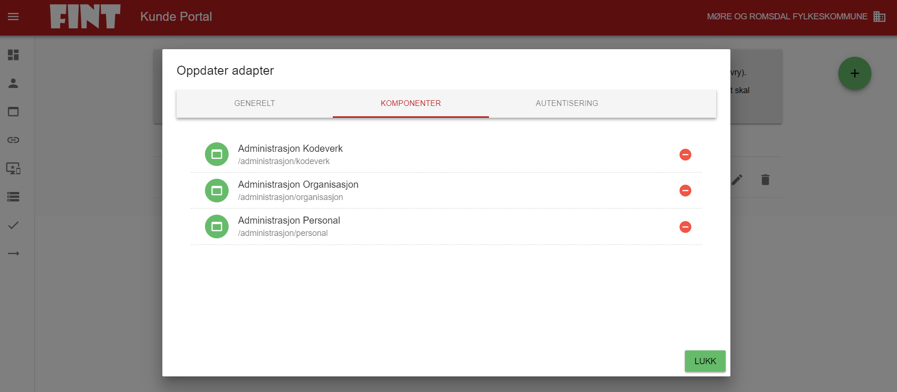

# Adapter

Et adapter leverer data til FINT. Oppsettene du oppretter i kundeportalen, gir et FINT-adapter tilgang til å kommunisere med FINT.

## Opprette et nytt adapter

1. Trykk på **Adapter** i menyen (fjerde ikon fra toppen).
   

2. Klikk på det store grønne symbolet med et pluss-tegn for å legge til et nytt adapter.
   

3. Fyll ut feltene for brukernavn, kort beskrivelse og beskrivelse.
    - **Brukernavn**: Beskriv hva adapteret skal brukes til (f.eks. visma-hrm-test).
    - **Kort beskrivelse**: Dette vises i listen over adaptere.
    - **Beskrivelse**: Legg til en mer detaljert forklaring av adapterets funksjon.
      

4. Trykk på **Legg til**.

5. Klikk på endre-symbolet (en grå blyant) bak det adapteret du akkurat opprettet i listen.

6. Ved å klikke på **Komponenter**, kommer man til følgende bilde:



6. Her finner du igjen de komponentene vi valgte i sted, og kan koble dem til adapteret. Klikk på grønt symbol med en pluss for å koble til, eller et rødt symbol med en minus for å koble fra. Det vil si at en tilkoblet komponent vises med rødt symbol. Deretter går man videre i toppmenyen til Autentisering.


Her kommer informasjonen som skal inn i konfigfilene til adapteret. Det er denne informasjonen som skal sendes til den som installerer FINT-adapteret i deres miljø. Dette er ikke denne informasjonen som skal sendes til VISMA for oppsett i VIS. Det skal man sette opp en klient for. Husk å trykke på symbolene bak Passord og Klient Hemmelighet for å generere disse første gangen. Hvis man genererer opp passord på nytt senere, må man endre i konfigfilene til adapteret også, hvis ikke vil adapteret feile ved oppkobling mot FINT. Klient Hemmeligheten vil hentes fra FINTs OAuth-server og vil ikke endres selv om han henter verdien på nytt.

Når man har generert opp Passord og hentet Klient Hemmelighet, kan man kopiere informasjonen ut i JSON-format, ved å klikke på knappen `KOPIER AUTENTISERINGSINFORMASJON`. Da kommer det på dette formatet:

```json
{
  “username”: “mrfylke_test_client@mrfylke.no”,
  “password”: “<fjernet>”,
  “clientId”: “<fjernet>”,
  “openIdSecret”: “<fjernet> “,
  “assetIds”: [ “mrfylke.no” ]
}
```

NB: Hvis passordet er “topseceret”, har du glemt å generere passordet. Dette er et default passord som ikke fungerer ved pålogging til adapteret. Da må du oppdatere passordet ved å klikke på oppdateringssymbolet (en pil formet som en sirkel).

Bruker som lages for å benytte FINT-adapteret, blir ikke opprettet som en domenebruker hos fylkeskommunen. Denne finnes bare i FINT-sammenheng.

### Endre konfig for FINT adapteret

Når dette er gjort, er man klar for å endre i konfigfilene til FINT adapteret.

Det er kontaktperson i kundeportalen som har opprettet tilgangen og autentiseringsinformasjonen, men som oftest en representant fra leverandøren som har ansvaret for konfigurasjonsfilene. Kontakt derfor denne representanten fra leverandøren for å legge til autentiseringen i konfigurasjonsfilene.

NB! Det er autentiseringsinformasjonen for adapteret, ikke klienten, som skal inn i konfigfilene for adapteret.

For Visma finnes en konfigfil for hver Service som kjøres, og alle må oppdateres. Pr i dag er det organisasjon, personal, fullmakt og kodeverk, altså 4 konfigfiler. For Agresso må ligger alle konfigurasjonene i en fil.

For å endre i konfigfilene til FINT adapteret så må man inn på serveren som adapteret er installert på. Finn mappen adapterinstallasjonen ligger på, og finn filene der.

Endre konfigfilen for hver av de servicene som kjører. Når endringen er gjort må servicene startes på nytt og man kan gå inn i loggfilene som ligger sammen med konfigfilen og sjekke at adapteret klarer å koble seg opp mot FINTs felleskomponenter.

*Alternantiv A: Konfigurasjon av adapter for Visma Enterprise*

Dette skal over i Konfigfilene til FINT adapteret (per i dag 3 stk konfigfiler) og settes i verdiene som tilsvarer for Vismas FINT adapter:

```shell
fint.oauth.username=mrfylke_test_client@mrfylke.no
fint.oauth.password=<password>
fint.oauth.access-token-uri=https://idp.felleskomponent.no/nidp/oauth/nam/token
fint.oauth.client-id=<clientId>
fint.oauth.client-secret=<openIdSecret>

fint.adapter.organizations=mrfylke.no
orgIdToCompanyMap={“mrfylke.no”:”1″}
```

Det er en verdi til her som dere ser og det er: fint.oauth.access-token-uri, det er viktig at også denne blir satt riktig.

Vi kommer tilbake til dette etter vi har satt opp en klient som ligger i neste menypunkt.

*Alternativ B: Konfigurasjon av adapter for UWB/Agresso*

Agresso-adapter har en konfigurasjonsfil som heter appsettings.json. Der finnes det en seksjon, som må fylles ut med opplysningene over:

```json
“OAuthTokenService”: {
“AccessTokenUri”: “https://idp.felleskomponent.no/nidp/oauth/nam/token”,
“ClientId”: “<clientId>“,
“ClientSecret”: “<openIdSecret>“,
“Username”: “<username>“,
“Password”: “<password>“,
“Scope”: “fint-client”,
“OAuthEnabled”: “true”
},
```

Deretter går man inn i kundeportalen og kjører testene. I basic-testen vil man kunne se om adapterene kjører, og hvilke objekter som har mottatt data. Det vil ta ca. 30 min fra FINT-adapter-servicene er startet til de er data er lastet. Når data er innlastet så kan kan gå videre til relasjonstesten.

