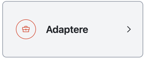
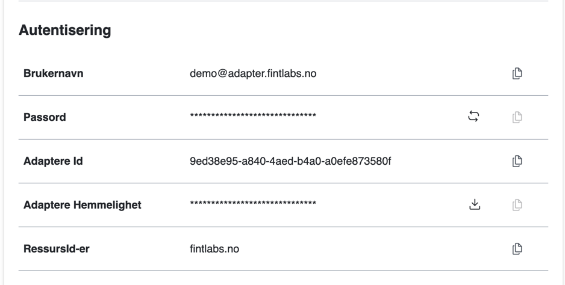

# Adapter

Et adapter leverer data til FINT. Oppsettene du oppretter i kundeportalen, gir et FINT-adapter tilgang til å kommunisere med FINT.
Dersom du hovedsakelig skal hente informasjon fra FINT (som en konsument), bør du heller [opprette en klient](klient.md).

## Opprette et nytt adapter

1. Logg inn på kundeportalen.

2. Klikk på **Adapter** i menyen (fjerde ikon fra toppen).  
   

3. Klikk på det store grønne symbolet med et pluss-tegn for å legge til et nytt adapter.  
   

4. Fyll ut feltene for brukernavn, kort beskrivelse og beskrivelse.
   - **Brukernavn**: Beskriv hva adapteret skal brukes til (f.eks. visma-hrm).
   - **Kort beskrivelse**: Dette vises i listen over adaptere.
   - **Beskrivelse**: Legg til en mer detaljert forklaring av adapterets funksjon.
   

5. Klikk på **Legg til**.

6. Finn adapteret som nettopp ble opprettet, og klikk på endre-symbolet.     
   

7. Klikk på **Komponenter** og huk av de komponentene som adapteret skal ha tilgang til.
   

   ?>Enkelte adaptere må kunne lese fra FINT, i tillegg til å levere data. I så fall må det opprettes en egen klient for adapteret. Rettigheten som settes gjelder kun det som adapteret skal kunne levere data for. 
 
8. Klikk så på **Autentisering**.
   

9. Klikk på oppdater-ikonet til høyre for **Passord** for å generere et nytt passord.  
   

10. Klikk på nedlasting-ikonet til høyre for **Klient Hemmelighet** for å hente hemmeligheten for klienten.  
   

11. Klikk på **Kopier autentiseringsinformasjon**. Påloggingsinformasjonen kan nå limes inn der du vil benytte den. Den kommer i dette formatet:

    ```json
    {
      “username”: “<klientnavn>@adapter.<fylke>.no”,
      “password”: “<fjernet>”,
      “clientId”: “<fjernet>”,
      “openIdSecret”: “<fjernet>“,
      “assetIds”: [“<fylke>.no”]
    }
    ```

**Tips:**
- Hvis passordet er `**********`, har du glemt å generere passord. Dette vil ikke fungere (se punkt 8).
- Selv om brukernavnet ser ut som en vanlig e-postadresse, er dette kun en tilgang i FINT-sammenheng og bør ikke forveksles med en domenebruker.
- Tenk på sikkerhet når autentiseringsinformasjonen skal videresendes. Den bør ikke sendes som klartekst i for eksempel en epost.

