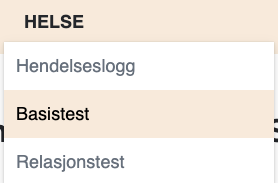
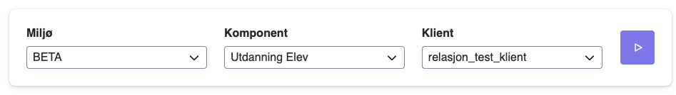
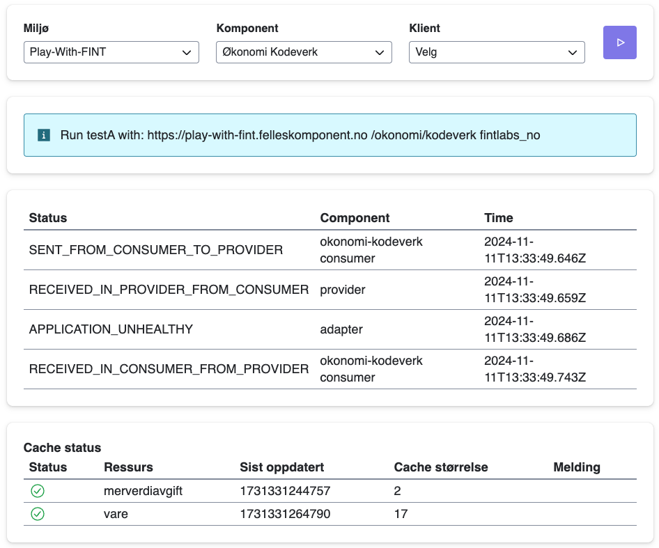

# Basistest

I kundeportalen ligger det to typer tester som skal brukes for å teste integrasjonene med FINT adapteret.

Trykk på helse i top-menyen, og deretter på basistest

Da kommer du inn på siden til basistest
Her velger du hvilken komponent du ønsker å sjekke, hvilket miljø og hvilken klient du bruker for å kjøre testen.

**Det er viktig å ha en egen testklient for å kjøre testene, som ikke brukes til noen annet, da passordet bli regenerert hver gang.**

For å kjøre testen klikker du på start knappen.

Resultatet av testen sier noe om helsen til komponenten, og hvor ferske dataen som ligger der er.
På bildet under ser man en test, som viser en komponent, som kjører og som har oppdaterte data.

Man kan også få tilfeller der helsestatusen er grønn, men cachestatusen er oransje. Eller at helsestatus er rød.

Hvis helsestatus er grønn og cache er orange, kan det være adapteret nylig har restartet, og man kan vente ca. 15 minutter for å sjekke igjen. Hvis problemet vedvarer, eller om helsestatus er rød, bør man inn på serveren som adapteret er installert på, og restarte tjenestene. Hvis ikke dette hjelper, kan må man kontakte FINT-prosjektet for å undersøke at alt er ok på den siden. I kundeportalen kan du opprette og fylle ut en supportsak fra menyen på venstre side.

