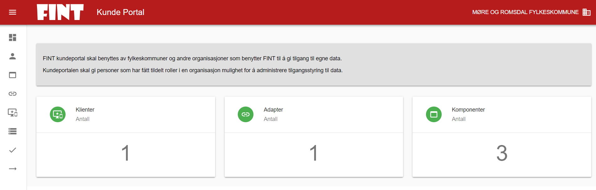
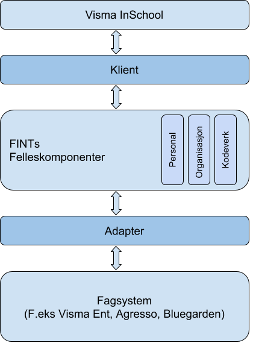
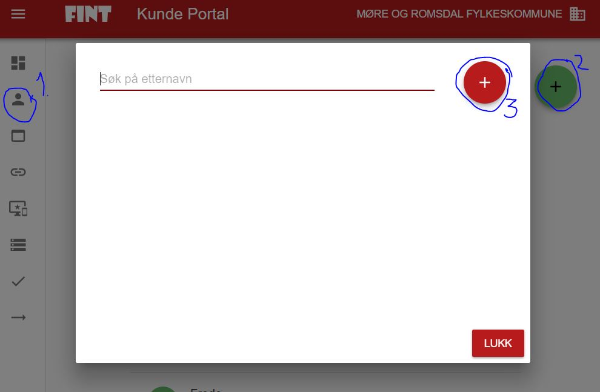
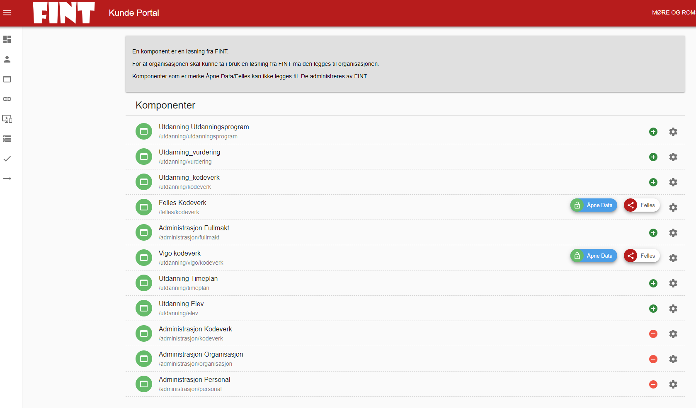
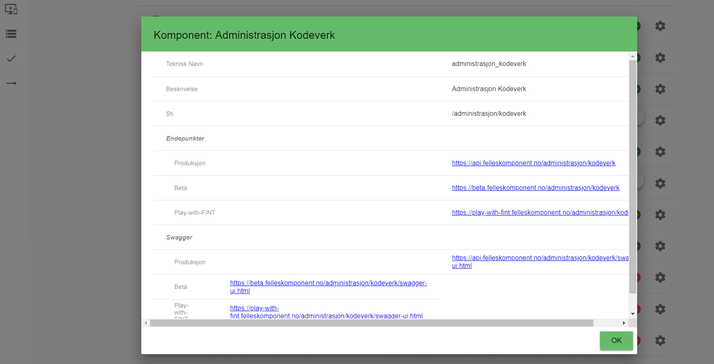

# Bli kjent med kundeportalen

### Startsiden

Når man har logget inn på kundeportalen, kommer man inn til et dashboard. Her kan man se antall klienter, adaptere og komponenter.

* `Komponent`: Inneholder alle felleskomponenter som er tilgjengelige. Her kan den enkelte fylkeskommune velge hvilke komponenter som skal være tilgjengelig for sin fylkeskommune. En felleskomponent må være aktivert for fylket for å kunne benyttes av klienter og adaptere.
* `Adapter`: Angir påloggingsinformasjon for adaptere som er installert av leverandøren til et av fylkeskommunens fagsystem. For eksempel må det opprettes et adapter i kundeportalen, slik at adapteret mot HR-systemet får korrekt påloggingsinformasjon, til komponenten som inneholder HR-informasjon.
* `Klient`: Her angis pålogginsinformasjon til komponenten som kan brukes av integrasjonsmotor, klient, applikasjon eller annen komponent i en arbeidsprosess. F.eks. må det opprettes en klient for at VIS skal få tilgang til ansattinformasjonen fra FINTs Felleskomponenter.

Her illustreres hvor klient, komponent og adapter er i dataflyten.

### Så hva er det vi nå skal gjøre?

* Vi skal opprette klienter i Kundeportalen for alle klienter som trenger tilgang til Felleskomponentene, og vi velger hvilke komponenter denne klienten skal ha tilgang til.
* Vi skal opprette adapter i Kundeportalen for alle fagsystemer som trenger tilgang til Felleskomponentene, og vi velger hvilke komponenter dette adapteret skal ha tilgang til.

For å opprette sitt oppsett, følger man valg i menystrukturen, som vises med symboler, på venstre side.

Første menypunkt, vist med blå sirkel i bildet under, er hvor man setter opp tekniske kontaktpersoner.

### Kontaktpersoner

Gå til Kontakter (1), og klikk på det grønne ikonet med en svart pluss i (2). Deretter trykk på det røde ikonet med en pluss i som kommer i vinduet som åpner seg (3). Der kan du, dersom du er juridisk teknisk kontakt, legge inn de tekniske kontaktene du ønsker skal ha tilgang til kundeportalen. Dersom kontakten du ønsker skal ha tilgang til kundeportalen ikke finnes i listen, ber du dem opprette en bruker.

### Komponenter

Her velger man hvilke komponenter man ønsker å gjøre tilgjengelig for sin organisasjon (hvilken organisasjon man har valgt vises i øvre høyre hjørne, i eksemplene vil det være Møre og Romsdal). De som har et grønt symbol med et pluss i, er komponenter som du kan legge til. De med rødt symbol med en minus i, er komponenter som allerede er lagt til. Man klikker på symbolet for å legge til eller fra komponenten. Hvis man klikker på tannhjulet bak det røde eller grønne symbolet, vil man få opp et vindu som viser informasjon om komponenten.

