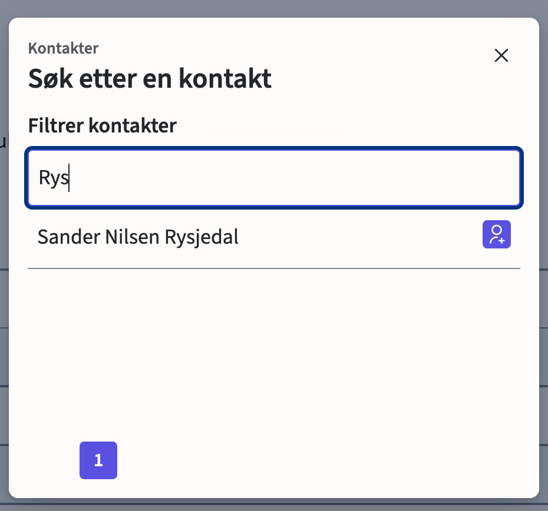
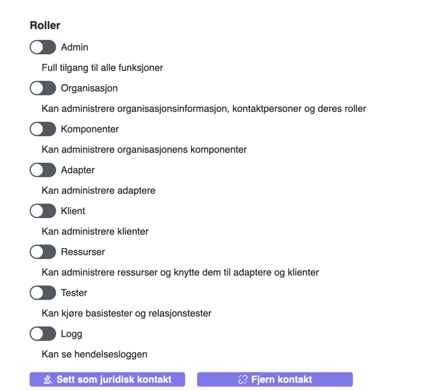

# Kontakter

Gå til Kontakter

Klikk på det **Legg til** knappen.

Her kan du søke etter personer. Søk må gjøres på etternavn. Fulle navnet kommer opp i listen.

Deretter trykk på det ikonet med en pluss.
Der kan du, dersom du er juridisk teknisk kontakt, legge inn de tekniske kontaktene du ønsker skal ha tilgang til kundeportalen.
Dersom kontakten du ønsker skal ha tilgang til kundeportalen ikke finnes i listen, ber du dem opprette en bruker i selv-registreringen vår.

# Roller
Du kan trykke på en bruker for å administrere rollene.
Du kan velge spesifikke roller ved å huke av de du trenger, 
eller du kan velge admin for å få alle rollene.
