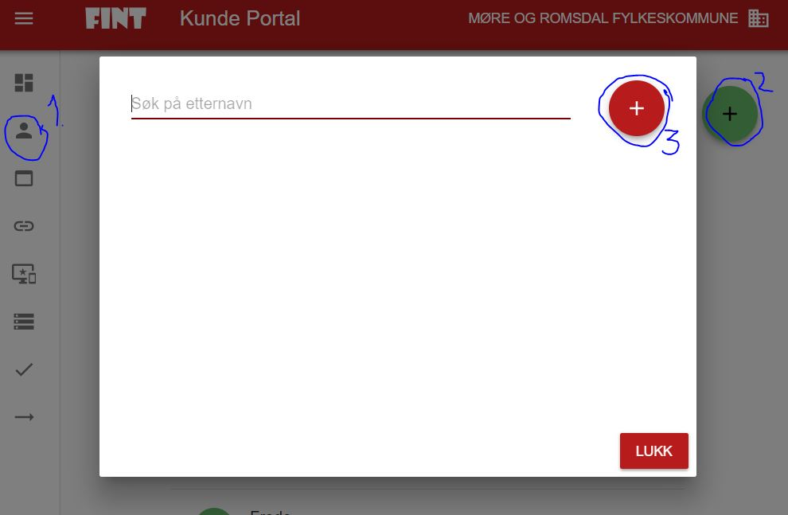

# Kontaktpersoner

Gå til Kontakter (1), og klikk på det grønne ikonet med en svart pluss i (2). Deretter trykk på det røde ikonet med en pluss i som kommer i vinduet som åpner seg (3). Der kan du, dersom du er juridisk teknisk kontakt, legge inn de tekniske kontaktene du ønsker skal ha tilgang til kundeportalen. Dersom kontakten du ønsker skal ha tilgang til kundeportalen ikke finnes i listen, ber du dem opprette en bruker.

