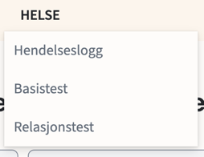
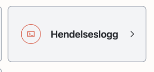
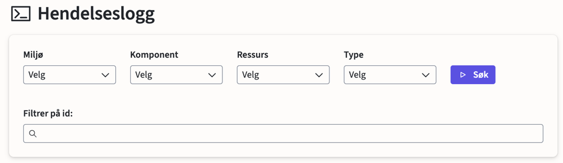
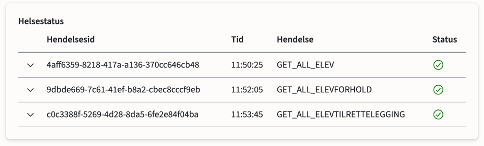
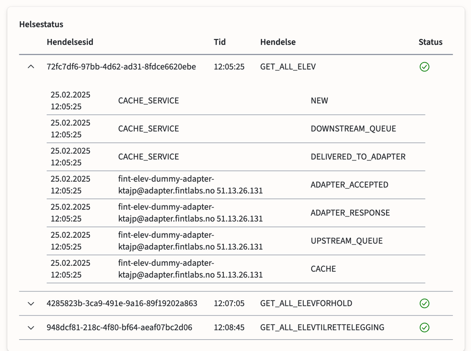

# Hendelseslogg

FINTs hendelseslogg gir deg oversikt over hendelsene som skjer i FINT versjon 1
Den finner du på kundeportalen, under Helse -> Hendelseslog.

Eller i hovedmenyen på landindsiden

I hendelseslogg må du velge miljø, komponent, resurs og typen du vill se loggen til.

Type oversikt:
> - GET_ALL: Er hendelsen som henter all data fra adapterene.
> - UPDATE: Henter kun data som er oppdatert.
> - GET: Henter spesifikke resurser.

Når du har valg det du vil se så vil loggen dukke opp under

