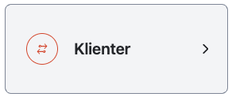
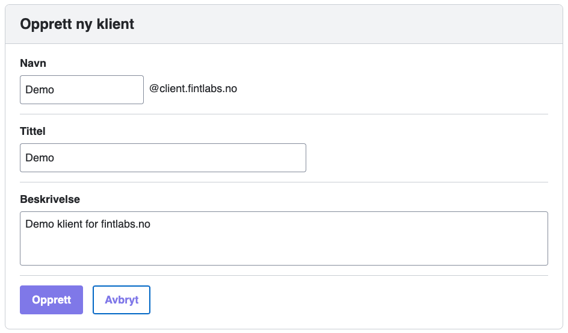
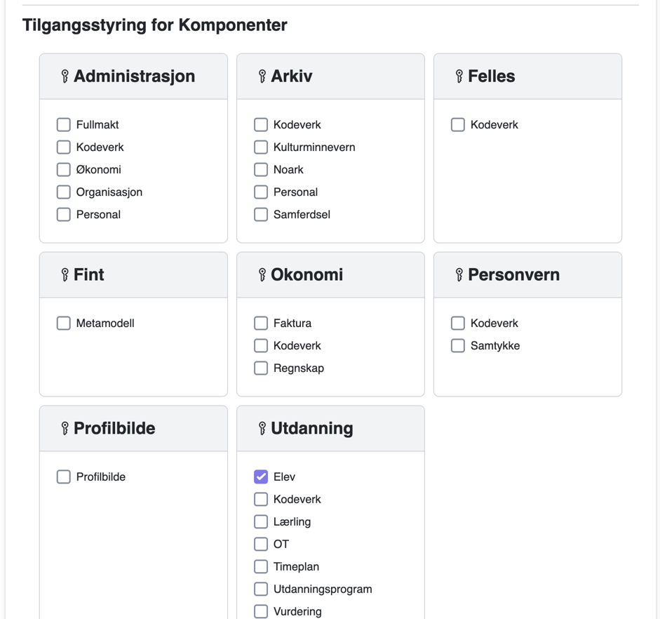
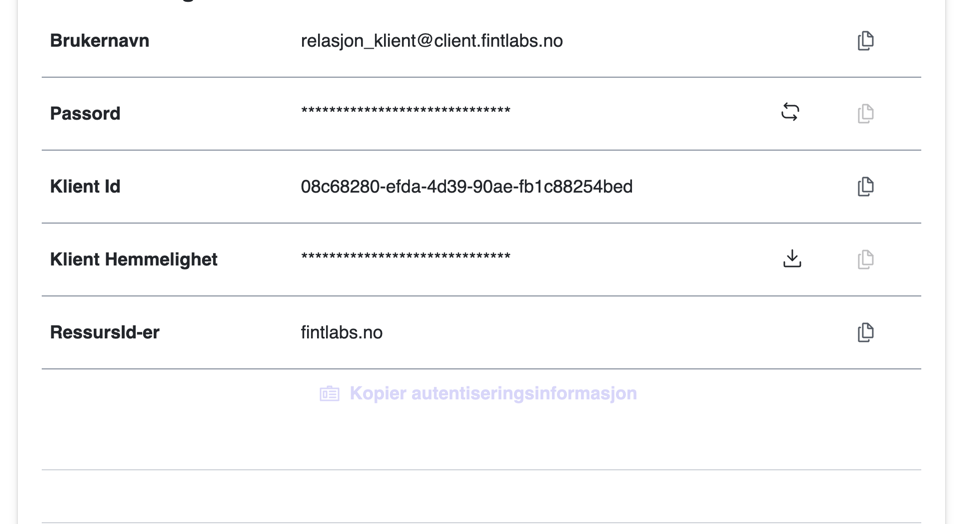
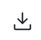

# Klienter

Menyvalgene Adapter og Klienter fungerer på samme måte, men de skiller seg basert på hvilket grensesnitt i felleskomponenten de har tilgang til. Adaptere får tilgang til Provider-grensesnittet og kan levere data til felleskomponenten, mens Klienter får tilgang til Consumer-grensesnittet og kan hente data fra felleskomponenten. Adaptere leverer vanligvis data til én komponent, mens Klienter kan hente data fra flere komponenter.

## Opprette en ny klient

Følg denne veiledningen for å opprette en ny FINT-klient. Denne kan brukes i [Testklient](technical/testclient.md), verktøy for å teste API-er som Postman eller Insomnia, eller for å opprette OAuth2-klienter i skreddersydde integrasjonstjenester.

?> Det er anbefalt å opprette en egen klient for hvert formål, dvs. ikke gjenbruke den samme klienten til forskjellige oppgaver. Hvis du endrer en klient som er i bruk, kan det føre til at integrasjonen slutter å fungere. Funksjonene **Basistest** og **Relasjonstest** i kundeportalen kan automatisk endre passord på klienten, så vi anbefaler at du ALLTID bruker egne klienter for disse funksjonene.

1. Logg inn på kundeportalen.

2. Klikk på **Klienter** i menyen (femte ikon fra toppen).  
   

3. Klikk på det store grønne symbolet med et pluss-tegn for å legge til et nytt adapter.  
   

4. Fyll ut feltene for brukernavn, kort beskrivelse og beskrivelse.
   - **Brukernavn**: Beskriv hva klienten skal brukes til (f.eks. relasjonstest).
   - **Kort beskrivelse**: Dette vises i listen over klienter.
   - **Beskrivelse**: Legg til en mer detaljert forklaring av klientens funksjon.
     

5. Klikk på **Legg til**.

6. Finn klienten som nettopp ble opprettet, og klikk på endre-symbolet.     
   

7. Klikk på **Komponenter** og huk av de komponentene som klienten skal ha tilgang til.
   

8. Klikk så på **Autentisering**.
   

9. Klikk på oppdater-ikonet til høyre for **Passord** for å generere et nytt passord.  
   

10. Klikk på nedlasting-ikonet til høyre for **Klient Hemmelighet** for å hente hemmeligheten for klienten.  
    

11. Klikk på **Kopier autentiseringsinformasjon**. Påloggingsinformasjonen kan nå limes inn der du vil benytte den. Den kommer i dette formatet:

    ```json
    {
      “username”: “<klientnavn>@client.<fylke>.no”,
      “password”: “<fjernet>”,
      “clientId”: “<fjernet>”,
      “openIdSecret”: “<fjernet>“,
      “assetIds”: [“<fylke>.no”]
    }
    ```

**Tips:**
- Hvis passordet er `**********`, har du glemt å generere passord. Dette vil ikke fungere (se punkt 8).
- Selv om brukernavnet ser ut som en vanlig e-postadresse, er dette kun en tilgang i FINT-sammenheng og bør ikke forveksles med en domenebruker.
- Tenk på sikkerhet når autentiseringsinformasjonen skal videresendes. Den bør ikke sendes som klartekst i for eksempel en epost.

