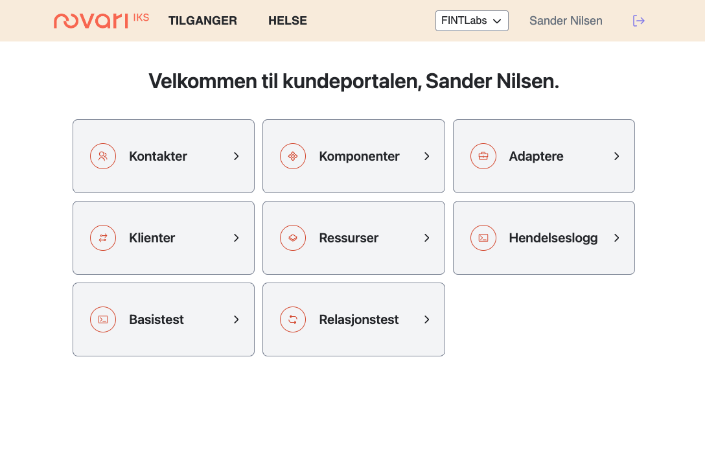

# Navigere rundt i kundeportalen

## Logge inn

Hvis du er lagt til som bruker i kundeportalen, logger du inn på følgende måte:

1. Åpne [kunde.felleskomponent.no](https://kunde.felleskomponent.no) i en nettleser.

2. Fullfør innloggingen med **ID-porten**.

3. Du er nå innlogget, og dashboardet vises:
   

4. De fleste brukere vil kun ha tilgang til én organisasjon. Hvis du er lagt til i flere organisasjoner, klikker du på organisasjonens navn øverst til høyre for å velge hvilken organisasjon du skal behandle.
   

### Startsiden

* `Komponent`: Inneholder alle felleskomponenter som er tilgjengelige. Her kan den enkelte fylkeskommune eller organisasjon velge hvilke komponenter som skal være tilgjengelig for sin fylkeskommune. En felleskomponent må være aktivert for fylket for å kunne benyttes av klienter og adaptere.
* `Adapter`: Angir påloggingsinformasjon for adaptere som er installert av leverandøren til et av fylkeskommunens fagsystem. For eksempel må det opprettes et adapter i kundeportalen, slik at adapteret mot HR-systemet får korrekt påloggingsinformasjon, til komponenten som inneholder HR-informasjon.
* `Klient`: Her angis pålogginsinformasjon til komponenten som kan brukes av integrasjonsmotor, klient, applikasjon eller annen komponent i en arbeidsprosess. F.eks. må det opprettes en klient for at VIS skal få tilgang til ansattinformasjonen fra FINTs Felleskomponenter.
* `Kontakter`: Her vises alle kontaktene som er i organisasjonen, der er det også mulig å legge til fler
* `Relasjonstest`: Her kan du kjøre en test for å se om det er relasjonsfeil i dataen som organisasjonen din har i FINT

Her illustreres hvor klient, komponent og adapter er i dataflyten.

### Så hva er det vi nå skal gjøre?

* Vi skal opprette klienter i Kundeportalen for alle klienter som trenger tilgang til Felleskomponentene, og vi velger hvilke komponenter denne klienten skal ha tilgang til.
* Vi skal opprette adapter i Kundeportalen for alle fagsystemer som trenger tilgang til Felleskomponentene, og vi velger hvilke komponenter dette adapteret skal ha tilgang til.

For å opprette sitt oppsett, følger man valg i menystrukturen, som vises med symboler, på venstre side.

Første menypunkt, vist med blå sirkel i bildet under, er hvor man setter opp tekniske kontaktpersoner.

