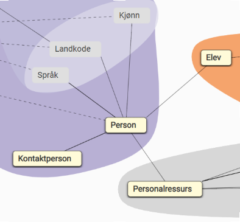

# Relasjonstest

FINTs relasjonstest kontrollerer alle utgående relasjoner fra en type ressurs.
Det vil si at fra ressursen Person, vil relasjonstesten kontrollere relasjonene til Kjønn, Landkode, Språk, Kontaktperson, Elev og Personalressurs, og kontrollere at relasjonen peker til en ressurs som eksisterer.

Starte relasjonstest
Opprett ny relasjonstest, og fyll ut følgende dialogboks:

Komponent-, Miljø- og Klientvalgene er like som for Basistest, mens Ressursvalget indikerer hvilken ressurs innenfor komponenten du ønsker å teste.

Relasjonstesten kan ta litt tid å gjennomføre, og det kan være mange testresultater. På oversiktsbildet viser Kundeportalen om testen pågår eller er fullført, og angir gjenstående tester før testen er ferdig.
Etter at testen er fullført vil oversikten indikere om testen er vellykket, eller om den har funnet feil i noen av relasjonene.
Ved å klikke på testen i oversikten, vises en oppsummering av relasjonstesten, og alle testresultatene kan lastes ned som en CSV-fil.
