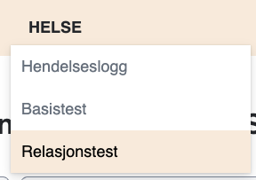
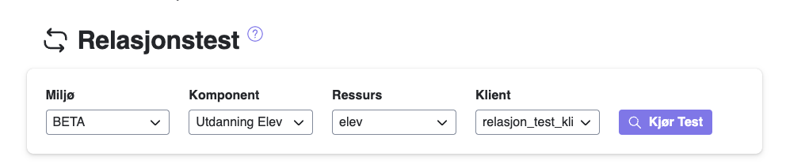
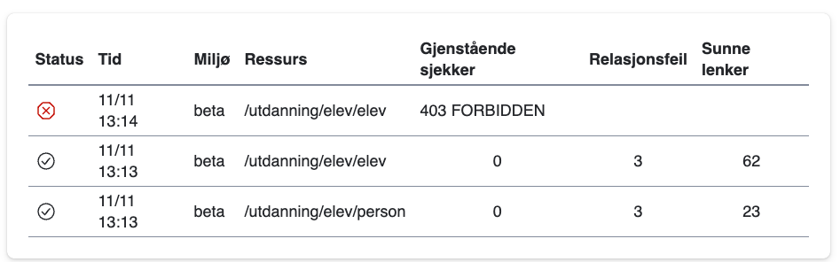

# Relasjonstest

FINTs relasjonstest kontrollerer alle utgående relasjoner fra en type ressurs.
Det vil si at fra ressursen Person, vil relasjonstesten kontrollere relasjonene til Kjønn, Landkode, Språk, Kontaktperson, 
Elev og Personalressurs, og kontrollere at relasjonen peker til en ressurs som eksisterer.

Overst i menyen trykker du på helse, også på relasjonstest.

Da kommer du inn på relasjonstes siden. Her veldiger du miljø, komponent, resurs og klienten du skal bruke til å teste.

**Klienten du velger vill få passordet sitt resatt, så vi anbefaler å ha egene klienter til å kjøre disse testene. Klienten må også ha tilgang til resursen som skal testes**

Under vil du se resultatet av testene som er kjørt. Der ser du også status på testen, og antall relasjonsfeiler og sunne lenker.

