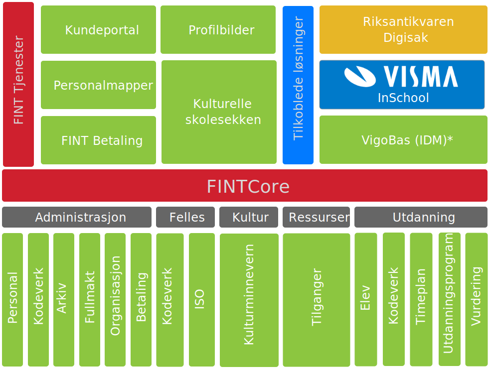

# Oversikt

## Administrasjon

  

  Bladi bladi

Se [informasjonsmodellen](https://informasjonsmodell.felleskomponent.no/docs/package_administrasjon) for mer detaljer.
  

  

  

## Utdanning

  

  Bladi bladi

Se [informasjonsmodellen](https://informasjonsmodell.felleskomponent.no/docs/package_utdanning) for mer detaljer.
  

  

  

## Kultur

### Den Kulturelle Skolesekken
#### Hva er Den Kulturelle Skolesekken?

Den kulturelle skolesekken (DKS) er en nasjonal ordning som sørger for at alle skoleelever i Norge får oppleve profesjonell kunst og kultur hvert år.
Gjennom ordningen får elevene mulighet til å oppleve, gjøre seg kjent med og utvikle forståelse for profesjonelle kunst- og kulturuttrykk.
DKS er et samarbeidsprosjekt mellom kultur- og opplæringssektoren på nasjonalt, regionalt og lokalt nivå, og omfatter alle skolene i Norge. Fylkeskommunen er ansvarlig for regional koordinering og programmering, men kommunene har også mulighet for å utvikle egne program lokalt. 
Informasjonen er hentet fra [denkulturelleskolesekken.no](https://www.denkulturelleskolesekken.no/forside/om-dks/)
#### API for håndtering av skoler, trinn, basis- og undervisningsgrupper.
Den Kulturelle Skolesekken og FINT utvikler et API som skal bidra til å effektivisere dagens manuelle håndtering av informasjon om skoler, elevtall, trinn, klasser m.m. i DKS portal og fagsystem. For at API-et skal fungere etter hensikten er det behov for tilgang til skoledata hos hvert enkelt fylke. I påvente av Visma InSchool må tilgang til skoledata løses ved hjelp av uttrekk fra det nåværende skoleadministrative systemet til fylkene.

#### Sett opp PIFU-uttrekk mot FINT.
FINT trenger tilgang til PIFU-IMS eksport av fylkets skoledata. Dette for å kunne sette opp adapter som datakilde for API-et mot DKS. 
Et PIFU-IMS adapter prosesserer uttrekk og tilgjengeliggjør data gjennom FINT sine felleskomponenter.	Fylkeskommunene styrer selv hvem som får tilgang til felleskomponentene og til hvilken informasjon.
De fylker som er koblet opp mot Visma InSchool (VIS) leverer allerede oppdaterte skoledata til FINT og trenger ikke aktivere og sette opp noe mer.
Fylkene som ikke er koblet på VIS må sende FINT tilgang til PIFU-eksporten fra deres skoleadministrative system, og opprette adapter, klient og ressurs i FINTs kundeportal.
#### Opprette adapter, klient og ressurs.
En teknisk kontakt fra fylkeskommunen oppretter et adapter, en klient og en ressurs via FINTs [kundeportal](https://kunde.felleskomponent.no).
En veiledning for opprettelse av adapter og klient finner du [her](https://www.fintlabs.no/#/tutorials). Felleskomponentene som skal aktiveres, på adapteret og klienten, er utdanningsprogram, elev og timeplan.
Når adapteret og klienten er laget, må en ressurs opprettes for å unngå at dataen blandes med eksisterende FINT-data. Som ressursnavn bruker du navnet på din fylkeskommune og bindestrek "dks". 
Eksempel: "viken-fylkeskommune-dks". Adapteret og klienten som er opprettet skal kobles til ressursen. Det gjør du ved å redigere ressursen og legge til adapter under "ADAPTERS" og klienten under "KLIENTER".
Ta kontakt med FINT når adapter og klient er opprettet slik at FINT kan få tilsendt autentiseringsinformasjonen på en sikker måte.

  

Se [informasjonsmodellen](https://informasjonsmodell.felleskomponent.no/docs/package_kultur) for mer detaljer.
  

  

  

