# Teknisk dokumentasjon

## Architectural overview - Common API
A Common API is a API on a business application. The Common API gets and sends information to/from a business application through an adapter. This document aims to describe how an adapter should be implemented.

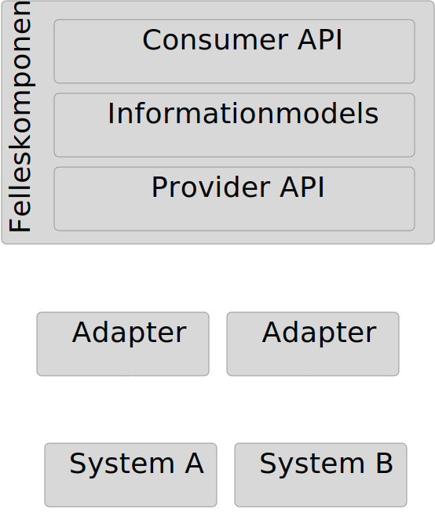

### Information Models
The Common API consist of standardized information models that will presented as resources in the Consumer API. Each Common API can consist of one or more information models. The models are documented here https://informasjonsmodell.felleskomponent.no

### Consumer API
Consumer API is where clients (applications, processes etc) access the data from the Business Application. 
Provider API
Provider API is where the adapter feeds the Common API with data.

### Adapter
The adapter is the “link” between the Common API and the Business Application. The main tasks for the adapter is:
Getting data from the Business Application
Mapping the data from the business application model to the Common API model
Sending the mapped data to the Common API

### Common API internals
The Common API has two main services:

* Cache service
* Event service

#### Cache Service

The cache service has the following responsibility:
Store data from the business applications for all the organisations using the Common API
Populate the cache
Keeps track of which data has changed since the last time the cache was populated

#### Event service

The internals in the Common API is event based. An event is created by:

* Cache Service
* Client

When a client hits a endpoint in the Consumer API the Common API is generating an event and sends it to the Cache Service. An event from the client will never go all the way down to the adapter.

When the Cache Service need to update the cache it sends an event down to the adapter.

All events are logged at all stages.


***Event flow***

### Provider API
The provider API is where the adapter communicates with the Common API. The adapter connects to get events from the Common API and sends back the response with the information from the business application.

The provider API makes use of SSE (Server-Sent-Events) (https://en.wikipedia.org/wiki/Server-sent_events) to send events to the adapter.

### Endpoints

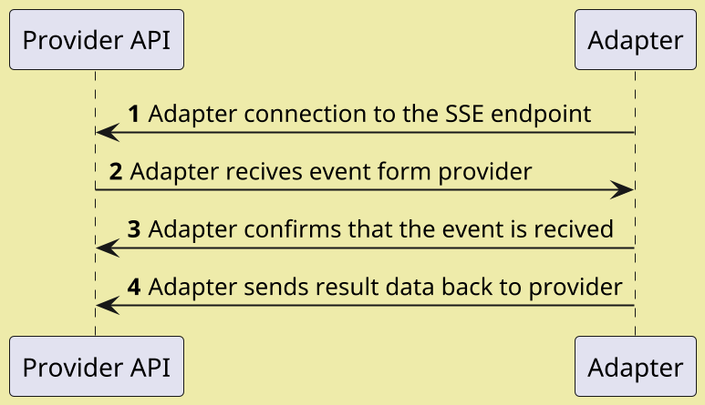

| Endpoint           | Method | Flow# | Description                                                                                                                               |
|--------------------|--------|-------|-------------------------------------------------------------------------------------------------------------------------------------------|
| /provider/sse/:id  | GET    | 1     | The adapter registers on this endpoint. Id should be an UUID. If the adapter supports several orgId’s each orgId must have it’s own UUID. |
| /provider/status   | POST   | 3     | When the adapter receives an event it should post back a status to tell the provider if the event can be handled.  Adapters must accept or reject events with `/status` within 120 seconds. |
| /provider/response | POST   | 4     | This is where the adapter sends back the response.  Adapters must respond to events within 20 minutes. |

### Authentication

The provider API is secured with OAuth2 using the Resource Owner Password Credentials Grant flow.

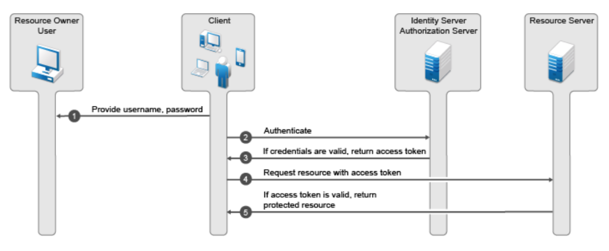

The ***Adapter is both Resource Owner and Client***. See https://github.com/fintlabs/fint-oauth-consumer-client-sample for an example implementation.

### Error handling

The adapter must handle the following error scenarios:
The event sent from the provider is not understood
There is something wrong with the received event
Could not communicate with the source system

All of the error situations should result in an event sent from the adapter to the provider with the status `PROVIDER_REJECTED`. If the adapter has information about the error this can be added to the message field in the event-object.

### Adapter skeleton

There is a skeleton as a starting point and guideline for develop a adapter. This skeleton has code for communicating with the provider api. See the readme for more information.

| Language | Link                                                               |
|----------|--------------------------------------------------------------------|
| Java     | https://github.com/fintlabs/fint-sse-adapter-skeleton        |
| C#       | https://github.com/fintlabs/fint-sse-adapter-skeleton-csharp |

### Information Models
The main purpose of the adapter is to map the internal business application model to the FINT information model. This includes relations between objects. 

The FINT information model consist of two key elements:

Main classes which represent the resources. This can be a person, student, employee, employment, code and so on.
Relations between main classes. 

For more information about the FINT information model and a description of all the classes, attributes and relations one can go to https://informasjonsmodell.felleskomponent.no.

The technical implementations of the models can be found at https://github.com/FINTmodels.

### Vocabulary

| Norwegian term  | English term         |
|-----------------|----------------------|
| Felleskomponent | Common API           |
| Fagapplikasjon  | Business application |


## Develop adapters
This articel amins to make you able to develop a FINT adapter.

### Getting started
A good startingpoint for developing an adapter is to go throug our quick tutorial:

* [Java](../tut-java-sse)
* [C#](../tut-dotnet-sse)

After that you can setup your adapter skeleton of choice:

* [Java skeleton](https://github.com/fintlabs/fint-sse-adapter-skeleton)
* [C# (.NET core) skeleton](https://github.com/fintlabs/Fint.Sse.Adapter.Skeleton)


### What does the skeleton do and what do you need to do?
The skeletons has all the code to:

* Connect to FINT
* Authentiacte to FINT (OAuth2)
* All the communication with FINT

Your task as a adapter developer is to:

1. Reponde to `events` sent from FINT
2. Interact with you backend system
3. Map you data to FINT 
4. Send back the information asked for in the `event`


## Events

The general flow between FINT and adapters are:

1. Adapter subscribes to events using the SSE endpoint
1. FINT delivers events on the SSE stream
1. Adapter accepts the event by `POST`ing to the status endpoint.  There is a 2-minute timeout on accepting events. If you use the adapter skeleton this is already handled.
1. Adapter responds to the event by `POST`ing to the response endpoint.  There is a 15-minute timeout on responding to events.

### Causes for events

FINT components produce events for three reasons:
- Health status requests
- Periodic cache update events every 15 minutes, triggering `GET_ALL_*` events.
- Incoming POST / PUT requests from clients.  Every request produces exactly one event.

FINT expects exactly one status and one response to every event delivered.  Additional responses will be rejected with `410 GONE`.

### Event kinds

FINT Adapters must be able to handle three different kinds of events:

  1. Request for system health status
  1. Requests to get all instances of a class from the FINT Consumer Cache Service
  1. Requests to get a single element of a class from the FINT Consumer API.
  1. Requests to update (create, modify or delete) a single element of a class from the FINT Consumer API.

The FINT Consumer will be issuing the events to the FINT Provider for the relevant `assetID`, and the FINT Provider will dispatch the event to all adapters connected and registered for this `assetID`.

This enables scenarios with distributed or redundant adapters where several adapters share the workload of handling events.  The adapter run-time instances must coordinate between themselves which instance responds to an event, since the provider will only accept a single set of responses for any given event.

Workloads can be distributed using two different strategies, which also could be combined:

  1. Divide and conquer: Different adapters handle different actions for a given component.  For instance, for `/administrasjon/personal`, one adapter could handle `Personalressurs` and `Arbeidsforhold`, and a different adapter could handle `Fastlonn`, `Variabellonn`, etc.
  1. Active and passive:  Several adapters are configured to respond to the same event, but coordinate internally to determine which of the instances should respond.

Any adapter instance registered with the asset ID can handle events in three ways:

  1. Accept the event and respond with data.  The consumer handles the data from the response.  Other adapters attempting to respond will receive a `410` status from the Provider.
  1. Reject the event.  The consumer ignores any data from the response.  Other adapters attempting to respond will receive a `410` status from the Provider.
  1. Ignore the event, assuming another instance is handling it.  If no other adapter is handling the events, the provider will expire the event after 120 seconds.

### System health status (`HEALTH`)

Every FINT Consumer has a health endpoint (`/admin/health`) that clients could `GET` from to
request health status.

Adapters have 30 seconds to respond to this health event.  The request payload contains an array
of health status structures, and the response should contain the same, with one additional element
for the status of the adapter and connection to the back-end systems.

The health status structure looks like this:

    {
      "component": "adapter",
      "status": "APPLICATION_HEALTHY",
      "timestamp": 1571327388028,
      "time": "2019-10-17T15:49:48.028Z"
    }

`timestamp` is in milliseconds since Unix epoch, `time` in ISO 8601.

`status` should be `APPLICATION_HEALTHY` or `APPLICATION_UNHEALTHY` depending on the state of the back-end application.

### Get all instances of a class (`GET_ALL_`_type_)

The FINT Consumer Cache Service issues these events every 15 minutes to update the consumer in-memory cache with all elements of the type.

Adapters are expected to retrieve all active elements from the back-end system and insert the data in the response event.

### Get a single instance of a class by ID (`GET_`_type_)

FINT Consumer APIs issue these events in cases where clients want the most recent version of a given element, and waits for the adapter to respond before returning data to the client.

The event's `query` attribute contains the `Identifikator` field name and field value to identify the element in the form _`field/value`_, exactly as the URI of the element in the Consumer API.

For instance, for `Personalressurs` with an `ansattnummer` ID of `12345`, the URI would be `/administrasjon/personal/personalressurs/ansattnummer/12345`, and the `query` attribute would then be `ansattnummer/12345`.

Adapters are expected to extract the `query` attribute, search the back-end system for the most recent version of the requested element.

For error situations, the adapter can control the HTTP response returned to the client using the following:

| `responseStatus` | `statusCode`   | HTTP result |
|------------------|----------------|-------------|
| `ERROR`          | (any)          | `500`       |
| `REJECTED`       | `"GONE"`       | `410`       |
| `REJECTED`       | `"NOT_FOUND"`  | `404`       |
| `REJECTED`       | (other values) | `400`       |

### Create a new element, or update an existing element by ID (`UPDATE_`_type_)

FINT Consumer APIs issue these events for `POST`, `PUT`, and `DELETE` requests for a given type, according to the following:

| REST Operation                     | `operation`| `query`       |
|------------------------------------|------------|---------------|
| `POST /path/to/type`               | `CREATE`   | (empty)       |
| `POST /path/to/type?validate=true` | `VALIDATE` | (empty)       |
| `PUT /path/to/type/field/value`    | `UPDATE`   | `field/value` |
| `DELETE /path/to/type/field/value` | `DELETE`   | `field/value` |

The adapters are expected to handle the various operations according to the following:

  - `VALIDATE`: The payload must be subjected to a semantic validation according to business rules, but not stored in the back-end system.  The response must either be `ACCEPTED` or `REJECTED` to indicate whether the payload is valid or not, or `ERROR` if the validation cannot be performed and should be retried.
  - `CREATE`: The payload must be subjected to a semantic validation according to business rules, supplied with a `systemId` `Indentifikator` (if relevant), and stored in the back-end system.  The response payload must be updated to correspond to the final version stored in the back-end system.  The response status must be `ACCEPTED`, `REJECTED`, or `CONFLICT` to indicate if the payload was valid or not, or if the creation conflicts with any other data in the system.  The `ERROR` response indicates a transient error, and that the creation can be retried.
  - `UPDATE`: The existing element, identified by the `query` field, should be updated with the payload according to business rules and which fields are `writable` in the FINT information model.  The response payload must include the final version stored in the back-end system.  Response status as above.
  - `DELETE`: The existing element, identified by the `query` field, should be removed from the back-end system if this is valid according to the business rules.  No response payload is expected, response status as above.

Events *must* be responded with a `responseStatus` setting indicating the result of the operation:

| `responseStatus` | HTTP status | Description of result
|------------------|-------------|------------------------
| `ACCEPTED`       | `303`       | The operation was accepted and completed successfully.  Based on event payload, the FINT API produces a `Location` header referring to the newly created resource.
| `REJECTED`       | `400`       | The operation was rejected.  The `message`, `statusCoude` and `problems` fields contain explanations as to why.
| `ERROR`          | `500`       | An error occurred during processing of the event.  The client may retry the same operation later.
| `CONFLICT`       | `409`       | The operation is in conflict with other activity.  The response contains an updated version of the resource so the client can update its own state.

If write operations are not supported or permitted, the event must be rejected by posting `ADAPTER_REJECTED` at the `/status` phase.

The response payload is handled according to the following, depending on ResponseStatus:

- `ACCEPTED`: The payload is added to the cache
- `REJECTED`: The payload is ignored.
- `ERROR`: The payload is ignored.
- `CONFLICT`: The payload is added to the cache.

Note the last clause.  For CONFLICT the adapter is supposed to deliver the most recent version of the information, so clients and the FINT cache can be updated.


## How to deal with errors

Since `UPDATE_` events involves multiple components and is based on events,
errors are bound to happen. 

### Update conflicts

Sometimes the update attempted is in conflict with other data in the back-end
system.  This could for instance be:

 - Attempts to create data with identifiers that refer to existing information.
 - Modifications that create illegal state when combined with existing information.

 In both cases, the adapter must reject the update with `CONFLICT` response status.  Furthermore, the response must contain the payload that the original
 update conflicts with.

 This enables the client to update its information and possibly modify the
 update before another attempt is made.

### Lost events

The update events could be lost at multiple stages of the flow.  To better
illustrate where this happens, let's first describe the successful scenario.

#### Successful case

The following sequence diagram illustrates the successful case, where 
information is updated, and the client successfully recieves confirmation
of the update.

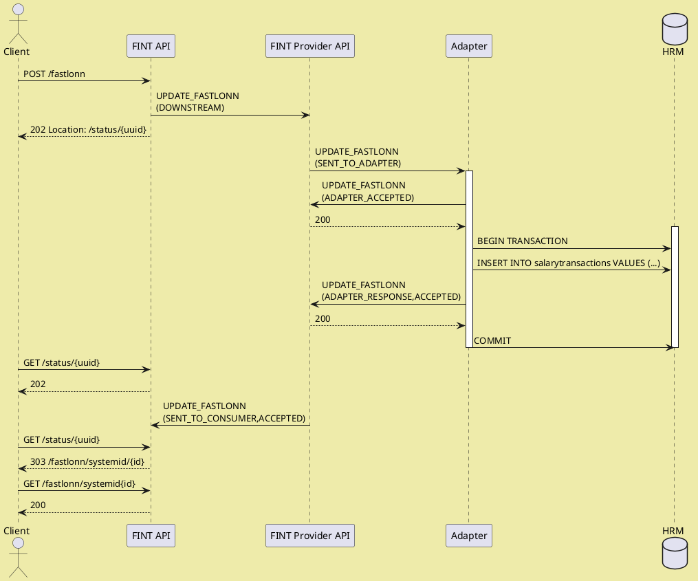

#### Event is lost before it reaches adapter

This is the simplest failure scenaro to handle.  Nobody gets informed of the
update, and the update can safely be retried after the original update
has expired.

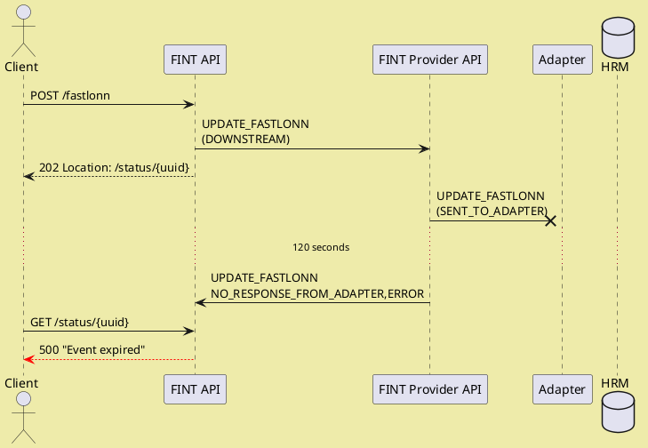

#### Event is confirmed by adapter, but not updated in back-end system

This scenario is very similar to the one above - the only difference is 
the time it takes for the event to expire.

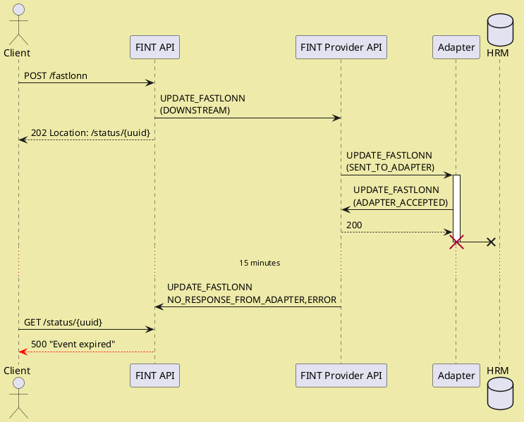

#### Event is confirmed and updated in back-end system, but client is not notified

This is the most difficult scenario.  Since the back-end system has been 
updated, the event cannot safely be retried, although the client does not
know.  There are basically two ways to resolve this issue.

Which of these is better depends on the back-end system's ability to record
and roll back pending modifications.


##### Roll back the modification so it can safely be retried.

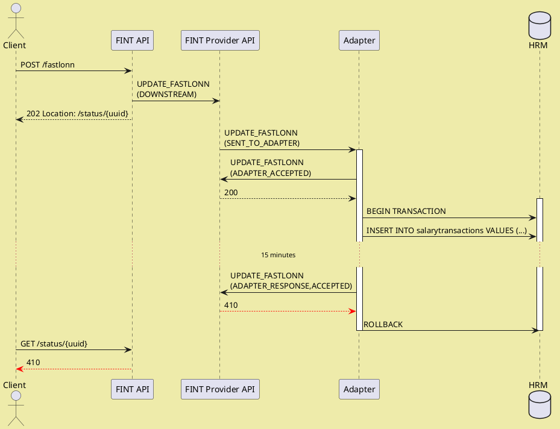

For this case to be possible, the connection between the
adapter and the back-end system must support transaction
rollback, or similar compensating operations.

##### Use conflict detection to reject a retry with `CONFLICT` status.

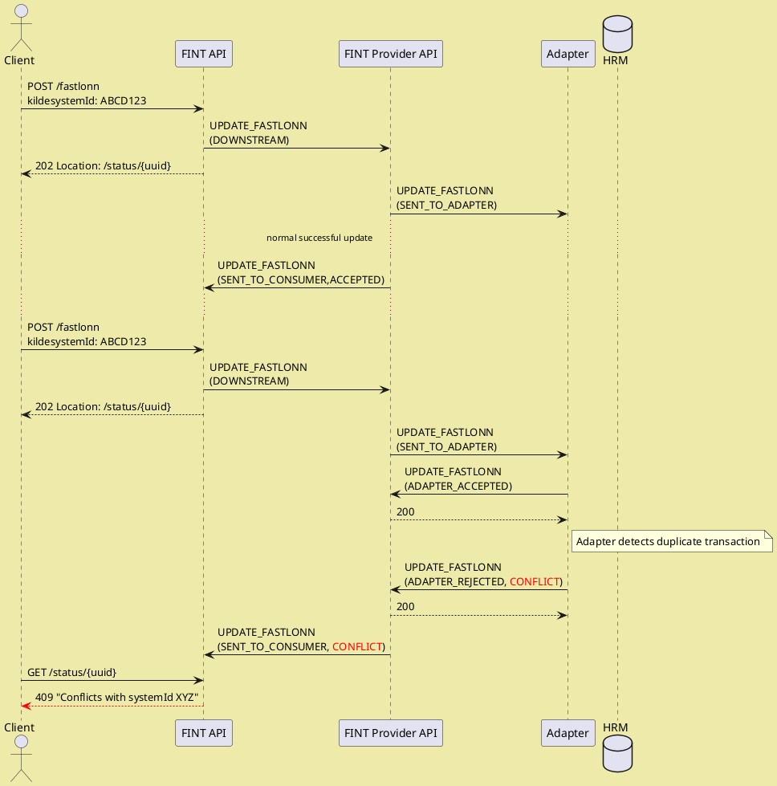

In this latter case, client support is required for the state
of the update to be synchronized correctly between client and
back-end system.  For this to work, it is essential that the
adapter correctly responds to the `CONFLICT` with a response
payload indicating the current state of the information in the
back-end system, and that the client correctly handles the
`409` status and updates its pending transaction with this
information.

## What is REST?

>The basis for almost all modern web-based APIs.

### REST? HATEOAS? HAL?
#### Representational state transfer

https://en.wikipedia.org/wiki/Representational_state_transfer

#### Hypermedia As The Engine Of Application State

https://en.wikipedia.org/wiki/HATEOAS

#### Hypertext Application Language

https://en.wikipedia.org/wiki/Hypertext_Application_Language


## Information Model at the Center

In FINT APIs, the information model defines how the APIs are structured and how they function.

### Types of classes

The FINT information model has four types of classes:

1. Main classes (`hovedklasse`)
1. Abstract classes
1. Complex datatypes
1. References

Only main classes are directly accessible from FINT APIs, and every main class in the model has an API endpoint.

?>A main class is equivalent to a resource in REST

All other types are used to construct the main classes, either by abstraction of common fields, or to represent fields in the classes.

### Identity

Main classes have identity, and can be referred to using an identifier value.  This is represented by attributes of the type `Identifikator`.  All main classes have at least one attribute of this type, but it's perfectly legal to have more than one identifying attribute.

If the class has multiple identifying attributes, any of the identifying attributes can be used to reference it, and the FINT API exposes endpoints to refer to the class by all of the identifying attributes.

For instance, `Personalressurs` can be identified by both `ansattnummer`, `brukernavn` and `systemId`. 

### Relations

Relations can be added to main classes, either directly or in an abstract base class.  In addition, attributes of the class can be comples datatypes, which also can have relations.

The name of the relation represents the relationship from the source to the target, and is often the name as the class of the target.

Relations can be optional or mandatory, single-valued or multi-value.  In any case, they are always represented in the same form. 

All relations are in the `_links` attribute on the class it links from.  Remember, this can be an inner complex datatype.  

The `_links` attribute is an object where the name of the relation is used as the property name.  The property is an array of objects with a `href` attribute containing the URI to the target resource.

All relations to other resources in the information model *always* refer to a main class using one of the identifiable fields.

The FINT model also includes references to resources outside the model.  These are represented by a special type of relation called `Referanse`.  They are also represented as URIs.

### Attributes

Attributes in the resources can either be complex datatypes or any of the primitive types:

- string
- integer
- float
- dateTime

Attributes can be optional or mandatory, single-valued or multi-value.  Multi-value attributes are always represented as an array, even if there is only a single value.

Dates are represented in ISO 8601 form with UTC time zone: `2019-06-05T09:48:23Z`.

## Naming convention

FINT information objects are named based on the packaging structure in the information model:

- Administrasjon `/administrasjon`
  - Fullmakt `/administrasjon/fullmakt`
  - Kodeverk `/administrasjon/kodeverk`
  - Organisasjon `/administrasjon/organisasjon`
  - Personal `/administrasjon/personal`
- Utdanning `/utdanning`
  - Elev `/utdanning/elev`
  - Kodeverk `/utdanning/kodeverk`
  - Timeplan `/utdanning/timeplan`
  - Utdanningsprogram `/utdanning/utdanningsprogram`
  - Vurdering `/utdanning/vurdering`

For every package, classes of the stereotype `hovedklasse` are accessible through the FINT API.
As an example, for the package *Personal* within the domain *Administrasjon*, the following classes
are currently `hovedklasse`:

- Personalressurs `/personalressurs`
- Arbeidsforhold `/arbeidsforhold`
- Fravær `/fravar`
- Fastlønn `/fastlonn`
- Fasttillegg `/fasttillegg`
- Variabellønn `/variabellonn`

Norwegian characters are translated according to the following scheme:

| Original | Replacement |
|---|---|
| æ | a |
| ø | o |
| å | a |


## Common operations

These operations are available for all classes in the FINT information model.

### Get all objects of a given class

`/domain/package/class`, i.e. `/administrasjon/personal/personalressurs`

This operation fetches all objects of a given class from the FINT cache.  The response looks
like this:

```json
{
    "_embedded": {
        "_entries": [
            {
                
            },
            {
                
            }
        ]
    },
    "_links": {
        "self": [
            {
                "href": "..."
            }
        ]
    },
    "total_items": 111
}
```

### Fetch individual item by identifier

`/domain/package/class/field/value`, i.e. `/administrasjon/personal/personalressurs/ansattnummer/123456`

Given an identifier field name (any field of type `Identifikator`) and the identifier value, try
fetching the individual item.

### Size of cache for a given class

`/domain/package/class/cache/size`, i.e. `/administrasjon/personal/personalressurs/cache/size`

Return the size of the cache for a given class.  The response looks like this:

```json
{
  "size": 10632
}
```

### Timestamp for when cache was last updated

`/domain/package/class/last-updated`, i.e. `/administrasjon/personal/personalressurs/last-updated`

Return a timestamp indicating when the cache was last updated.  The response looks like this:

```json
{
  "lastUpdated": "1559551091034"
}
```

### Get objects updated since timestamp

`/domain/package/class?sinceTimeStamp=<time>`, i.e. `/administrasjon/personal/personalressurs?sinceTimeStamp=1559551091034`

Returns a collection of all objects that have been updated (added or modified) later than the
provided timestamp.  The response looks like this:

```json
{
    "_embedded": {
        "_entries": [
            {
                
            },
            {
                
            }
        ]
    },
    "_links": {
        "self": [
            {
                "href": "..."
            }
        ]
    },
    "total_items": 2
}
```

If `total_items` is `0`, this indicates that there are no new updates since the given timestamp.

### Health Check

`/domain/package/admin/health`, i.e. `/administrasjon/personal/admin/health`

Triggers a health check towards the adapter providing data.  The response indicates whether the adapter is connected and responding.

## General guidelines

To get the most value from FINT APIs, some guidelines to follow.

### Information is a Graph

FINT's resources have relatively few attributes, but more relations.  Every resource only has the attributes that are
directly relevant for the resource.  Everything else is represented as relations (links) to other resources. 
As an example, the class `Personalressurs`, representing an employee, does not have the employee's name.  Instead there is
a link to `Person`, representing a private person, where you find the properties of the employee as a private person.

#### Refer, not Replicate

Information always changes.  Stale data is often worse than not having any data at all.  The FINT API is based on the principle that information should be fetched from the source when needed, not replicated beforehand.

#### References are Stable

Resources in FINT are represented using URIs.  These URIs are constructed by the API based on attributes that can be used to identify the resource, represented by the type `Identifikator`.

As long as the identifiable attribute does not change, neither does the URI representing the resource.

### Everything is a Resource

All classes in the FINT information model is represented in the exact same way, as resources with URIs and references using URIs to other classes it refers to.

The type of the resource is explicit from the URI of the resource.  For instance, from the URI `/administrasjon/personal/personalressurs`, the type of the resource is always `Personalressurs`.


## Updating information using FINT

Updates use HTTP operations to create, modify and delete information.  It builds upon the "everything
is a resource" principle, so when updating information the resource URI is central.

### Asynchronous operations

Since the updates must propagate via the FINT component and an adapter before being processed by the
back end system, updates might take some time to complete.  For this, FINT APIs use asynchronous
operations as described in http://restcookbook.com/Resources/asynchroneous-operations/.

The process is as follows:

1. The client initiates an update operation.
1. The FINT API validates the syntax of the operation and responds with status code `202` and a `Location` 
   header referring to a `/status/<uuid>` resource
1. The client fetches the *Status* resource.
   - If the operation is still pending, the FINT API keeps responding with status code `202`.
1. If the operation has completed, the FINT API responds with the final status of the update:
   - If successful, status `303` with a `Location` referring to the resource that has been
     created or updated.
   - _Note:_ If the operation is a deletion, the status code is `410` instead.
   - If rejected by the back-end system, status `400` with a response body indicating the error.
   - If the update is in conflict with other updates or data in the back-end system, the status
     is `409` and the response body contains the original information the update conflicts with.
   - If there was a temporary failure processing the request, status `500` with the
     error message.
      In this case the client can re-try the request.

The *Status* resource is valid for 30 minutes after initiating the original request.

### Creating new objects

`POST /domain/package/class`, i.e. 
`POST /administrasjon/personal/fravar`

The body must be a complete resource to be created, including `_links` to other resources it refers to.

Internal identifiers controlled by the back-end system can be omitted.

### Modifying existing objects

`PUT /domain/package/class/field/value`, i.e. `PUT /administrasjon/personal/personalressurs/ansattnummer/123456`

The resource to be modified is identified by the identifiable field and value.
Any field of type `Identifikator` can be used to identify the resource.

The body must be the complete resource after modification.
Attributes that can be modified are indicated in the information model.

### Deleting objects

`DELETE /domain/package/class/field/value`, i.e. `DELETE /administrasjon/personal/fravar/systemid/abcdef1234`

Not all information classes support deletion.
If deletion is not supported, the operation is rejected with status `400`.


## Accessing
All FINT APIs are protected, and require Bearer token authorization.

### OAuth 2.0 Resource Owner Credentials Flow

To access FINT resources, a valid Bearer token must be obtained from the FINT IDP.  Authorization details are available from the FINT customer portal, https://kunde.felleskomponent.no

### Example projects for accessing FINT data

- Java, using Spring Boot: https://github.com/FINTLabs/client-example-spring
- Java, using Google HTTP and OAuth libraries: https://github.com/FINTLabs/client-example-plain-java
- Node.JS: https://github.com/FINTLabs/client-example-node
- Kotlin, using Spring Boot: https://github.com/FINTLabs/client-example-kotlin-spring
- Elm: https://github.com/FINTLabs/fint-api-client-demo
- BizTalk: https://github.com/FINTLabs/Fint.BizTalk.Example
- C#: https://github.com/FINTLabs/Fint.DotNet.Example

### Libraries for accessing OAuth protected resources

- Spring Boot OAuthRestTemplate: https://github.com/FINTLabs/fint-oauth-token-service

### Obtaining a valid Bearer token using `curl`

```bash
curl -s ${IDP_URL} \
-u "${OAUTH_ID}:${OAUTH_SECRET}" \
-d grant_type=password \
-d username="${OAUTH_USER}" \
-d password="${OAUTH_PWD}" \
-d scope="${SCOPE}" | \
jq -r '.access_token'
```

After obtaining the valid token, add it to the request header:

```bash
curl -H "Authorization: Bearer ${TOKEN}" https://.....
```

## FINT environments

FINT offers three environments, Play-with-FINT, Beta and Production:

- https://play-with-fint.felleskomponent.no
- https://beta.felleskomponent.no
- https://api.felleskomponent.no

For all of these environments the URIs follow the same pattern, so to find employee #33445, append the following path to the URI: `/administrasjon/personal/personalressurs/ansattnummer/33445`.

## JSON Schema

FINT offer [draft-07](https://json-schema.org/specification.html) JSON Schema for all classes in the FINT information model.  These are available under https://fintlabs.no/schema/

To find a particular schema, the domain of the resource class and the name of the resource is added to the URI in the form `<domain>/<class>.json`

For insance, the schema for `Personalressurs` is available at https://fintlabs.no/schema/administrasjon/personalressurs.json

## GraphQL API

FINT also offers an experimental [GraphQL](https://graphql.org/) API for accessing data as a graph.

The GraphQL endpoint is at `/graphql/graphql`.  It requires the same Bearer token as the rest of the FINT APIs.

Our recommended client to test GrapqQL is https://insomnia.rest - using this the OAuth credentials from the customer portal can be used directly as an Environment.

Create a `POST` request to the GraphQL endpoint, configure OAuth 2, and Insomnia fetches the GraphQL schema so you can validate the query and see the results.

### FINT GraphQL Schema

The GraphQL schema for FINT follow the information model exactly.  The root schema defines query endpoints for all resources by an identifier.  It is not possible to get all resources for a class for performance reasons.

### Example queries

Here are some examples to get you started.

#### Employee information

Given an employee ID, find person's name and National Identity Number, all positions with size and place of employment:

```graphql
query ($ansattnummer: String) {
  personalressurs(ansattnummer: $ansattnummer) {
    person {
      fodselsnummer {
        identifikatorverdi
      }
      navn {
        fornavn
        etternavn
      }
    }
    arbeidsforhold {
      ansettelsesprosent
      arbeidssted {
        organisasjonsKode {
          identifikatorverdi
        }
        organisasjonsnavn
      }
    }
  }
}
```

#### Student information

Given a student's FEIDE name, find student's contact information, school and home address. 

```graphql
query ($feidenavn: String) {
  elev(feidenavn: $feidenavn) {
    kontaktinformasjon {
      epostadresse
      mobiltelefonnummer
    }
    elevforhold {
      skole {
        navn
        organisasjon {
          organisasjonsnavn
        }
      }
    }
    person {
      navn {
        fornavn
        etternavn
      }
      bostedsadresse {
        adresselinje
        postnummer
        poststed
      }
    }
  }
}
```

#### Class membership

Given a teaching group's systemId, find names and contact information for all students in that group:

```graphql
query ($systemId: String) {
  undervisningsgruppe(systemId: $systemId) {
    navn
    beskrivelse
    elevforhold {
      elev {
        kontaktinformasjon { 
          mobiltelefonnummer
        }
        person {
          navn {
            fornavn
            etternavn
          }
        }
      }
    }
  }
}
```

## Tools

## FINT Test Client

FINT has a web-based test client for accessing and inspecting data available through FINT.

This test client is available under the URL `/test-client/` for each environment, i.e.:

- https://play-with-fint.felleskomponent.no/test-client/
- https://beta.felleskomponent.no/test-client/
- https://api.felleskomponent.no/test-client/

For Play-with-FINT the test client immediately presents you with the welcome page where you can
enter the URI for a resource to access.  The other two requires authentication, so you'll need to provide
valid authorization details for a client from FINT's customer portal.

On the welcome page, enter the URI for a resource, i.e. `/administrasjon/organisasjon/organisasjonselement`
and hit the button.  Results are presented as JSON, and all the URLs can be clicked to follow links to
other resources from within the test client.

### Get FINT Token Web
FINT has a web-based tool to get a token that you can use to insert a token using i.e. `ModHeader` plugin for `Chrome`.

https://token.fintlabs.no/

### fint-curl

This script can be used to fetch a protected FINT resource, fetching a bearer token when needed.

To use it, copy the client authorization details from https://kunde.felleskomponent.no to a file called `client.json` in the current directory.  The name and location of this file can be overridden using the environment variable `CLIENT`.

```bash
#!/bin/bash

#set -x

if ! ( curl --version > /dev/null && jq --version > /dev/null)
then
	echo "Required tools curl and jq not installed"
	exit 1
fi

case $(uname -s) in
	Linux)
		STATSZ="stat -c %s"
		STATMT="stat -c %Y"
		;;

	Darwin)
		STATSZ="stat -f %z"
		STATMT="stat -f %m"
		;;

	*)
		echo "Unknown OS $(uname -s)"
		exit 1
		;;
esac

CLIENT=${CLIENT:-client.json}
TOKEN=${CLIENT}.token

if [[ ! -e $CLIENT ]]
then
    echo "Client settings missing"
    exit 1
fi

eval $(cat $CLIENT | jq -r  "\"OAUTH_ID=\"+.clientId, \"OAUTH_SECRET=\"+.openIdSecret, \"OAUTH_USER=\"+.username, \"OAUTH_PWD=\"+.password, \"SCOPE=\"+.scope, \"IDP_URL=\"+.idpUri, \"ASSET_ID=\"+.assetId")

if [[ ! ( -e $TOKEN ) || $($STATSZ $TOKEN) -lt 10 || ( $(( $(date +%s) - $($STATMT $TOKEN) )) -gt 3500 ) ]]
then
    curl -f -s ${IDP_URL:-https://idp.felleskomponent.no/nidp/oauth/nam/token} -u "${OAUTH_ID}:${OAUTH_SECRET}" -d grant_type=password -d username="${OAUTH_USER}" -d password="${OAUTH_PWD}" -d scope="${SCOPE:-fint-client}" | jq -r '.access_token' > $TOKEN
fi

if [[ $($STATSZ $TOKEN) -lt 10 ]]
then
	echo "Authorization failure"
	exit 1
fi

curl -H "Authorization: Bearer $(cat $TOKEN)" -H  "accept: application/json;charset=UTF-8" -H "Content-Type: application/json" -H  "x-org-id: ${ASSET_ID:-fintlabs.no}" -H  "x-client: ${OAUTH_USER}" $*

```

### jsonvalidate

This Python 2.7 script performs JSON schema validation on a collection of resources.  The schema to use is provided as an URI on the command line.  It reads the resources from standard input, so it can be piped with `fint-curl` above to retrieve the data, i.e.

```bash
fint-curl https://beta.felleskomponent.no/administrasjon/personal/personalressurs | \
jsonvalidate https://fintlabs.no/schema/administrasjon/personalressurs.json
```

Make sure the libraries are the most recent ones from PyPI, the versions supplied with Debian / Ubuntu are too old.

```python
#!/usr/bin/python

import jsonschema
import requests
import sys
import json
from tqdm import tqdm

r = requests.get(sys.argv[1])

schema = r.json()

data = json.load(sys.stdin)

validator = jsonschema.Draft7Validator(schema)

print "Validating", data["total_items"], "items..."

errors = 0

with open("errors.log", "a") as logfile:
	for item in tqdm(data["_embedded"]["_entries"]):
		try:
			validator.validate(item)
		except Exception as e:
			errors += 1
			print >> logfile, item
			print >> logfile, e
	
print "Validation completed with", errors, "errors."

```

## Test klient

### Veiledning i bruk av Test klient
FINTLabs har laget en testklient som kan brukes. Den finner du her https://beta.felleskomponent.no/test-client/

Her får man opp en påloggingsvindu med 5 felter:

Påloggingsinfo hentes fra Kundeportalen til FINT. [Her](kundeportal) finner du fremgangsmåten for å opprette klienter i kundeportalen.

```
Client ID: xxxxx
Client Seceret: xxxxxxxxxxxxxx
Username: xxxxxxx
Password: xxxxxxxx
OrgId: xxxxxxx
```

Når man har logget inn kommer man hit:

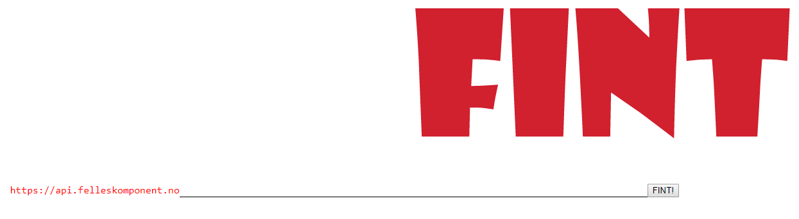

Her kan man legge inn de endepunktene som skal sjekkes ved å lime/skrive inn endepunktet på følgende måte:

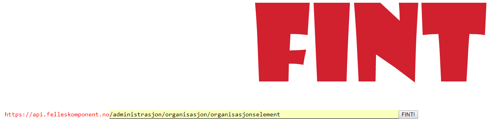

Trykk så på knappen bak hvor det står FINT!

Da får du opp resultatet i JSON format:

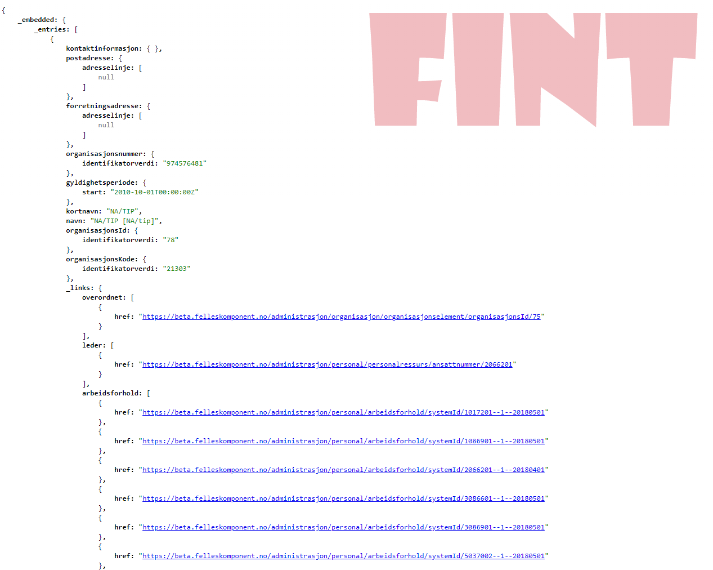

Under `_links` er koblinger til andre modeller. Man kan klikke på linkene for å se hvilken informasjon som ligger i koblingen.

Verdiene her bør sjekkes mot informasjonsmodellen og mot fagsystemet. Sjekk at multiplisiteten og typen er korrekt. Sjekk også at dataen er fylt ut i korrekte felter.

Informasjonsmodellen finnes her:

https://informasjonsmodell.felleskomponent.no/docs

!>Det kan være utvidelser i modellen på denne siden i forhold til den versjonen av adapteret som testes.

Her kan man også finne de andre modellene/endepunktene som skal sjekkes (i menyen til venstre)

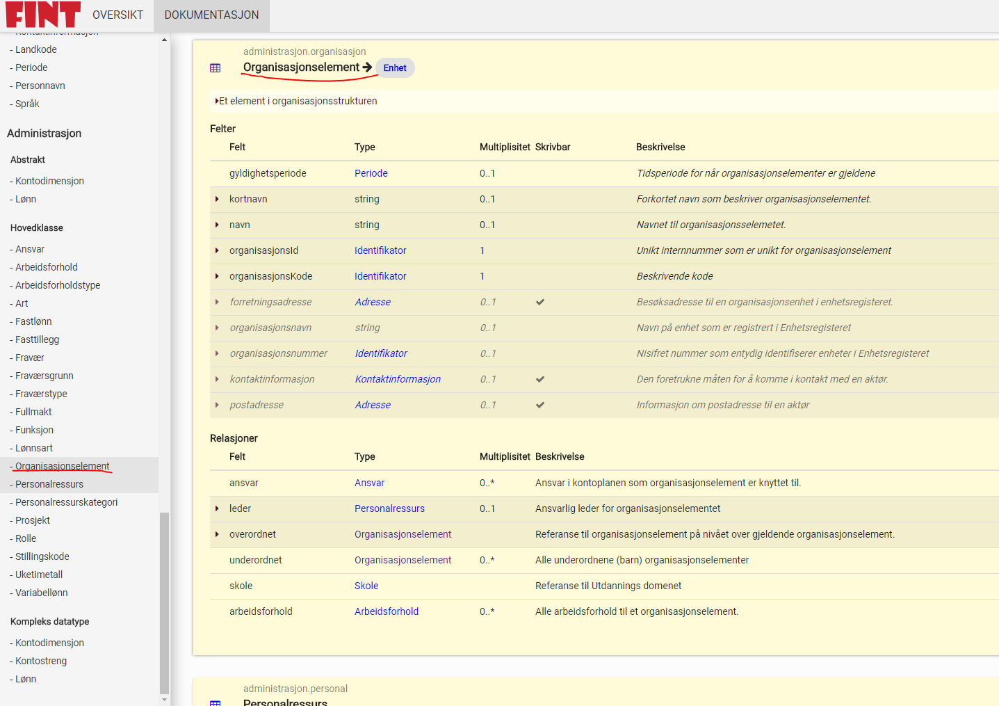


Endepunkter som må sjekkes:

**Leveranse 1 – `Personal/ Ansatt`**

* `administrasjon/personal/person`
* `administrasjon/personal/personalressurs`
* `administrasjon/personal/arbeidsforhold`

**Leveranse 1 – `Kodeverk`, som f.eks**

* `administrasjon/kodeverk/art`
* `administrasjon/kodeverk/ansvar`
* `administrasjon/kodeverk/funksjon`
* `administrasjon/kodeverk/prosjekt`
* `administrasjon/kodeverk/lonnsart`
* `administrasjon/kodeverk/stillingskode`

**Leveranse 1 – `Organisasjonsstruktur`**
* `administrasjon/organisasjon/organisasjonselement`

 

### Tester
Gjennomfør stikkprøver hvor dere verifiserer at overført informasjon kommer i rett felt.

#### Opprett ny ansatt i HR-system
Sjekk at den ansatte vises i VIS (hvis du har tilgang til VIS, ellers sjekk i TestClient)
Endre informasjon på en ansatt i HR-system f.eks.

* Adresse
* Telefonnummer
* Ansettelsesprosent
* Hovedstilling
* Stillingstittel
* Tilstedeprosent
* Årslønn
* Sjekk om informasjonen blir endret tilsvarende i VIS (hvis du har tilgang til VIS, ellers sjekk i TestClient)

#### Slett bruker i HR-system

* Verifiser at bruker blir slettet fra VIS (hvis du har tilgang til denne, ellers sjekk i TestClient)

#### Flytte en ansatt mellom to virksomheter
* Flytt en ansatt fra en virksomhet til en annen virksomhet
* Verifiser at vedkommende blir flyttet tilsvarende i VIS (hvis du har tilgang til VIS, ellers sjekk i TestClient)
* Verifiser at personen blir slettet fra den ene og opprettet på den andre virksomheten
 

#### Opprett en ansatt på to virksomheter

* Verifiser at den ansatte blir opprettet på begge virksomheter i VIS (hvis du har tilgang til VIS, ellers sjekk i TestClient)
 

#### Kontroller antall ansatte på virksomheten

* Sjekk antall ansatte registrert i HR-system på aktuell virksomhet
* Sjekk antall ansatte registrert i VIS på aktuell virksomhet (hvis du har tilgang til VIS, ellers sjekk i TestClient)
 

#### Kriterier
**Ansatt**

*Agresso*, kriterier som bestemmer hvilke data som overføres til FINT/VIS:

* fødselsnummer må være ulikt `00000000019`
* ansatte `+/- 365 dager` fra dagens dato når HR-adapteret overfører informasjon til FINT/VIS

*Visma Enterprise*, kriterier som bestemmer hvilke data som overføres til FINT/VIS:
* filtrering på selskapsnr, slik at kun fylkeskommunens ansatte hentes ut. (Ikke fk-foretak o.l.)
* ansatte `+/- 365 dager` fra dagens dato når HR-adapteret overfører informasjon til FINT/VIS

## Informationmodels
### Models and Common API
*FINT Information models* are models used in the *Common API*. The models contains information resoures the county council use in their day to day tasks. *FINT* aims to develop this model to contain vital information in all the areas the county council operates in. This means that every new version will contain more information and an new areas.

>Go to [Information Model at the Center](api?id=information-model-at-the-center) for more details.

#### Versioning

FINT is using [semantic versioning](http://semver.org/) for its models:

- `MAJOR` version have **backwards incompatible changes**
- `MINOR` *(feature release)* versions add functionality in a **backwards-compatible manner**, and
- `PATCH` *(bug fixes)* versions add **backwards-compatible bug fixes**. 

Additional labels for pre-release and build metadata are available as extensions to the `MAJOR.MINOR.PATCH` format. 

- `MINOR` versions are generally even numbers: 0, 2, 4, ...
- `PATCH` numbers are released in increments of 10: 0, 10, 20, ...

>The version relation between the *FINT Information model* and the *technical implementations* is that they start with the same `MAJOR.MINOR.PATCH` versions.  Additional releases of *technical implementations* based on the **same** *FINT Information model* will increment the `PATCH` number by `1`. 

### FINT information models
The models are designed and documented in `Enterprise Architect (EA)`. You can find the `EA` project at [https://github.com/fintlabs/fint-informasjonsmodell](https://github.com/fintlabs/fint-informasjonsmodell). 

#### Documentation portal
For a more userfriendly view of the models we developet a frontend to the `XMI 2.1` export from `EA`. You can find the documentation portal at [https://informasjonsmodell.felleskomponent.no](https://informasjonsmodell.felleskomponent.no).

The project for the frontend is found [here](https://github.com/fintlabs/fint-informasjonsmodell-documentation).

#### Contribute
If you find bugs or have suggestions for improvement please feel free to submit an [issue](https://github.com/fintlabs/fint-informasjonsmodell/issues).

#### Latest versions

| **Component**     | **GitHub Release**                                                                                                                                                     |                                                                                                                                                                            |
|-------------------|------------------------------------------------------------------------------------------------------------------------------------------------------------------------|----------------------------------------------------------------------------------------------------------------------------------------------------------------------------|
| Information Model | [](https://github.com/fintlabs/fint-informasjonsmodell)       | [](https://informasjonsmodell.felleskomponent.no/)                                        |
| **Java**          | **GitHub Release**                                                                                                                                                     | **Package Version**                                                                                                                                                        |
| Event Model       | [](https://github.com/FINTmodels/fint-event-model)                             | [](https://bintray.com/fint/maven/fint-event-model/_latestVersion)                             |
| Relation Model    | [](https://github.com/FINTmodels/fint-relation-model)                       | [](https://bintray.com/fint/maven/fint-relation-model/_latestVersion)                       |
| Common            | [](https://github.com/FINTmodels/fint-felles-model-java)                 | [](https://bintray.com/fint/maven/fint-felles-model-java/_latestVersion)                 |
| Administration    | [](https://github.com/FINTmodels/fint-administrasjon-model-java) | [](https://bintray.com/fint/maven/fint-administrasjon-model-java/_latestVersion) |
| Education         | [](https://github.com/FINTmodels/fint-utdanning-model-java)           | [](https://bintray.com/fint/maven/fint-utdanning-model-java/_latestVersion)           |
| Vigo Code Lists   | [](https://github.com/FINTmodels/fint-vigokv-model)                           | [](https://bintray.com/fint/maven/fint-vigokv-model/_latestVersion)                           |
| **.NET**          | **GitHub Release**                                                                                                                                                     | **Package Version**                                                                                                                                                        |
| Event Model       | [](https://github.com/FINTmodels/Fint.Event.Model)                             | [](https://bintray.com/fint/nuget/FINT.Event.Model/_latestVersion)                             |
| Relation Model    | [](https://github.com/FINTmodels/Fint.Relation.Model)                       | [](https://bintray.com/fint/nuget/FINT.Relation.Model/_latestVersion)                       |
| Common            | [](https://github.com/FINTmodels/FINT.Model.Felles)                           | [](https://bintray.com/fint/nuget/FINT.Model.Felles/_latestVersion)                           |
| Administration    | [](https://github.com/FINTmodels/FINT.Model.Administrasjon)           | [](https://bintray.com/fint/nuget/FINT.Model.Administrasjon/_latestVersion)           |
| Education         | [](https://github.com/FINTmodels/FINT.Model.Utdanning)                     | [](https://bintray.com/fint/nuget/FINT.Model.Utdanning/_latestVersion)                                    |