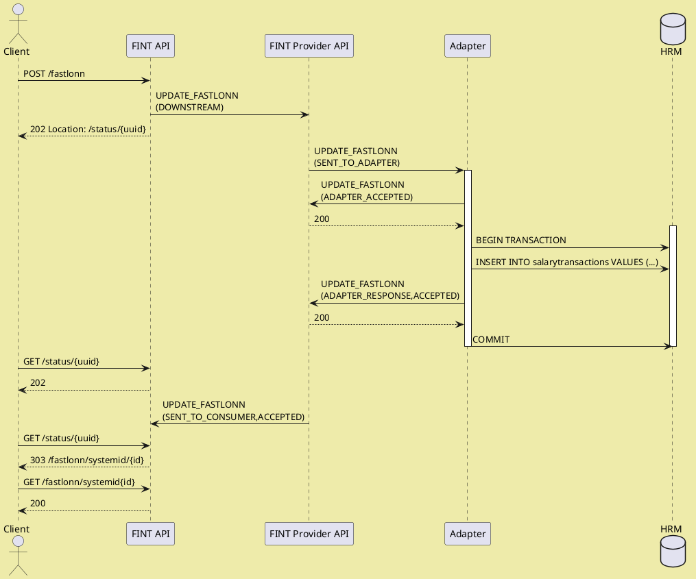
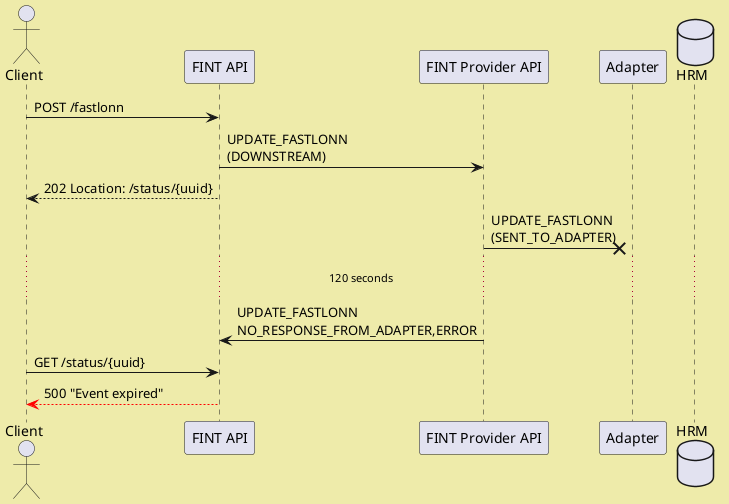
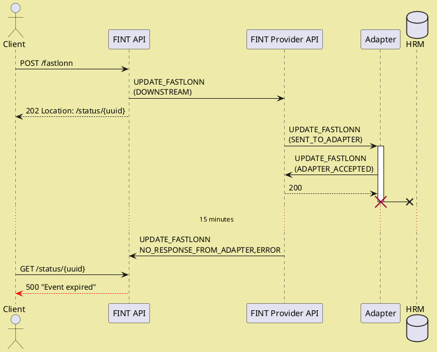
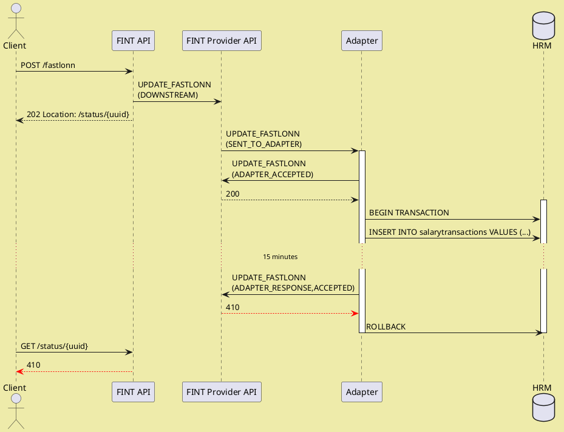
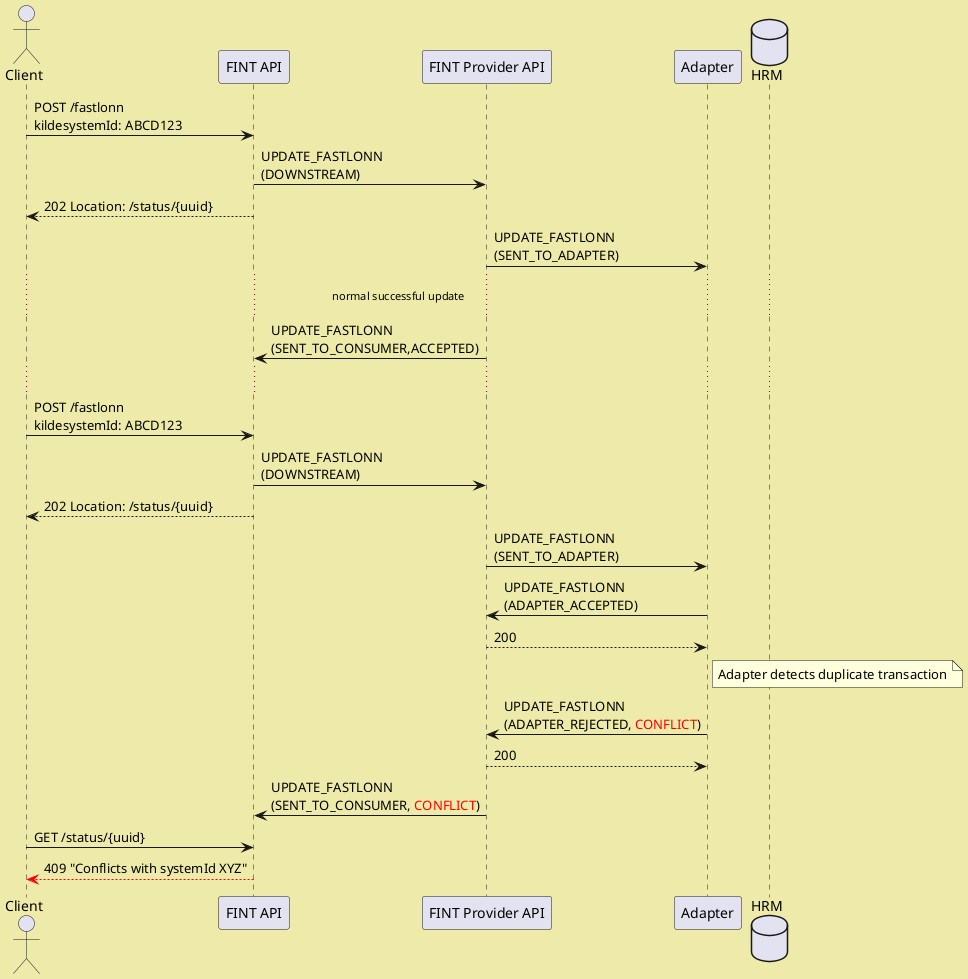
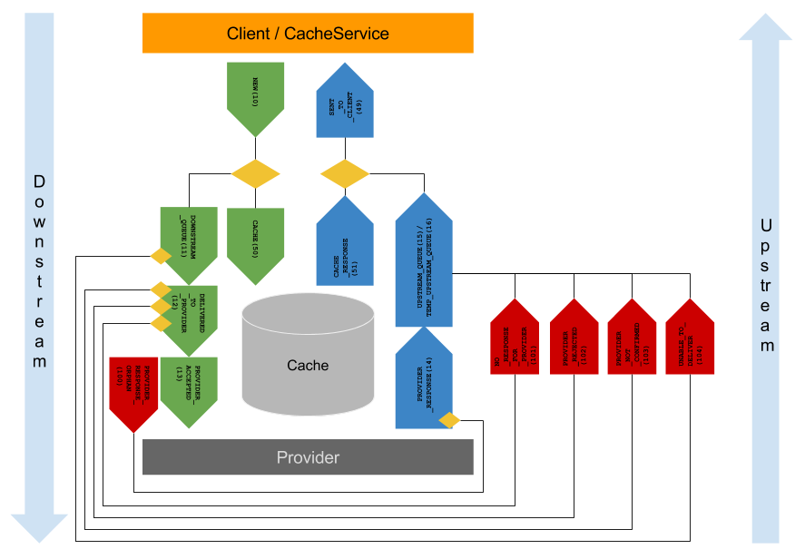

# Teknisk dokumentasjon

## Developing an adapter

### Getting started

A good starting point for developing an adapter is our quick tutorials:

* [Java](../tutorials?id=java-sse-adapter)
* [C Sharp/.NET](../tutorials?id=net-sse-adapter)

After that you can setup your adapter skeleton of choice:

* Java skeleton - <https://github.com/fintlabs/fint-sse-adapter-skeleton>
* C Sharp/.NET skeleton -  <https://github.com/fintlabs/Fint.Sse.Adapter.Skeleton>

### What does the skeleton do and what do you need to do?

The skeleton handles **connection**, **authorization** and **communication** with FINT.

Your task as developer of an adapter is to:

1. Repond to `events` sent from FINT
2. Interact with you back-end system
3. Map you data to FINT
4. Send back the information asked for in the `event`

### Mapping data

FINT's information model is available as classes in Java and C#.  The naming of classes follow the naming of the classes in the information model.  Model classes are available here:

* Java -- <https://github.com/FINTmodels/fint-information-model-java>
* C# -- <https://github.com/FINTmodels/FINT.Information.Model>

#### Maven and Nuget dependencies

Libraries are deployed to Bintray for each component, i.e. `administrasjon`, `utdanning`, `arkiv`, `okonomi`.  The library version is the same as the model version.  They have the following naming convention:

* Java -- `fint-<component>-resource-model-java`, i.e. `fint-administrasjon-resource-model-java`.
* C# -- `FINT.Model.Resource.<Compponent>`, i.e. `FINT.Model.Resource.Administrasjon`.

### Linking resources

The FINT APIs have a link mapping service which ensures that links between resources follow the naming conventions and locations for our API endpoints.  Using these mapped links ensures that all URIs presented to clients are valid.

Mappable links are represented according to the following pattern:

* `${<component>[.<package>].<class>}/<field>/<identifier>`
* `${felles.person}/fodselsnummer/12345678901`
* `${administrasjon.personal.personalressurs}/ansattnummer/12345`
* `${utdanning.elev.skoleressurs}/systemid/ABCD123`

In the Java and C# libraries, links are represented using a `Link` class.  This class has static constructors that can be used to create valid relations.

Java:
```java
Link.with(Person.class, "fodselsnummer", "12345678901");
```

C#:
```cs
Link.with(typeof(Person), "fodselsnummer", "12345678901");
```

### Events

The general flow between FINT and adapters are:

1. Adapter subscribes to events using the SSE endpoint
2. FINT delivers events on the SSE stream
3. Adapter accepts the event by `POST`ing to the status endpoint.  There is a 2-minute timeout on accepting events. If you use the adapter skeleton this is already handled.
4. Adapter responds to the event by `POST`ing to the response endpoint.  There is a 15-minute timeout on responding to events.

#### Causes for events

FINT components produce events for three reasons:

* Health status requests
* Periodic cache update events every 15 minutes, triggering `GET_ALL_*` events.
* Incoming POST / PUT requests from clients.  Every request produces exactly one event.

FINT expects exactly one status and one response to every event delivered.  Additional responses will be rejected with [`410 GONE`](https://http.cat/410).

#### Event kinds

FINT Adapters must be able to handle three different kinds of events:

  1. Request for system health status
  1. Requests to get all instances of a class from the FINT Consumer Cache Service
  1. Requests to get a single element of a class from the FINT Consumer API.
  1. Requests to update (create, modify or delete) a single element of a class from the FINT Consumer API.

The FINT Consumer will be issuing the events to the FINT Provider for the relevant `assetID`, and the FINT Provider will dispatch the event to all adapters connected and registered for this `assetID`.

This enables scenarios with distributed or redundant adapters where several adapters share the workload of handling events.  The adapter run-time instances must coordinate between themselves which instance responds to an event, since the provider will only accept a single set of responses for any given event.

Workloads can be distributed using two different strategies, which also could be combined:

  1. Divide and conquer: Different adapters handle different actions for a given component.  For instance, for `/administrasjon/personal`, one adapter could handle `Personalressurs` and `Arbeidsforhold`, and a different adapter could handle `Fastlonn`, `Variabellonn`, etc.
  1. Active and passive:  Several adapters are configured to respond to the same event, but coordinate internally to determine which of the instances should respond.

Any adapter instance registered with the asset ID can handle events in three ways:

  1. Accept the event and respond with data.  The consumer handles the data from the response.  Other adapters attempting to respond will receive a [`410`](https://http.cat/410) status from the Provider.
  1. Reject the event.  The consumer ignores any data from the response.  Other adapters attempting to respond will receive a [`410`](https://http.cat/410) status from the Provider.
  1. Ignore the event, assuming another instance is handling it.  If no other adapter is handling the events, the provider will expire the event after 120 seconds.

#### System health status (`HEALTH`)

Every FINT Consumer has a health endpoint (`/admin/health`) that clients could `GET` from to
request health status.

Adapters have 30 seconds to respond to this health event.  The request payload contains an array
of health status structures, and the response should contain the same, with one additional element
for the status of the adapter and connection to the back-end systems.

The health status structure looks like this:

```json
{
  "component": "adapter",
  "status": "APPLICATION_HEALTHY",
  "timestamp": 1571327388028,
  "time": "2019-10-17T15:49:48.028Z"
}
```

`timestamp` is in milliseconds since Unix epoch, `time` in ISO 8601.

`status` should be `APPLICATION_HEALTHY` or `APPLICATION_UNHEALTHY` depending on the state of the back-end application.

#### Get all instances of a class (`GET_ALL_`_type_)

The FINT Consumer Cache Service issues these events every 15 minutes to update the consumer in-memory cache with all elements of the type.

Adapters are expected to retrieve all active elements from the back-end system and insert the data in the response event.

The response payload must contain an array of individual information elements in JSON format, conforming to the FINT 
information model.

#### Get a single instance of a class by ID (`GET_`_type_)

FINT Consumer APIs issue these events in cases where clients want the most recent version of a given element, and waits for the adapter to respond before returning data to the client.

The event's `query` attribute contains the `Identifikator` field name and field value to identify the element in the form _`field/value`_, exactly as the URI of the element in the Consumer API.

For instance, for `Personalressurs` with an `ansattnummer` ID of `12345`, the URI would be `/administrasjon/personal/personalressurs/ansattnummer/12345`, and the `query` attribute would then be `ansattnummer/12345`.

Adapters are expected to extract the `query` attribute, search the back-end system for the most recent version of the requested element.

The response payload must contain a single element in JSON format, conforming to the information model.

For error situations, the adapter can control the HTTP response returned to the client using the following:

| `responseStatus` | `statusCode`   | HTTP result                   |
| ---------------- | -------------- | ----------------------------- |
| `ERROR`          | (any)          | [`500`](https://http.cat/500) |
| `REJECTED`       | `"GONE"`       | [`410`](https://http.cat/410) |
| `REJECTED`       | `"NOT_FOUND"`  | [`404`](https://http.cat/404) |
| `REJECTED`       | (other values) | [`400`](https://http.cat/400) |

#### Create a new element, or update an existing element by ID (`UPDATE_`_type_)

FINT Consumer APIs issue these events for `POST`, `PUT`, and `DELETE` requests for a given type, according to the following:

| REST Operation                     | `operation` | `query`       |
| ---------------------------------- | ----------- | ------------- |
| `POST /path/to/type`               | `CREATE`    | (empty)       |
| `POST /path/to/type?validate=true` | `VALIDATE`  | (empty)       |
| `PUT /path/to/type/field/value`    | `UPDATE`    | `field/value` |
| `DELETE /path/to/type/field/value` | `DELETE`    | `field/value` |

The adapters are expected to handle the various operations according to the following:

  - `VALIDATE`: The payload must be subjected to a semantic validation according to business rules, but not stored in the back-end system.  The response must either be `ACCEPTED` or `REJECTED` to indicate whether the payload is valid or not, or `ERROR` if the validation cannot be performed and should be retried.
  - `CREATE`: The payload must be subjected to a semantic validation according to business rules, supplied with a `systemId` `Indentifikator` (if relevant), and stored in the back-end system.  The response payload must be updated to correspond to the final version stored in the back-end system.  The response status must be `ACCEPTED`, `REJECTED`, or `CONFLICT` to indicate if the payload was valid or not, or if the creation conflicts with any other data in the system.  The `ERROR` response indicates a transient error, and that the creation can be retried.
  - `UPDATE`: The existing element, identified by the `query` field, should be updated with the payload according to business rules and which fields are `writable` in the FINT information model.  The response payload must include the final version stored in the back-end system.  Response status as above.
  - `DELETE`: The existing element, identified by the `query` field, should be removed from the back-end system if this is valid according to the business rules.  No response payload is expected, response status as above.

Events *must* be responded with a `responseStatus` setting indicating the result of the operation:

| `responseStatus` | HTTP status sent to client    | Response body | Description of result                                                                                                                                              |
| ---------------- | ----------------------------- | ------------- | ------------------------------------------------------------------------------------------------------------------------------------------------------------------ |
| `ACCEPTED`       | [`201`](https://http.cat/201) | FINT object   | The operation was accepted and completed successfully.  Based on event payload, the FINT API produces a `Location` header referring to the newly created resource. |
| `REJECTED`       | [`400`](https://http.cat/400) | Error details | The operation was rejected.  The `message`, `statusCoude` and `problems` fields contain explanations as to why.                                                    |
| `ERROR`          | [`500`](https://http.cat/500) | Error details | An error occurred during processing of the event.  The client may retry the same operation later.                                                                  |
| `CONFLICT`       | [`409`](https://http.cat/409) | FINT object   | The operation is in conflict with other activity.  The response contains an updated version of the resource so the client can update its own state.                |

If write operations are not supported or permitted, the event must be rejected by posting `ADAPTER_REJECTED` at the `/status` phase.

The response payload must be a single element representing the current state of the information, conforming to the 
information model.  It is handled according to the following, depending on ResponseStatus:

- `ACCEPTED`: The payload is returned to the client, and possibly cached.
- `REJECTED`: The payload is ignored.
- `ERROR`: The payload is ignored.
- `CONFLICT`: The payload is returned to the client, and possibly cached.

Note the last clause. For `CONFLICT` the adapter is supposed to deliver the most recent version of the information, so clients and the FINT cache can be updated.

### How to deal with errors

Since `UPDATE_` events involves multiple components and is based on events,
errors are bound to happen. 

#### Update conflicts

Sometimes the update attempted is in conflict with other data in the back-end
system.  This could for instance be:

 - Attempts to create data with identifiers that refer to existing information.
 - Modifications that create illegal state when combined with existing information.

 In both cases, the adapter must reject the update with `CONFLICT` response status.  Furthermore, the response must contain the payload that the original
 update conflicts with.

 This enables the client to update its information and possibly modify the
 update before another attempt is made.

#### Lost events

The update events could be lost at multiple stages of the flow.  To better
illustrate where this happens, let's first describe the successful scenario.

##### Successful case

The following sequence diagram illustrates the successful case, where 
information is updated, and the client successfully recieves confirmation
of the update.



##### Event is lost before it reaches adapter

This is the simplest failure scenaro to handle.  Nobody gets informed of the
update, and the update can safely be retried after the original update
has expired.



##### Event is confirmed by adapter, but not updated in back-end system

This scenario is very similar to the one above - the only difference is 
the time it takes for the event to expire.



##### Event is confirmed and updated in back-end system, but client is not notified

This is the most difficult scenario.  Since the back-end system has been updated, the event cannot safely be retried, although the client does not know. There are basically two ways to resolve this issue.

Which of these is better depends on the back-end system's ability to record and roll back pending modifications.

###### Roll back the modification so it can safely be retried



For this case to be possible, the connection between the
adapter and the back-end system must support transaction
rollback, or similar compensating operations.

###### Use conflict detection to reject a retry with `CONFLICT` status.



In this latter case, client support is required for the state
of the update to be synchronized correctly between client and
back-end system.  For this to work, it is essential that the
adapter correctly responds to the `CONFLICT` with a response
payload indicating the current state of the information in the
back-end system, and that the client correctly handles the
`409` status and updates its pending transaction with this
information.

## Understanding the API

### REST? HATEOAS? HAL?

#### Representational state transfer

<https://en.wikipedia.org/wiki/Representational_state_transfer>

#### Hypermedia As The Engine Of Application State

<https://en.wikipedia.org/wiki/HATEOAS>

#### Hypertext Application Language

<https://en.wikipedia.org/wiki/Hypertext_Application_Language>

### Information Model at the Center

In FINT, the information model defines how the APIs are structured and how they function.

#### Types of classes

The FINT information model has four types of classes:

1. Main classes (`hovedklasse`)
1. Abstract classes
1. Complex datatypes
1. References

Only main classes are directly accessible from FINT APIs, and every main class in the model has an API endpoint.

?>A main class is equivalent to a resource in REST

All other types are used to construct the main classes, either by abstraction of common fields, or to represent fields in the classes.

#### Identity

Main classes have identity, and can be referred to using an identifier value. This is represented by attributes of the type `Identifikator`. All main classes have at least one attribute of this type, but it's perfectly legal to have more than one identifying attribute.

If the class has multiple identifying attributes, any of the identifying attributes can be used to reference it, and the FINT API exposes endpoints to refer to the class by all of the identifying attributes.

For instance, `Personalressurs` can be identified by both `ansattnummer`, `brukernavn` and `systemId`.

#### Relations

Relations can be added to main classes, either directly or in an abstract base class.  In addition, attributes of the class can be complex datatypes, which also can have relations.

The name of the relation represents the relationship from the source to the target, and has often the same name as the class of the target.

Relations can be optional or mandatory, single-value or multi-value.  In any case, they are always represented in the same form.

All relations are in the `_links` attribute on the class it links from.  Remember, this can be an inner complex datatype.  

The `_links` attribute is an object where the name of the relation is used as the property name.  The property is an array of objects with a `href` attribute containing the URI to the target resource.

All relations to other resources in the information model *always* refer to a main class using one of the identifiable fields.

The FINT model also includes references to resources outside the model.  These are represented by a special type of relation called `Referanse`.  They are also represented as URIs.

#### Attributes

Attributes in the resources can either be complex datatypes or any of the primitive types:

- string
- integer
- float
- dateTime

Attributes can be optional or mandatory, single-value or multi-value.  Multi-value attributes are always represented as an array, even if there is only a single value.

Dates are represented in ISO 8601 form with UTC time zone: `2019-06-05T09:48:23Z`.

### Naming convention

FINT information objects are named based on the packaging structure in the information model:

- Administrasjon `/administrasjon`
  - Fullmakt `/administrasjon/fullmakt`
  - Kodeverk `/administrasjon/kodeverk`
  - Organisasjon `/administrasjon/organisasjon`
  - Personal `/administrasjon/personal`
- Utdanning `/utdanning`
  - Elev `/utdanning/elev`
  - Kodeverk `/utdanning/kodeverk`
  - Timeplan `/utdanning/timeplan`
  - Utdanningsprogram `/utdanning/utdanningsprogram`
  - Vurdering `/utdanning/vurdering`

For every package, classes of the stereotype `hovedklasse` are accessible through the FINT API.
As an example, for the package *Personal* within the domain *Administrasjon*, the following classes
are currently `hovedklasse`:

- Personalressurs `/personalressurs`
- Arbeidsforhold `/arbeidsforhold`
- Fravær `/fravar`
- Fastlønn `/fastlonn`
- Fasttillegg `/fasttillegg`
- Variabellønn `/variabellonn`

Norwegian characters are translated according to the following scheme:

| Original | Replacement |
| -------- | ----------- |
| æ        | a           |
| ø        | o           |
| å        | a           |

### Common operations

These operations are available for all classes in the FINT information model.

#### Get all objects of a given class

`/domain/package/class`, i.e. `/administrasjon/personal/personalressurs`

This operation fetches all objects of a given class from the FINT cache. The response looks
like this:

```json
{
  "_embedded": {
    "_entries": [
      {

      },
      {

      }
    ]
  },
  "_links": {
    "self": [
      {
          "href": "..."
      }
    ]
  },
  "total_items": 111
}
```

#### Pagination

`/domain/package/class?size=X&offset=Y`, i.e. `/administrasjon/personal/personalressurs?size=10000&offset=20000`

The complete list of resources could be very long, and the FINT API supports pagination in order to enable clients to
consume parts of the data.

Pagination is enabled by providing a `size` request parameter.  The response then looks like this:

```json
{
  "_embedded": {
    "_entries": [
      {

      },
      {

      }
    ]
  },
  "_links": {
    "self": [
      {
        "href": ".../?offset=20000&size=10000"
      }
    ],
    "prev": [
      {
        "href": ".../?offset=10000&size=10000"
      }
    ],
    "next": [
      {
        "href": ".../?offset=30000&size=10000"
      }
    ]
  },
  "total_items": 1800000,
  "offset": 20000,
  "size": 10000
}
```

The `prev` and `next` links will only appear if there are additional pages before or after this page, respectively.

In addition, the `total_items` attribute indicates the total size of the dataset, and the `offset` and `size` parameters 
correspond to the ones in the `self` link.

#### Fetch individual item by identifier

`/domain/package/class/field/value`, i.e. `/administrasjon/personal/personalressurs/ansattnummer/123456`

Given an identifier field name (any field of type `Identifikator`) and the identifier value, try
fetching the individual item.

#### Size of cache for a given class

`/domain/package/class/cache/size`, i.e. `/administrasjon/personal/personalressurs/cache/size`

Return the size of the cache for a given class.  The response looks like this:

```json
{
  "size": 10632
}
```

#### Timestamp for when cache was last updated

`/domain/package/class/last-updated`, i.e. `/administrasjon/personal/personalressurs/last-updated`

Return a timestamp indicating when the cache was last updated.  The response looks like this:

```json
{
  "lastUpdated": "1559551091034"
}
```

#### Get objects updated since timestamp

`/domain/package/class?sinceTimeStamp=<time>`, i.e. `/administrasjon/personal/personalressurs?sinceTimeStamp=1559551091034`

Returns a collection of all objects that have been updated (added or modified) later than the
provided timestamp.  The response looks like this:

```json
{
  "_embedded": {
    "_entries": [
      {

      },
      {

      }
    ]
  },
  "_links": {
    "self": [
      {
          "href": "..."
      }
    ]
  },
  "total_items": 2
}
```

If `total_items` is `0`, this indicates that there are no new updates since the given timestamp.

The general algorithm for continuously retrieving updates are this:

1. Maintain a `timestamp` variable, initially set to `0`.
2. Fetch the `.../last-updated` value, and store this in a _new_ variable.
3. Fetch resources, using the request parameter `sinceTimeStamp=<timestamp>`
4. Update the `timestamp` variable with the value retrieved from step 2.
5. Repeat as often as you find necessary.

__NOTE:__ This algorithm can be combined with pagination.  In this case, step 3 becomes a loop where resources
are fetched until the response no longer contains a `next` link.

#### Health Check

`/domain/package/admin/health`, i.e. `/administrasjon/personal/admin/health`

Triggers a health check towards the adapter providing data.  The response indicates whether the adapter is connected and responding.

### General guidelines

To get the most value from FINT APIs, some guidelines to follow.

#### Information is a Graph

FINT resources have relatively few attributes, but more relations.  Every resource only has the attributes that are
directly relevant for the resource.  Everything else is represented as relations (links) to other resources.
As an example, the class `Personalressurs`, representing an employee, does not have the employee's name.  Instead there is
a link to `Person`, representing a private person, where you find the properties of the employee as a private person.

#### Refer, not Replicate

Information always changes.  Stale data is often worse than not having any data at all.  The FINT API is based on the principle that information should be fetched from the source when needed, not replicated beforehand.

#### References are Stable

Resources in FINT are represented using URIs.  These URIs are constructed by the API based on attributes that can be used to identify the resource, represented by the type `Identifikator`.

As long as the identifiable attribute does not change, neither does the URI representing the resource.

#### Everything is a Resource

All classes in the FINT information model is represented in the exact same way, as resources with URIs and references using URIs to other classes it refers to.

The type of the resource is explicit from the URI of the resource.  For instance, from the URI `/administrasjon/personal/personalressurs`, the type of the resource is always `Personalressurs`.

### Updating information using FINT

Updates use HTTP operations to create, modify and delete information.  It builds upon the "everything
is a resource" principle, so when updating information the resource URI is central.

#### Asynchronous operations

Since the updates must propagate via the FINT component and an adapter before being processed by the
back-end system, updates might take some time to complete.  For this, FINT APIs use asynchronous
operations as described in <http://restcookbook.com/Resources/asynchroneous-operations/.>

The process is as follows:

1. The client initiates an update operation.
1. The FINT API validates the syntax of the operation and responds with status code `202` and a `Location` 
   header referring to a `/status/<uuid>` resource
1. The client fetches the *Status* resource.
   - If the operation is still pending, the FINT API keeps responding with status code `202`.
1. If the operation has completed, the FINT API responds with the final status of the update:
   - If successful, status `201` with a `Location` referring to the resource that has been
     created or updated, and a payload with the updated resource.
   - _Note:_ If the operation is a deletion, the status code is `204` instead.
   - If rejected by the back-end system, status `400` with a response body indicating the error.
   - If the update is in conflict with other updates or data in the back-end system, the status
     is `409` and the response body contains the original information the update conflicts with.
   - If there was a temporary failure processing the request, status `500` with the
     error message.
      In this case the client can retry the request.

The *Status* resource is valid for 30 minutes after initiating the original request.

#### Creating new objects

`POST /domain/package/class`, i.e. 
`POST /administrasjon/personal/fravar`

The body must be a complete resource to be created, including `_links` to other resources it refers to.

Internal identifiers controlled by the back-end system can be omitted.

#### Modifying existing objects

`PUT /domain/package/class/field/value`, i.e. `PUT /administrasjon/personal/personalressurs/ansattnummer/123456`

The resource to be modified is identified by the identifiable field and value.
Any field of type `Identifikator` can be used to identify the resource.

The body must be the complete resource after modification.
Attributes that can be modified are indicated in the information model.

#### Deleting objects

`DELETE /domain/package/class/field/value`, i.e. `DELETE /administrasjon/personal/fravar/systemid/abcdef1234`

Not all information classes support deletion.
If deletion is not supported, the operation is rejected with status `400`.

### API Internals

The Common API has two main services:

* Cache service
* Event service

### Cache Service

The cache service has the following responsibility:
Store data from the business applications for all the organisations using the Common API
Populate the cache
Keeps track of which data has changed since the last time the cache was populated

### Event service

The internals in the Common API is event based. An event is created by:

* Cache Service
* Client

When a client hits a endpoint in the Consumer API the Common API is generating an event and sends it to the Cache Service. An event from the client will never go all the way down to the adapter.

When the Cache Service need to update the cache it sends an event down to the adapter.

All events are logged at all stages.



## The information model

### Versioning

FINT is using [semantic versioning](http://semver.org/) for the information model:

* `MAJOR` version have **backwards incompatible changes**
* `MINOR` *(feature release)* versions add functionality in a **backwards-compatible manner**, and
* `PATCH` *(bug fixes)* versions add **backwards-compatible bug fixes**.

Additional labels for pre-release and build metadata are available as extensions to the `MAJOR.MINOR.PATCH` format.

* `MINOR` versions are generally even numbers: 0, 2, 4, ...
* `PATCH` numbers are released in increments of 10: 0, 10, 20, ...

>The version relation between the FINT Information model and the technical implementations is that they start with the same `MAJOR.MINOR.PATCH` versions.  Additional releases of technical implementations based on the **same** FINT Information model will increment the `PATCH` number by `1`.

### Development

The models are designed and documented in `Enterprise Architect (EA)`. You can find the `EA` project at <https://github.com/fintlabs/fint-informasjonsmodell>.

### Presentation

For a more user-friendly view of the models we developed a frontend to the `XMI 2.1` export from `EA`. For more information about the FINT information model and a description of all the classes, attributes and relations go to <https://informasjonsmodell.felleskomponent.no>.

The project for the frontend is found here <https://github.com/fintlabs/fint-informasjonsmodell-documentation>.

The technical implementations of the models can be found at <https://github.com/FINTmodels>.

#### Contribute

If you find bugs or have suggestions for improvement please feel free to submit an issue at <https://github.com/fintlabs/fint-informasjonsmodell/issues>.

#### Latest versions

| **Component**     | **GitHub Release**                                                                                                                                                     |                                                                                                                                                                            |
| ----------------- | ---------------------------------------------------------------------------------------------------------------------------------------------------------------------- | -------------------------------------------------------------------------------------------------------------------------------------------------------------------------- |
| Information Model | [](https://github.com/fintlabs/fint-informasjonsmodell)                   | [](https://informasjonsmodell.felleskomponent.no/)                                        |
| **Java**          | **GitHub Release**                                                                                                                                                     | **Package Version**                                                                                                                                                        |
| Event Model       | [](https://github.com/FINTmodels/fint-event-model)                             | [](https://bintray.com/fint/maven/fint-event-model/_latestVersion)                             |
| Relation Model    | [](https://github.com/FINTmodels/fint-relation-model)                       | [](https://bintray.com/fint/maven/fint-relation-model/_latestVersion)                       |
| Common            | [](https://github.com/FINTmodels/fint-felles-model-java)                 | [](https://bintray.com/fint/maven/fint-felles-model-java/_latestVersion)                 |
| Administration    | [](https://github.com/FINTmodels/fint-administrasjon-model-java) | [](https://bintray.com/fint/maven/fint-administrasjon-model-java/_latestVersion) |
| Education         | [](https://github.com/FINTmodels/fint-utdanning-model-java)           | [](https://bintray.com/fint/maven/fint-utdanning-model-java/_latestVersion)           |
| Vigo Code Lists   | [](https://github.com/FINTmodels/fint-vigokv-model)                           | [](https://bintray.com/fint/maven/fint-vigokv-model/_latestVersion)                           |
| **.NET**          | **GitHub Release**                                                                                                                                                     | **Package Version**                                                                                                                                                        |
| Event Model       | [](https://github.com/FINTmodels/Fint.Event.Model)                             | [](https://bintray.com/fint/nuget/FINT.Event.Model/_latestVersion)                             |
| Relation Model    | [](https://github.com/FINTmodels/Fint.Relation.Model)                       | [](https://bintray.com/fint/nuget/FINT.Relation.Model/_latestVersion)                       |
| Common            | [](https://github.com/FINTmodels/FINT.Model.Felles)                           | [](https://bintray.com/fint/nuget/FINT.Model.Felles/_latestVersion)                           |
| Administration    | [](https://github.com/FINTmodels/FINT.Model.Administrasjon)           | [](https://bintray.com/fint/nuget/FINT.Model.Administrasjon/_latestVersion)           |
| Education         | [](https://github.com/FINTmodels/FINT.Model.Utdanning)                     | [](https://bintray.com/fint/nuget/FINT.Model.Utdanning/_latestVersion)                     |

## FINT environments

FINT offers three environments:

* <https://play-with-fint.felleskomponent.no> (play)
* <https://beta.felleskomponent.no> (beta)
* <https://api.felleskomponent.no> (prod)

For all of these environments the URIs follow the same pattern, so to find employee #33445, append the following path to the URI: `/administrasjon/personal/personalressurs/ansattnummer/33445`.
