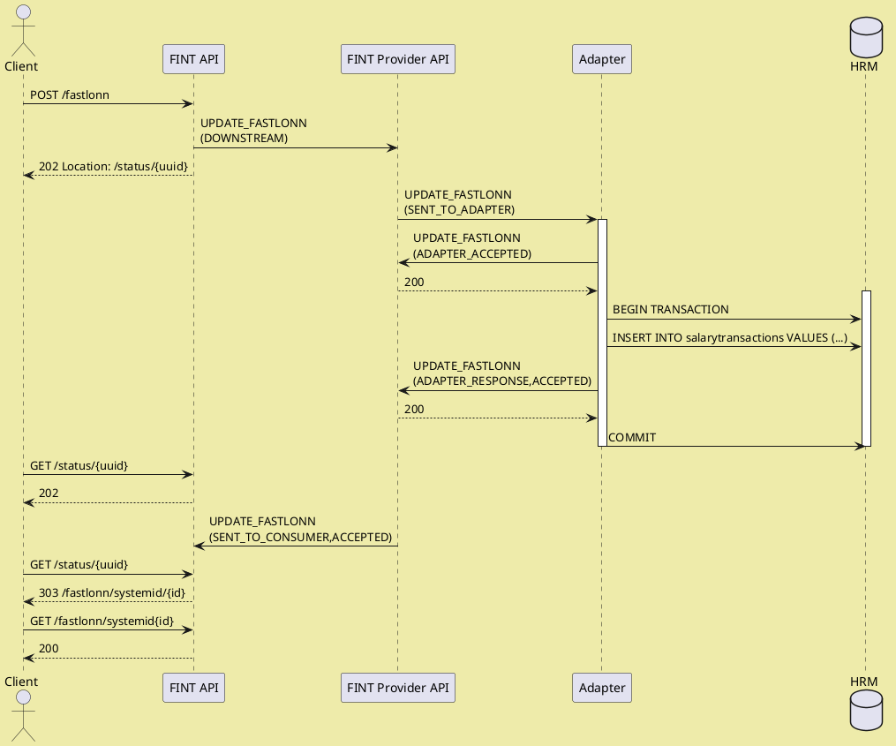
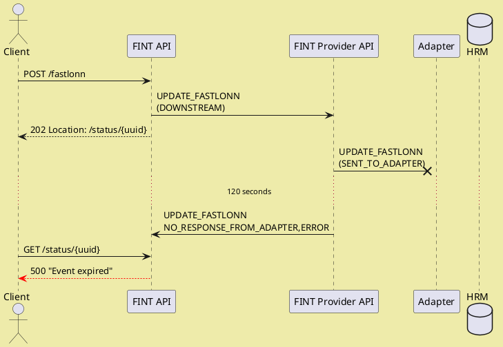
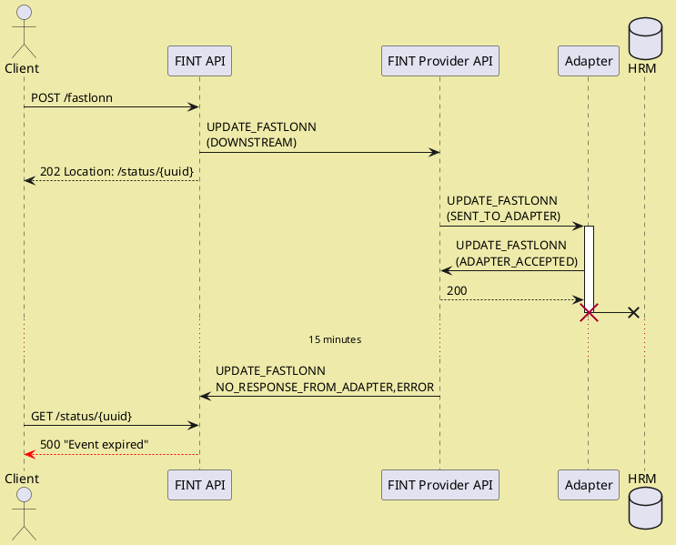
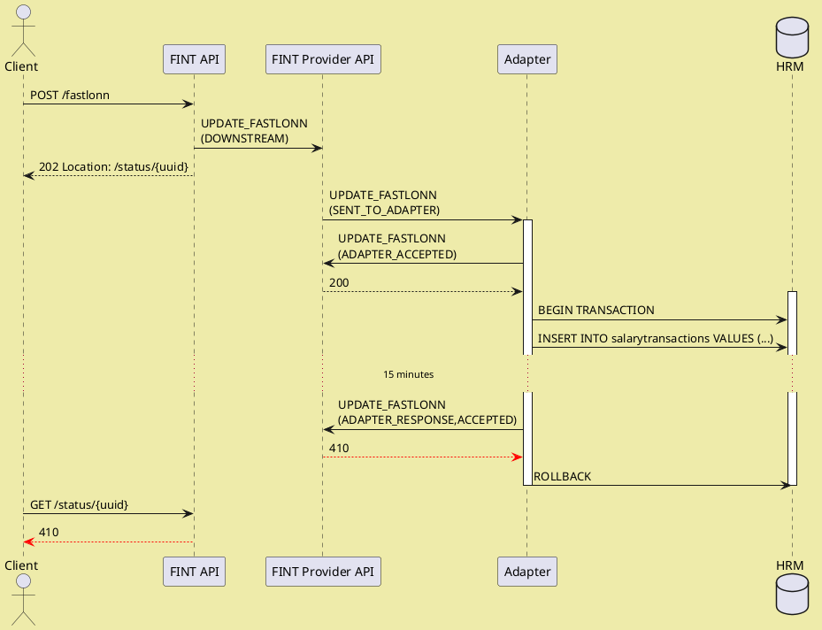
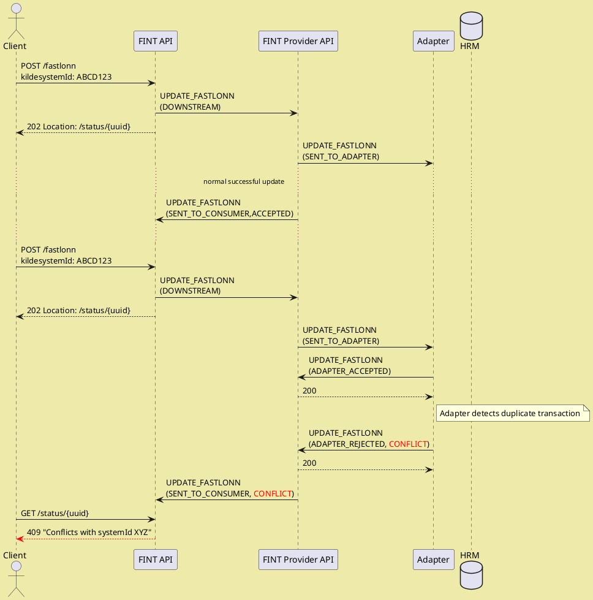

# Developing an adapter

## Getting started

A good starting point for developing an adapter is our quick tutorials:

* [Java](../tutorials?id=java-sse-adapter)
* [C Sharp/.NET](../tutorials?id=net-sse-adapter)

After that you can setup your adapter skeleton of choice:

* Java skeleton - <https://github.com/fintlabs/fint-sse-adapter-skeleton>
* C Sharp/.NET skeleton -  <https://github.com/fintlabs/Fint.Sse.Adapter.Skeleton>

## What does the skeleton do and what do you need to do?

The skeleton handles **connection**, **authorization** and **communication** with FINT.

Your task as developer of an adapter is to:

1. Respond to `events` sent from FINT
2. Interact with you back-end system
3. Map you data to FINT
4. Send back the information asked for in the `event`

## Mapping data

FINT's information model is available as classes in Java and C#.  The naming of classes follow the naming of the classes in the information model.  Model classes are available here:

* Java -- <https://github.com/FINTmodels/fint-information-model-java>
* C# -- <https://github.com/FINTmodels/FINT.Information.Model>

### Maven and Nuget dependencies

Libraries are deployed to [repo.fintlabs.no](https://repo.fintlabs.no/) and [NuGet](https://www.nuget.org/profiles/FINTLabs) for each component, i.e. `administrasjon`, `utdanning`, `arkiv`, `okonomi`.  The library version is the same as the model version.  They have the following naming convention:

* Java -- `fint-<component>-resource-model-java`, i.e. `fint-administrasjon-resource-model-java`.
* C# -- `FINT.Model.Resource.<Compponent>`, i.e. `FINT.Model.Resource.Administrasjon`.

## Linking resources

The FINT APIs have a link mapping service which ensures that links between resources follow the naming conventions and locations for our API endpoints.  Using these mapped links ensures that all URIs presented to clients are valid.

Mappable links are represented according to the following pattern:

* `${<component>[.<package>].<class>}/<field>/<identifier>`
* `${felles.person}/fodselsnummer/12345678901`
* `${administrasjon.personal.personalressurs}/ansattnummer/12345`
* `${utdanning.elev.skoleressurs}/systemid/ABCD123`

In the Java and C# libraries, links are represented using a `Link` class.  This class has static constructors that can be used to create valid relations.

Java:
```java
Link.with(Person.class, "fodselsnummer", "12345678901");
```

C#:
```cs
Link.with(typeof(Person), "fodselsnummer", "12345678901");
```

## Events

The general flow between FINT and adapters are:

1. Adapter subscribes to events using the SSE endpoint
2. FINT delivers events on the SSE stream
3. Adapter accepts the event by `POST`ing to the status endpoint.  There is a 2-minute timeout on accepting events. If you use the adapter skeleton this is already handled.
4. Adapter responds to the event by `POST`ing to the response endpoint.  There is a 15-minute timeout on responding to events.

### Causes for events

FINT components produce events for three reasons:

* Health status requests
* Periodic cache update events every 15 minutes, triggering `GET_ALL_*` events.
* Incoming POST / PUT requests from clients.  Every request produces exactly one event.

FINT expects exactly one status and one response to every event delivered.  Additional responses will be rejected with [`410 GONE`](https://http.cat/410).

### Event kinds

FINT Adapters must be able to handle three different kinds of events:

  1. Request for system health status
  1. Requests to get all instances of a class from the FINT Consumer Cache Service
  1. Requests to get a single element of a class from the FINT Consumer API.
  1. Requests to update (create, modify or delete) a single element of a class from the FINT Consumer API.

The FINT Consumer will be issuing the events to the FINT Provider for the relevant `assetID`, and the FINT Provider will dispatch the event to all adapters connected and registered for this `assetID`.

This enables scenarios with distributed or redundant adapters where several adapters share the workload of handling events.  The adapter run-time instances must coordinate between themselves which instance responds to an event, since the provider will only accept a single set of responses for any given event.

Workloads can be distributed using two different strategies, which also could be combined:

  1. Divide and conquer: Different adapters handle different actions for a given component.  For instance, for `/administrasjon/personal`, one adapter could handle `Personalressurs` and `Arbeidsforhold`, and a different adapter could handle `Fastlonn`, `Variabellonn`, etc.
  1. Active and passive:  Several adapters are configured to respond to the same event, but coordinate internally to determine which of the instances should respond.

Any adapter instance registered with the asset ID can handle events in three ways:

  1. Accept the event and respond with data.  The consumer handles the data from the response.  Other adapters attempting to respond will receive a [`410`](https://http.cat/410) status from the Provider.
  1. Reject the event.  The consumer ignores any data from the response.  Other adapters attempting to respond will receive a [`410`](https://http.cat/410) status from the Provider.
  1. Ignore the event, assuming another instance is handling it.  If no other adapter is handling the events, the provider will expire the event after 120 seconds.

### System health status (`HEALTH`)

Every FINT Consumer has a health endpoint (`/admin/health`) that clients could `GET` from to
request health status.

Adapters have 30 seconds to respond to this health event.  The request payload contains an array
of health status structures, and the response should contain the same, with one additional element
for the status of the adapter and connection to the back-end systems.

The health status structure looks like this:

```json
{
  "component": "adapter",
  "status": "APPLICATION_HEALTHY",
  "timestamp": 1571327388028,
  "time": "2019-10-17T15:49:48.028Z"
}
```

`timestamp` is in milliseconds since Unix epoch, `time` in ISO 8601.

`status` should be `APPLICATION_HEALTHY` or `APPLICATION_UNHEALTHY` depending on the state of the back-end application.

### Get all instances of a class (`GET_ALL_`_type_)

The FINT Consumer Cache Service issues these events every 15 minutes to update the consumer in-memory cache with all elements of the type.

Adapters are expected to retrieve all active elements from the back-end system and insert the data in the response event.

The response payload must contain an array of individual information elements in JSON format, conforming to the FINT 
information model.

### Get a single instance of a class by ID (`GET_`_type_)

FINT Consumer APIs issue these events in cases where clients want the most recent version of a given element, and waits for the adapter to respond before returning data to the client.

The event's `query` attribute contains the `Identifikator` field name and field value to identify the element in the form _`field/value`_, exactly as the URI of the element in the Consumer API.

For instance, for `Personalressurs` with an `ansattnummer` ID of `12345`, the URI would be `/administrasjon/personal/personalressurs/ansattnummer/12345`, and the `query` attribute would then be `ansattnummer/12345`.

Adapters are expected to extract the `query` attribute, search the back-end system for the most recent version of the requested element.

The response payload must contain a single element in JSON format, conforming to the information model.

For error situations, the adapter can control the HTTP response returned to the client using the following:

| `responseStatus` | `statusCode`   | HTTP result                   |
| ---------------- | -------------- | ----------------------------- |
| `ERROR`          | (any)          | [`500`](https://http.cat/500) |
| `REJECTED`       | `"GONE"`       | [`410`](https://http.cat/410) |
| `REJECTED`       | `"NOT_FOUND"`  | [`404`](https://http.cat/404) |
| `REJECTED`       | (other values) | [`400`](https://http.cat/400) |

### Create a new element, or update an existing element by ID (`UPDATE_`_type_)

FINT Consumer APIs issue these events for `POST`, `PUT`, and `DELETE` requests for a given type, according to the following:

| REST Operation                     | `operation` | `query`       |
| ---------------------------------- | ----------- | ------------- |
| `POST /path/to/type`               | `CREATE`    | (empty)       |
| `POST /path/to/type?validate=true` | `VALIDATE`  | (empty)       |
| `PUT /path/to/type/field/value`    | `UPDATE`    | `field/value` |
| `DELETE /path/to/type/field/value` | `DELETE`    | `field/value` |

The adapters are expected to handle the various operations according to the following:

  - `VALIDATE`: The payload must be subjected to a semantic validation according to business rules, but not stored in the back-end system.  The response must either be `ACCEPTED` or `REJECTED` to indicate whether the payload is valid or not, or `ERROR` if the validation cannot be performed and should be retried.
  - `CREATE`: The payload must be subjected to a semantic validation according to business rules, supplied with a `systemId` `Indentifikator` (if relevant), and stored in the back-end system.  The response payload must be updated to correspond to the final version stored in the back-end system.  The response status must be `ACCEPTED`, `REJECTED`, or `CONFLICT` to indicate if the payload was valid or not, or if the creation conflicts with any other data in the system.  The `ERROR` response indicates a transient error, and that the creation can be retried.
  - `UPDATE`: The existing element, identified by the `query` field, should be updated with the payload according to business rules and which fields are `writable` in the FINT information model.  The response payload must include the final version stored in the back-end system.  Response status as above.
  - `DELETE`: The existing element, identified by the `query` field, should be removed from the back-end system if this is valid according to the business rules.  No response payload is expected, response status as above.

Events *must* be responded with a `responseStatus` setting indicating the result of the operation:

| `responseStatus` | HTTP status sent to client    | Response body | Description of result                                                                                                                                              |
| ---------------- | ----------------------------- | ------------- | ------------------------------------------------------------------------------------------------------------------------------------------------------------------ |
| `CREATED`        | [`201`](https://http.cat/201) | FINT object   | The operation was accepted and completed successfully.  Based on event payload, the FINT API produces a `Location` header referring to the newly created resource. |
| `ACCEPTED`       | [`202`](https://http.cat/202) |               | The operation is treated as an ascyn request and it is accepted. Recheck status until it is either successful (200) or has failed.                                 |
| `REJECTED`       | [`400`](https://http.cat/400) | Error details | The operation was rejected.  The `message`, `statusCoude` and `problems` fields contain explanations as to why.                                                    |
| `ERROR`          | [`500`](https://http.cat/500) | Error details | An error occurred during processing of the event.  The client may retry the same operation later.                                                                  |
| `CONFLICT`       | [`409`](https://http.cat/409) | FINT object   | The operation is in conflict with other activity.  The response contains an updated version of the resource so the client can update its own state.                |

?> If the response is a 202 ACCEPTED, it means that the request is being processed async. You should then use a backoff strategy to recheck if the operation is complete. The period you wait between each check should increase and you should wait until you get a different response. This can take up to 20 minutes.

If write operations are not supported or permitted, the event must be rejected by posting `ADAPTER_REJECTED` at the `/status` phase.

The response payload must be a single element representing the current state of the information, conforming to the 
information model.  It is handled according to the following, depending on ResponseStatus:

- `ACCEPTED`: The payload is returned to the client, and possibly cached.
- `REJECTED`: The payload is ignored.
- `ERROR`: The payload is ignored.
- `CONFLICT`: The payload is returned to the client, and possibly cached.

Note the last clause. For `CONFLICT` the adapter is supposed to deliver the most recent version of the information, so clients and the FINT cache can be updated.

## How to deal with errors

Since `UPDATE_` events involves multiple components and is based on events,
errors are bound to happen. 

### Update conflicts

Sometimes the update attempted is in conflict with other data in the back-end
system.  This could for instance be:

 - Attempts to create data with identifiers that refer to existing information.
 - Modifications that create illegal state when combined with existing information.

 In both cases, the adapter must reject the update with `CONFLICT` response status.  Furthermore, the response must contain the payload that the original
 update conflicts with.

 This enables the client to update its information and possibly modify the
 update before another attempt is made.

### Lost events

The update events could be lost at multiple stages of the flow.  To better
illustrate where this happens, let's first describe the successful scenario.

#### Successful case

The following sequence diagram illustrates the successful case, where 
information is updated, and the client successfully recieves confirmation
of the update.



#### Event is lost before it reaches adapter

This is the simplest failure scenaro to handle.  Nobody gets informed of the
update, and the update can safely be retried after the original update
has expired.



#### Event is confirmed by adapter, but not updated in back-end system

This scenario is very similar to the one above - the only difference is 
the time it takes for the event to expire.



#### Event is confirmed and updated in back-end system, but client is not notified

This is the most difficult scenario.  Since the back-end system has been updated, the event cannot safely be retried, although the client does not know. There are basically two ways to resolve this issue.

Which of these is better depends on the back-end system's ability to record and roll back pending modifications.

##### Roll back the modification so it can safely be retried



For this case to be possible, the connection between the
adapter and the back-end system must support transaction
rollback, or similar compensating operations.

##### Use conflict detection to reject a retry with `CONFLICT` status.



In this latter case, client support is required for the state
of the update to be synchronized correctly between client and
back-end system.  For this to work, it is essential that the
adapter correctly responds to the `CONFLICT` with a response
payload indicating the current state of the information in the
back-end system, and that the client correctly handles the
`409` status and updates its pending transaction with this
information.