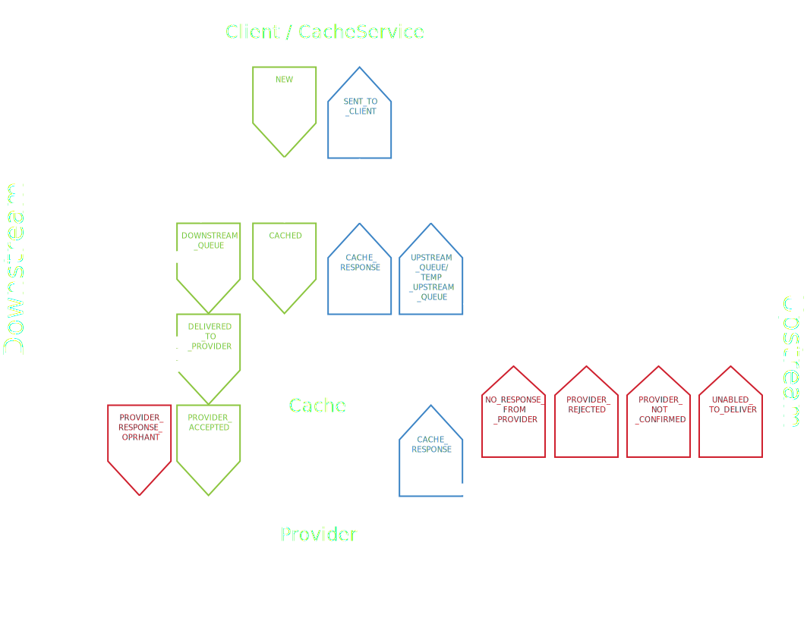

## FINTs interne oppbygning

Det felles APIet har to hovedtjenester:

* Cache-tjeneste
* Hendelsestjeneste

### Cache-tjeneste

Cache-tjenesten har følgende ansvarsområder:

* Lagrer data fra forretningssystemene for alle organisasjonene som bruker det felles APIet
* Populerer cachen
* Holder oversikt over hvilke data som har endret seg siden sist cachen ble fylt opp

### Hendelsestjeneste

Det interne i det felles APIet er basert på hendelser. En hendelse opprettes av:

* Cache-tjeneste
* Klient

Når en klient treffer et endepunkt i konsumer-APIet, genererer det felles APIet en hendelse og sender den til Cache-tjenesten. En hendelse fra klienten vil aldri gå helt ned til adapteren.

Når Cache-tjenesten trenger å oppdatere cachen, sender den en hendelse ned til adapteren gjennom tilbyderen.

Alle hendelser logges på alle stadier.

### Ordliste

| Engelsk term         | Norsk term            |
|----------------------|-----------------------|
| Common API           | Felleskomponent       |
| Business application | Fagsystem             |

