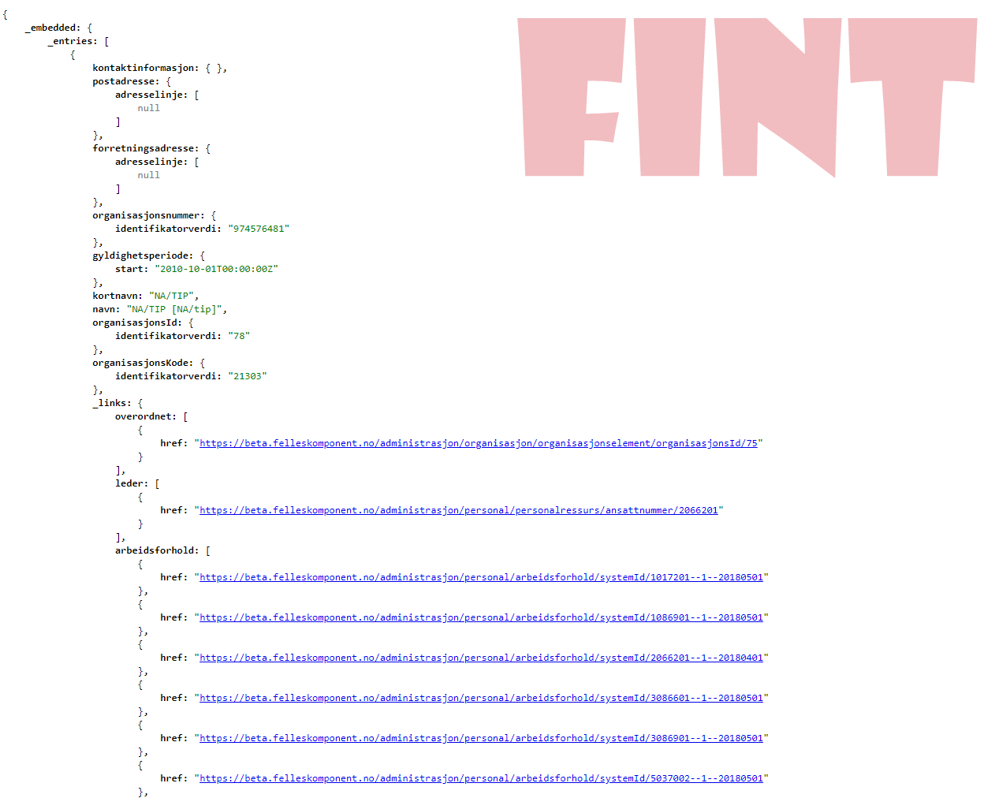
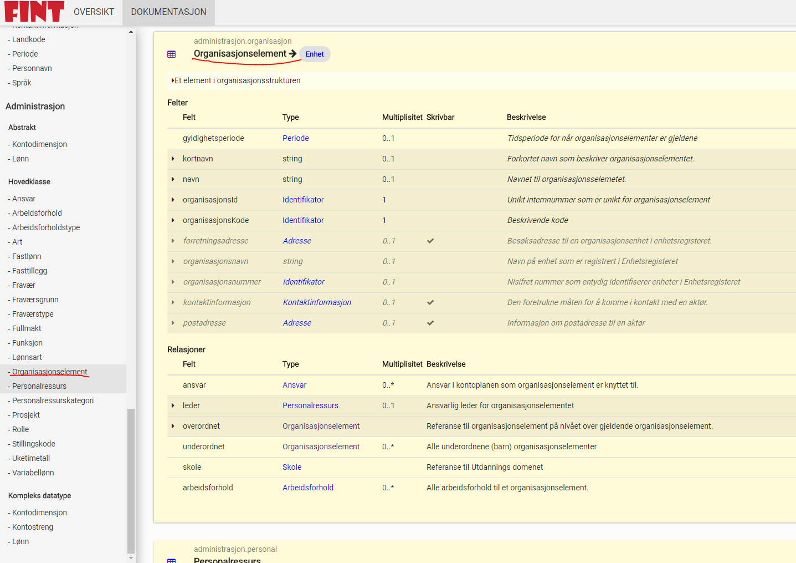

# Veiledninger


## Java SSE adapter

### Introduction

This tutorial will lead you through the process of setting up and adapter to communicate with the Play-With-FINT-Adapter service.

### Setting up the environment

#### Clone the skeleton

```bash
$ git clone https://github.com/FINTLabs/fint-sse-adapter-skeleton.git my-adapter
$ cd my-adapter
$ rm -rf .git
```

#### Open the project in your favorite IDE

This is a Gradle project so make sure to import the Gradle dependencies. You can either do it in the IDE or in the commandline:

```bash
$ ./gradlew --refresh-dependencies build
```

!>*Note that this project uses `Lombok` so you need to enable `annotation processing` if you use `IntelliJ`. There is also a `Lombok`-plugin for `IntelliJ`*

### Get an OrgId

* Go to <https://play-with-fint-adapter.felleskomponent.no/demo/organization/generateOrgId> to generate an `OrgId`.

!> This `OrgId` is vaild until midnight the same day.

* Replace `pwfa.no` with your `OrgId` in the `application.yml` file:

```yaml
fint:
 adapter:
  organizations: OrgId
```

### The first test

* Set a breakpoint at the start of the handleEvent method in the `EventHandlerService` class.

```java
                public void handleEvent(Event event) {
Breakpoint -->      if (event.isHealthCheck()) {
                    ...
                }
```

* Start the adapter in debug mode
* Open a browser and hit <https://play-with-fint-adapter.felleskomponent.no/swagger-ui.html>
* From the `Admin` controller, configure the `/admin/health` with setting the following headers:
  * `x-org-id` use the generated OrgId
  * `x-client` to `test`
* Send the health event from the `/admin/health` endpoint.
* Step through the code to see what happens.
* You can also hit the `dog` and `owner` controllers to see how `FintResources` and `Relations` are build. See <https://github.com/FINTmodels/fint-relation-model> for more information.

### Security

The `adapter` uses `OAuth2` by default to authenticated to the `provider` endpoint. This tutorial is set up with at tutorial user. In production one will get a *real* user. This is the `OAuth2` config:

```yaml
fint:
 oauth:
  enabled: true
  username: pwfatut
  password: pwfatut
  client-id: 2d0ed372-53fb-4d0a-9e7f-d546c5cf2d71
  client-secret: kgaiww60LjjNh0iyfv0KSjMZMbv04L6YZfYq5iYpu6IhIyxo6UFdslQMw_BBmZeVOuUCl75f3dE6FaDTVxgYjg
  access-token-uri: https://idp.felleskomponent.no/nidp/oauth/nam/token
  scope: fint-client
```

### Links

* <https://github.com/fintlabs/fint-sse-adapter-skeleton> - FINT SSE adapter skeleton
* <https://github.com/FINTlibs/fint-sse> - FINT SSE client library
* <https://github.com/FINTmodels/fint-relation-model> - FINT Relation model

### Contribute

If you find bugs or have suggestions for improvement please feel free to submit an issue at <https://github.com/fintlabs/fint-sse-adapter-skeleton/issues>.

## .NET SSE adapter

This tutorial will lead you through the process of setting up and adapter to communicate with the Play-With-FINT-Adapter service.

### Setting up the enviornment

#### Clone the skeleton

```bash
$ git clone https://github.com/fintlabs/Fint.Sse.Adapter.Skeleton.git my-adapter
$ cd my-adapter
$ rm -rf .git
```

#### Open the project in our favorite IDE

This is a `netcoreapp2.0`\\`netstandard2.0` project. You need to import the dependencies. You can either do it in the IDE or in the commandline. This example uses the `dotnet` CLI:

```bash
$ dotnet restore
```

This `repo` consists of three projects:

- **FINT.Sse.Adapter** - This is the main `adapter` code.
- **FINT.Sse.Adapter.Console** - This is a wrapper around `FINT.Sse.Adaper` to make it run using `netcoreapp2.0`. You can create another wrapper for your favorit version/framework.
- **FINT.Sse.Adapter.Tests** - This is the `unit test` project.

### Get an OrgId

* Go to <https://play-with-fint-adapter.felleskomponent.no/demo/organization/generateOrgId> to generate an `OrgId`.

!> This `OrgId` is vaild until midnight the same day.

* Replace `pwfa.no` with your `OrgId` in the `appsettings.json` file in the `Fint.Sse.Adapter.Console` project:

```json
{
  "Logging": {
    "IncludeScopes": false,
    "LogLevel": {
      "Default": "Debug",
      "System": "Information",
      "Microsoft": "Information"
    }
  },
  "Configuration": {
    "ConsoleTitle": "FINT Console Boilerplate",
    "SseEndpoint": "https://play-with-fint-adapter.felleskomponent.no/provider/sse",
    "StatusEndpoint": "https://play-with-fint-adapter.felleskomponent.no/provider/status",
    "ResponseEndpoint": "https://play-with-fint-adapter.felleskomponent.no/provider/response",
    "Organizations": "pwfa.no", <-- HERE
    "LogLocation": "logs"
  }
}
```

```csharp
                public void HandleEvent(Event<object> serverSideEvent)
                {
Breakpoint -->      if (serverSideEvent.IsHealthCheck())
                    {
                    ...
                }
```

* Start the adapter in debug mode
* Open a browser and hit <https://play-with-fint-adapter.felleskomponent.no/swagger-ui.html>
* From the `Admin` controller, configure the `/admin/health` with setting the following headers:
  * `x-org-id` use the generated OrgId
  * `x-client` to `test`
* Send the health event from the `/admin/health` endpoint.
* Step through the code to see what happens.
* You can also hit the `dog` and `owner` controllers to see how `FintResources` and `Relations` are build. See <https://github.com/FINTmodels/Fint.Relation.Model> for more information.

### Security

The `adapter` uses `OAuth2` by default to authenticated to the `provider` endpoint. This tutorial is set up with at tutorial user. In production one will get a *real* user. This is the `OAuth2` config:

```json
"OAuthTokenService": {
    "AccessTokenUri": "https://idp.felleskomponent.no/nidp/oauth/nam/token",
    "ClientId": "2d0ed372-53fb-4d0a-9e7f-d546c5cf2d71",
    "ClientSecret": "kgaiww60LjjNh0iyfv0KSjMZMbv04L6YZfYq5iYpu6IhIyxo6UFdslQMw_BBmZeVOuUCl75f3dE6FaDTVxgYjg",
    "Username": "pwfatut",
    "Password": "pwfatut",
    "Scope": "fint-client",
    "OAuthEnabled": "true"
}
```

### Links

* <https://github.com/fintlabs/Fint.Sse.Adapter.Skeleton> - FINT SSE adapter skeleton
* <https://github.com/FINTlibs/Fint.Sse> - FINT SSE client library
* <https://github.com/FINTmodels/Fint.Relation.Model]> - FINT Relation model

### Contribute

If you find bugs or have suggestions for improvement please feel free to submit an issue at <https://github.com/fintlabs/Fint.Sse.Adapter.Skeleton/issues>.

## Testklient

FINTLabs har laget en testklient som kan brukes. Den finner du her <https://beta.felleskomponent.no/test-client/>

Her får man opp en påloggingsvindu med 5 felter:

Påloggingsinfo hentes fra Kundeportalen til FINT. [Her](./tutorials.md?id=klienter) finner du fremgangsmåten for å opprette klienter i kundeportalen.

```
Client ID: xxxxx
Client Seceret: xxxxxxxxxxxxxx
Username: xxxxxxx
Password: xxxxxxxx
OrgId: xxxxxxx
```

Når man har logget inn kommer man hit:


Her kan man legge inn de endepunktene som skal sjekkes ved å lime/skrive inn endepunktet på følgende måte:


Trykk så på knappen bak hvor det står FINT!

Da får du opp resultatet i JSON format:



Under `_links` er koblinger til andre modeller. Man kan klikke på linkene for å se hvilken informasjon som ligger i koblingen.

Verdiene her bør sjekkes mot informasjonsmodellen og mot fagsystemet. Sjekk at multiplisiteten og typen er korrekt. Sjekk også at dataen er fylt ut i korrekte felter.

Informasjonsmodellen finnes her:

<https://informasjonsmodell.felleskomponent.no>

!>Det kan være utvidelser i modellen på denne siden i forhold til den versjonen av adapteret som testes.

Her kan man også finne de andre modellene/endepunktene som skal sjekkes (i menyen til venstre)




Endepunkter som må sjekkes:

**Leveranse 1 – `Personal/ Ansatt`**

* `administrasjon/personal/person`
* `administrasjon/personal/personalressurs`
* `administrasjon/personal/arbeidsforhold`

**Leveranse 1 – `Kodeverk`, som f.eks**

* `administrasjon/kodeverk/art`
* `administrasjon/kodeverk/ansvar`
* `administrasjon/kodeverk/funksjon`
* `administrasjon/kodeverk/prosjekt`
* `administrasjon/kodeverk/lonnsart`
* `administrasjon/kodeverk/stillingskode`

**Leveranse 1 – `Organisasjonsstruktur`**
* `administrasjon/organisasjon/organisasjonselement`

 

### Tester
Gjennomfør stikkprøver hvor dere verifiserer at overført informasjon kommer i rett felt.

#### Opprett ny ansatt i HR-system
Sjekk at den ansatte vises i VIS (hvis du har tilgang til VIS, ellers sjekk i TestClient)
Endre informasjon på en ansatt i HR-system f.eks.

* Adresse
* Telefonnummer
* Ansettelsesprosent
* Hovedstilling
* Stillingstittel
* Tilstedeprosent
* Årslønn
* Sjekk om informasjonen blir endret tilsvarende i VIS (hvis du har tilgang til VIS, ellers sjekk i TestClient)

#### Slett bruker i HR-system

* Verifiser at bruker blir slettet fra VIS (hvis du har tilgang til denne, ellers sjekk i TestClient)

#### Flytte en ansatt mellom to virksomheter
* Flytt en ansatt fra en virksomhet til en annen virksomhet
* Verifiser at vedkommende blir flyttet tilsvarende i VIS (hvis du har tilgang til VIS, ellers sjekk i TestClient)
* Verifiser at personen blir slettet fra den ene og opprettet på den andre virksomheten
 

#### Opprett en ansatt på to virksomheter

* Verifiser at den ansatte blir opprettet på begge virksomheter i VIS (hvis du har tilgang til VIS, ellers sjekk i TestClient)
 

#### Kontroller antall ansatte på virksomheten

* Sjekk antall ansatte registrert i HR-system på aktuell virksomhet
* Sjekk antall ansatte registrert i VIS på aktuell virksomhet (hvis du har tilgang til VIS, ellers sjekk i TestClient)
 

#### Kriterier
**Ansatt**

*Agresso*, kriterier som bestemmer hvilke data som overføres til FINT/VIS:

* fødselsnummer må være ulikt `00000000019`
* ansatte `+/- 365 dager` fra dagens dato når HR-adapteret overfører informasjon til FINT/VIS

*Visma Enterprise*, kriterier som bestemmer hvilke data som overføres til FINT/VIS:
* filtrering på selskapsnr, slik at kun fylkeskommunens ansatte hentes ut. (Ikke fk-foretak o.l.)
* ansatte `+/- 365 dager` fra dagens dato når HR-adapteret overfører informasjon til FINT/VIS


## Oppsett av Azure AD Federering - VIGO-IDP

### Virkemåte


- I vigoBAS hentes studentnumber og employeeId fra Fint.

- VigoBAS eksporter studentnumber og employeeId til valgte extensionAttribute i onprem AD (valgfritt hvilke av attributtene 1-15 som benyttes).

- extensionAttributtene overføres til Azure AD via Azure AD connect

- I Azure AD benytter Enterprise appen VIGO-IDP extensionattributtene samt egendefinerte roller for å sette opp claims som benyttes mot de ulike Fint komponenetene.

### Forberedelser

- Studentnumber og emplyeeId fra Fint må eksporteres via vigoBAS til onprem AD (i dette eksempelet er Extension attributt 8 og 9 valgt) slik at disse synces opp til Azure AD.

- Opprettet grupper i onprem AD (som synces til Azure AD) eller Azure AD for kobling til roller/tilgang til Azure IDP'n. 

### Legge til en "Enterprise app"

Hver fylkeskommune må sette opp en Enterprise applications i sin egen Azure tenant. 

- Logg inn på egen Azure tenant https://portal.azure.com

- Søk etter “Azure Active Directory” og velg denne

- Klikk på “Enterprise applications” i venstre menyen

- Klikk på “New application”

- Gi den ett navn (VIGO-IDP)


- Appen lages og når den popper opp - > klikk på “ 2. Set up single sign on”


- Klikk på [Create]
- Klikk på "SAML"


- Klikk på “Edit” under punkt 1 “Basic SAML Configuration”


- Fyll inn “Identifier (Entity ID):

https://idp.felleskomponent.no/nidp/saml2/metadata

- Fyll inn “Replay URL (Assertion Consumer Service URL”

https://idp.felleskomponent.no/nidp/saml2/spassertion_consumer@


- Klikk "Save"

### Legge til app roller

- Gå tilbake til Azure Active Directory og klikk på “App registrations”:


- Klikk på “All applications”. Da kommer alle apper i tennanten opp. Hvis du ikke ser “VIGO-IDP” så søk den opp. Klikk på “VIGO-IDP” appen.


- Klikk på “App roles|Preview”:


- Klikk på “ + Create app role”:


Fyll inn:

- Display name : Valgfritt navn
- Allowed member types : Users/Group
- Value : Predefionert fra Vigo som samsvarer med tjenesten som det skal authentiseres mot
- Description : Valgfri beskrivende tekst

Klikk på [Apply]


For å opprette flere roller: gjenta prosessen ved å trykke på “ +Create app role” og fyll inn som ovenfor. 

Figuren under viser 4 roller som er satt opp: 
- https://role-catalog.vigoiks.no/vigo/drosjeloyve/admin
- https://role-catalog.vigoiks.no/vigo/samtykke/user
- https://role-catalog.vigoiks.no/vigo/elevfakturering/user
- https://role-catalog.vigoiks.no/vigo/isyroad/user

Alle rollene, med beskrivelse, finnes i Rollekatalogen: https://role-catalog.vigoiks.no


### Koble gruppe i Azure med rolle

- Gå tilbake til Azure AD og klikk på “Enterprise applications”:


- Hvis du ikke ser “VIGO-IDP”: Søk den opp i søkefeltet. Klikk på VIGO-IDP:


- Klikk på “Users and groups”


- Klikk på “Add user/group”:


- Klikk på “None selected” under “Users and groups”:


- Søk opp gruppen:


- Velg gruppen som skal ha tilgang (som skal ha rollen) og velg [Select]:


- Klikk på “None selected” under “Select a role”:


- Har du mange roller så søk opp rollen du opprettet tidligere. Klikk på rollen og velg [Select]:


- Klikk på [Assign]:

I dette tilfellet vil medlemmer av gruppen “TILGANG-VIGO-SAMTYKKE” få rollen “vigo-samtykke-enduser”


I bildet under “Users and groups” vil det vises de som har tilgang til appen og de tilknyttede rollene:


### Legge til claims for SAML autentisering

- I ventre menyen: klikk på “Single sign-on”. Klikk så på “Edit” på punkt 2 under “User Attributes & claims”:


- Klikk på “ + Add new claim”:


Fyll inn:

- Name: studentnumber
- Namespace:  http://schemas.xmlsoap.org/ws/2005/05/identity/claims
- Source: Attribute
- Source attribute: Det attributtet i azure ad som innholder studentnumber
  - Verdien hentes fra /utdanning/elev/elev/systemid i Fint og synces via VigoBAS → onprem Ad → Azure AD


Klikk på “ + Add new claim” og fyll inn:
- Name: employeeId
- Namespace: http://schemas.xmlsoap.org/ws/2005/05/identity/claims
- Source: Attribute
- Source attribute: Det attributtet i azure ad som inneholder employeeId 
  - Verdien hentes fra /administrasjon/personal/personalressurs/ansattnummer/ i Fint og synces via VigoBAS → onprem Ad → Azure AD


Klikk på “ + Add new claim” og fyll inn:
- Name: roles
- Namespace: http://schemas.xmlsoap.org/ws/2005/05/identity/claims
- Source: Attribute
- Source attribute: user.assignroles


Klikk på “ + Add new claim” og fyll inn:
- Name: organizationnumber
- Namespace:  http://schemas.xmlsoap.org/ws/2005/05/identity/claims
- Source: Attribute
- Source attribute: “organisasjonsnummer til fylkeskommunen”


Klikk på “ + Add new claim” og fyll inn:
- Name: organizationid
- Namespace:   http://schemas.xmlsoap.org/ws/2005/05/identity/claims
- Source: Attribute
- Source attribute: “dns navn til fylkeskommunen”


I oversikten over User attributes and claims skal det se slik ut:


- Påse at claim under “Required claim” (Name ID) har disse egenskapene:


### Last ned og send sertifikat og metadata til FINT

I punkt “3 SAML Signing Certificate” : last ned følgende:
- “Certificate (Base64)”
- “Federation Metadata XML”


Disse sendes til kontaktpersonen i fintlabs.


### Teste løsningen

Dette kan gjøres etter at Fint har mottat metadata og sertifikat samt konfigurert tilgangen.

- Gå til: https://idp.felleskomponent.no/nidp/
- I vaffelmenyen, klikk på din fylkeskommune.


For å se selve SAML tokenet så kan man benytte Firefox med SAML-tracer tilleget. 

Attributeliste for egendefinerte claims vil da se slik ut:

```
<AttributeStatement>

...

<Attribute Name="http://schemas.xmlsoap.org/ws/2005/05/identity/claims/employeeId">

<AttributeValue>S5544332211</AttributeValue>

</Attribute>

<Attribute Name="http://schemas.xmlsoap.org/ws/2005/05/identity/claims/roles">

<AttributeValue>vigo-samtykke-enduser</AttributeValue>

</Attribute>

<Attribute Name="http://schemas.xmlsoap.org/ws/2005/05/identity/claims/studentnumber">

<AttributeValue>E1122334455</AttributeValue>

</Attribute>

...

</AttributeStatement>

```

## Logge på en FINT tjeneste
Gå til url'en som er oppgitt for den tjenesten du skal inn på. Dette kan feks være https://flyt.vigoiks.no/"fylkesid" eller https://samtykke.vigoiks.no/"fylkesid"

Hvis du ikke allrede er innlogget i Office365 til fylket vil du bli videresendt til en autentiseringsvelger. Se under:


Klikk på pilen i [Velg tilhøringhet]-boksen og velg din fylkeskommune fra listen som dukker opp. Se under:


Når du har valgt fylkeskommune vil [FORTSETT]-knappen bli grønn. Klikk på denne. Da sendes du til din vanlige pålogging for Office365 til din fylkeskommune. Se under:


Logg deg inn på vanlig måte i Office365. Du vil nå komme inn i tjenesten hvis din fylkeskommune har gitt deg tilgang til det.

## Feilsøking federert FINT-pålogging
### Attributter i SAML-token
Når man logger på en FINT-tjeneste som er federerert (VIGO-IDP) overføres det utvalgte attributter fra fylkets Azure-tennant til Vigo sin access manager. Disse attributtene sendes så videre til tjenesten brukeren skal aksesere. Hvilke attributter som de ulike tjenestene har behov for varierer utifra hvilken tjeneste du skal aksesere. Påse at de attributtene som tjenesten krever ligger i SAML-tokenet som overføres fra fylkenes Azure til Vigo sin access manager.

### Tilgangsroller
For å få tilgang til en federert FINT-tjeneste kreves det ofte at brukeren har fått tildelt en rolle i fylkenes Azure-tennant. Se "Oppsett av Azure AD Federering - VIGO-IDP" ovenfor hvordan dette gjøres. VIGO Iks forvalter disse rollene.

Oversikt over roller finner du her: https://role-catalog.vigoiks.no

### Sjekke SAML-token - SAMLtracer
For å sjekke om de nødvendige attributter overføres fra fylkenes Azure til VIGO sin access manager kan man benytte en SAML-tracer. Dette er ett nettlesertilegg. 
- Innstaller saml-tracer som tilegg i nettleseren din
- Start SAML-tracer og gå til tjenesten i nettleseren
- Se etter SAML taggen på høyre side i SAML-traceren og klikk på denne linjen (er det flere linjer med denne taggen er det oftest den siste linjen vi er ute etter)
- I den nederste ruten klikker du på SAML fanen

Attributtene som overføres i tokenet ligger da mellom 
``` <AttributeStatement> ``` og  ``` </AttributeStatement> ``` taggene.

Se under:


