## Oppsett av Azure AD Federering - VIGO-IDP

### Virkemåte


- I vigoBAS hentes studentnumber og employeeId fra Fint.

- VigoBAS eksporter studentnumber og employeeId til valgte extensionAttribute i onprem AD (valgfritt hvilke av attributtene 1-15 som benyttes).

- extensionAttributtene overføres til Azure AD via Azure AD connect

- I Azure AD benytter Enterprise appen VIGO-IDP extensionattributtene samt egendefinerte roller for å sette opp claims som benyttes mot de ulike Fint komponenetene.

### Forberedelser

- Studentnumber og emplyeeId fra Fint må eksporteres via vigoBAS til onprem AD (i dette eksempelet er Extension attributt 8 og 9 valgt) slik at disse synces opp til Azure AD.

- Opprettet grupper i onprem AD (som synces til Azure AD) eller Azure AD for kobling til roller/tilgang til Azure IDP'n. 

### Legge til en "Enterprise app"

Hver fylkeskommune må sette opp en Enterprise applications i sin egen Azure tenant. 

- Logg inn på egen Azure tenant https://portal.azure.com

- Søk etter “Azure Active Directory” og velg denne

- Klikk på “Enterprise applications” i venstre menyen

- Klikk på “New application”

- Gi den ett navn (VIGO-IDP)


- Appen lages og når den popper opp - > klikk på “ 2. Set up single sign on”


- Klikk på [Create]
- Klikk på "SAML"

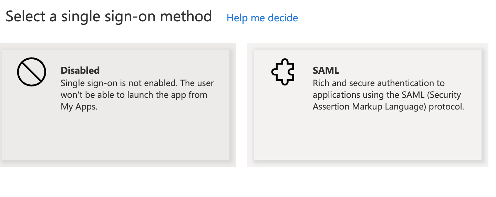

- Klikk på “Edit” under punkt 1 “Basic SAML Configuration”


- Fyll inn “Identifier (Entity ID):

https://idp.felleskomponent.no/nidp/saml2/metadata

- Fyll inn “Replay URL (Assertion Consumer Service URL”

https://idp.felleskomponent.no/nidp/saml2/spassertion_consumer@


- Klikk "Save"

### Legge til app roller

- Gå tilbake til Azure Active Directory og klikk på “App registrations”:


- Klikk på “All applications”. Da kommer alle apper i tennanten opp. Hvis du ikke ser “VIGO-IDP” så søk den opp. Klikk på “VIGO-IDP” appen.


- Klikk på “App roles|Preview”:


- Klikk på “ + Create app role”:

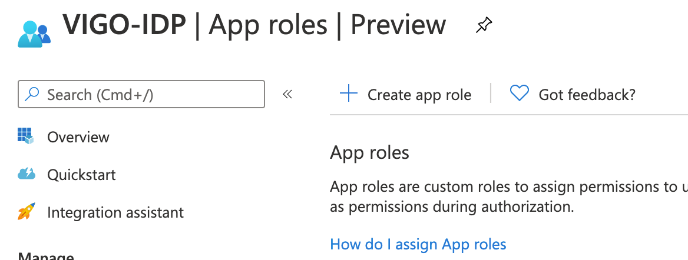

Fyll inn:

- Display name : Valgfritt navn
- Allowed member types : Users/Group
- Value : Predefionert fra Vigo som samsvarer med tjenesten som det skal authentiseres mot
- Description : Valgfri beskrivende tekst

Klikk på [Apply]


For å opprette flere roller: gjenta prosessen ved å trykke på “ +Create app role” og fyll inn som ovenfor. 

Figuren under viser 3 roller : 
- vigo-vigobas-administrators
- vigo-drosjeloyve-admin
- vigo-samtykke-endusers


### Koble gruppe i Azure med rolle

- Gå tilbake til Azure AD og klikk på “Enterprise applications”:


- Hvis du ikke ser “VIGO-IDP”: Søk den opp i søkefeltet. Klikk på VIGO-IDP:

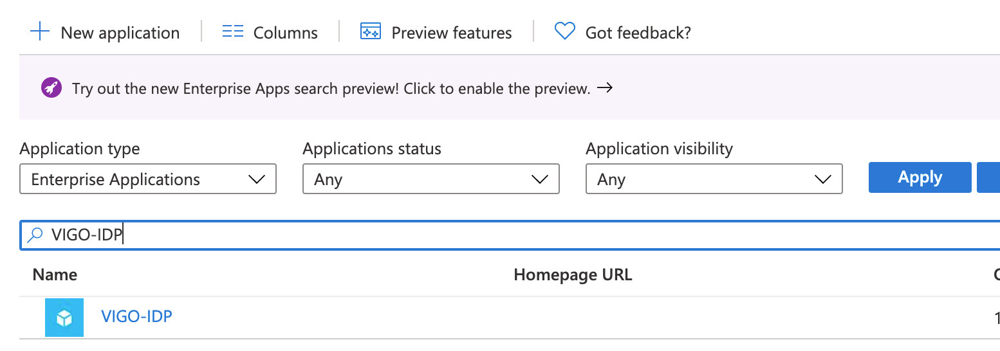

- Klikk på “Users and groups”


- Klikk på “Add user/group”:

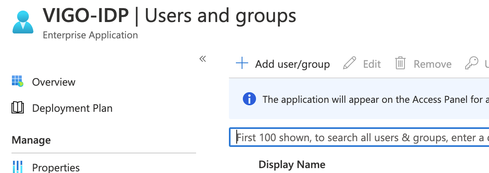

- Klikk på “None selected” under “Users and groups”:

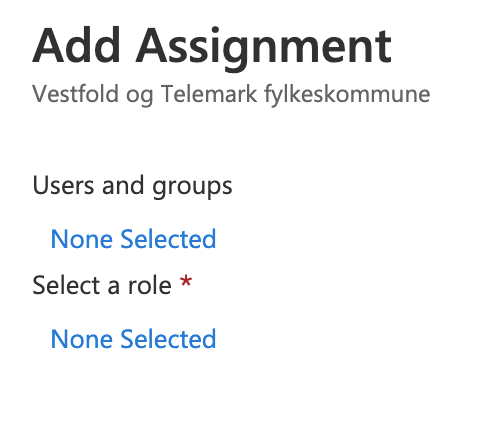

- Søk opp gruppen:


- Velg gruppen som skal ha tilgang (som skal ha rollen) og velg [Select]:


- Klikk på “None selected” under “Select a role”:

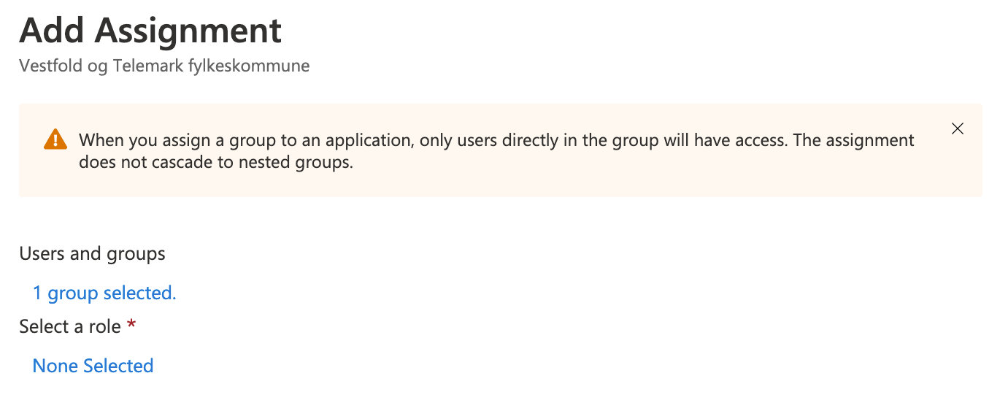

- Har du mange roller så søk opp rollen du opprettet tidligere. Klikk på rollen og velg [Select]:

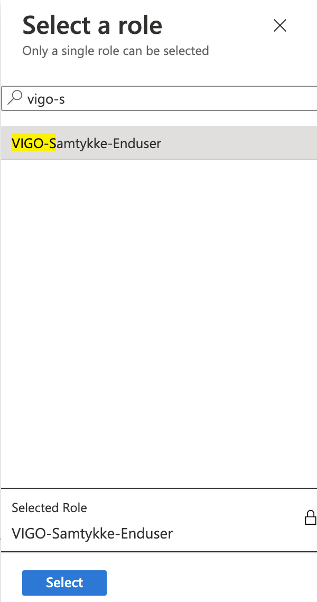

- Klikk på [Assign]:

I dette tilfellet vil medlemmer av gruppen “TILGANG-VIGO-SAMTYKKE” få rollen “vigo-samtykke-enduser”


I bildet under “Users and groups” vil det vises de som har tilgang til appen og de tilknyttede rollene:


### Legge til claims for SAML autentisering

- I ventre menyen: klikk på “Single sign-on”. Klikk så på “Edit” på punkt 2 under “User Attributes & claims”:


- Klikk på “ + Add new claim”:

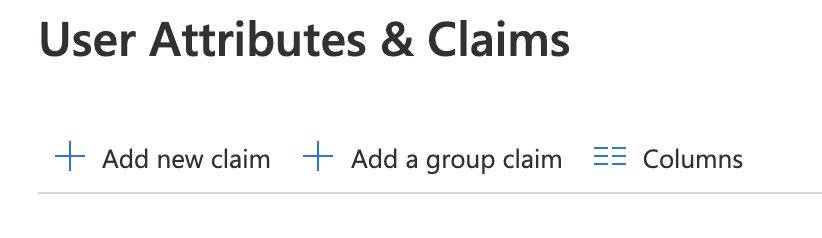

Fyll inn:

- Name: studentnumber
- Namespace:  http://schemas.xmlsoap.org/ws/2005/05/identity/claims
- Source: Attribute
- Source attribute: Det attributtet i azure ad som innholder studentnumber
  - Verdien hentes fra /utdanning/elev/elev/systemid i Fint og synces via VigoBAS → onprem Ad → Azure AD

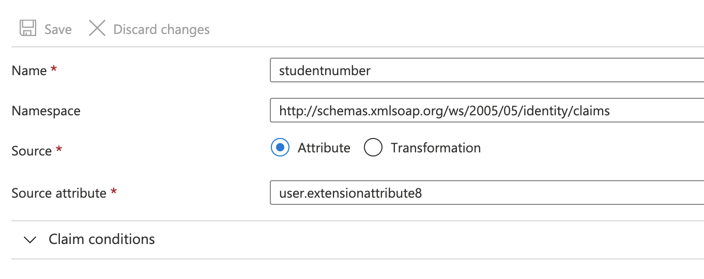

Klikk på “ + Add new claim” og fyll inn:
- Name: employeeId
- Namespace: http://schemas.xmlsoap.org/ws/2005/05/identity/claims
- Source: Attribute
- Source attribute: Det attributtet i azure ad som inneholder employeeId 
  - Verdien hentes fra /administrasjon/personal/personalressurs/ansattnummer/ i Fint og synces via VigoBAS → onprem Ad → Azure AD

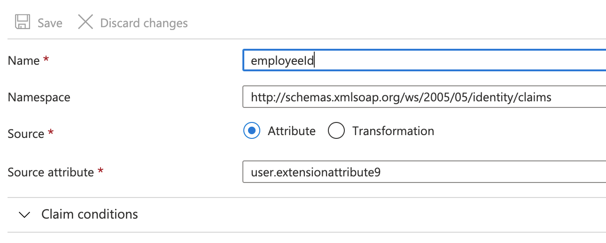

Klikk på “ + Add new claim” og fyll inn:
- Name: roles
- Namespace: http://schemas.xmlsoap.org/ws/2005/05/identity/claims
- Source: Attribute
- Source attribute: user.assignroles


Klikk på “ + Add new claim” og fyll inn:
- Name: organizationnumber
- Namespace:  http://schemas.xmlsoap.org/ws/2005/05/identity/claims
- Source: Attribute
- Source attribute: “organisasjonsnummer til fylkeskommunen”

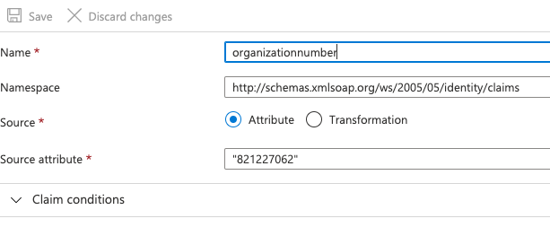

Klikk på “ + Add new claim” og fyll inn:
- Name: organizationid
- Namespace:   http://schemas.xmlsoap.org/ws/2005/05/identity/claims
- Source: Attribute
- Source attribute: “dns navn til fylkeskommunen”

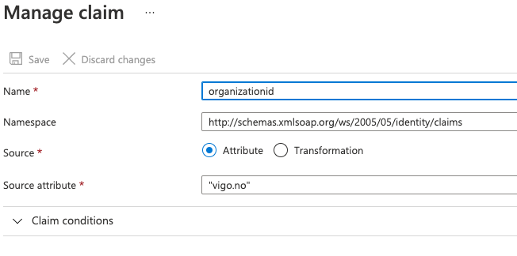

I oversikten over User attributes and claims skal det se slik ut:


- Påse at claim under “Required claim” (Name ID) har disse egenskapene:

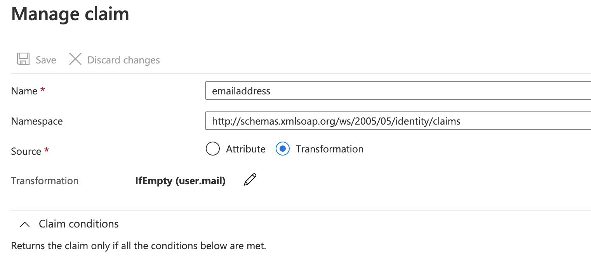

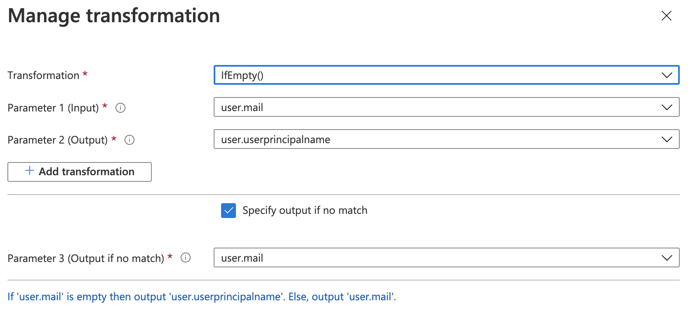


### Last ned og send sertifikat og metadata til FINT

I punkt “3 SAML Signing Certificate” : last ned følgende:
- “Certificate (Base64)”
- “Federation Metadata XML”

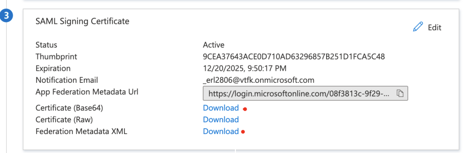

Disse sendes til kontaktpersonen i fintlabs.


### Teste løsningen

Dette kan gjøres etter at Fint har mottat metadata og sertifikat samt konfigurert tilgangen.

- Gå til: https://idp.felleskomponent.no/nidp/
- I vaffelmenyen, klikk på din fylkeskommune.


For å se selve SAML tokenet så kan man benytte Firefox med SAML-tracer tilleget. 

Attributeliste for egendefinerte claims vil da se slik ut:

```
<AttributeStatement>

...

<Attribute Name="http://schemas.xmlsoap.org/ws/2005/05/identity/claims/employeeId">

<AttributeValue>S5544332211</AttributeValue>

</Attribute>

<Attribute Name="http://schemas.xmlsoap.org/ws/2005/05/identity/claims/roles">

<AttributeValue>vigo-samtykke-enduser</AttributeValue>

</Attribute>

<Attribute Name="http://schemas.xmlsoap.org/ws/2005/05/identity/claims/studentnumber">

<AttributeValue>E1122334455</AttributeValue>

</Attribute>

...

</AttributeStatement>

```

