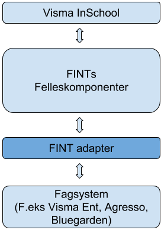
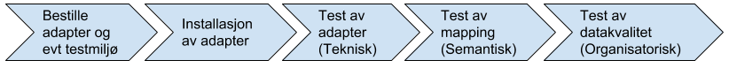
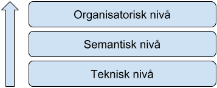

# Visma InSchool (VIS)

Visma InSchool (VIS) er et skoleadministrativt system. VIS skal kobles mot fylkeskommunenes fagsystemer. FINT er felleskomponenter som er utviklet for å standardisere integrasjonene mellom ​VIS og fagsystemene. Hvert fagsystem må i den sammenheng ha et FINT-adapter. Adapteret mottar data fra fagsystemet og tilpasser den til å passe med FINTs felleskomponenter.  

## Hva er et FINT-adapter?

Felleskomponentene til FINT må kobles til fagsystemet for å kunne levere og motta informasjon. Et FINT-adapter håndterer denne koblingen.

Adapteret må installeres i tilknytning til fagsystemet i den enkelte fylkeskommune. Vanligvis som en service på en server til fagystemet.

Diagrammet over viser hvordan data flyter mellom Visma InSchool og Fylkeskommunenes fagsystemer, og hvor FINT-adapteret er plassert i denne flyten. Hvert fagsystem må ha et eget FINT adapter. FINT Adapterene utvikles av fagsystemets leverandør.

## Hva du må gjøre for å komme i gang

### Overordnet om testing

Vi har delt opp testingen i nivåer basert på EIF Conceptual Model. Hvis du ønsker å vite mer om denne modellen kan du lese mer om denne her: [Nasjonalt rammeverk for samhandling](https://www.difi.no/fagomrader-og-tjenester/digitalisering-og-samordning/nasjonal-arkitektur/samhandlingsarkitektur/nytt-nasjonalt-rammeverk-samhandlings)

#### Bestille adapter og testmiljø

1. Man kontakter kontaktperson for sitt fagsystem (se kontaktpersoner i kap. under), for å initiere en avtale for FINT adapteret, og bestille testmiljø (om man ikke har det fra før). Det anbefales å ha en separat testdatabase (i de fleste tilfeller vil dette innebære en separat testinstallasjon av fagsystemet på en egen testserver). Det finnes utkast til avtale for adapter som er i bruk for andre fylkeskommuner.
1. I FINTs kundeportal finner man påloggingsinformasjon til adaptrene for sitt fylke. Denne informasjonen må teknisk konsulent for Økonomi/HR systemet ha ved installasjon av adapteret. Du finner en egen beskrivelse av kunderportalen og hvordan man oppretter pålogginsinformasjon her: https://www.fintlabs.no/#/kundeportal
1. Når avtalen er signert, avtales installasjon av adapteret sammen med en person fra IT drift i FK, f.eks. systemeier av Økonomi/HR-systemet, og kundeansvarlig eller teknisk konsulent for systemet. Man avtaler på hvilken server adapteret skal installeres.
1. Etter adapteret er installert, kan man i kundeportalen se “health status” på adapterne.
1. Deretter starter den tekniske testen.
​

**Kontaktpersoner**

* *Vismas FINT-adapter*, kontakter man fylkets eksisterende kontaktperson/key account. Installasjonsveiledning for Visma Adapter.
* *Agresso* har en egen kontaktperson for adapterne: Rolf Arne Flå hos Evry.
* *FINT* se [Kontakt](fint?id=kontakt)

#### Installasjon av adapteret
Det er teknisk representant fra leverandøren av fagsystemet, som utfører installasjon av adapter og oppsett av testmiljø.

Tid og tekniske detaljer, avtales med representant fra lokal IT-drift, f.eks. systemansvarlig for fagsystemet som adapteret går i mot.

 

#### Test av adapter (teknisk nivå)
`Basistest` -
I FINTs kundeportal kan man se helsestatusen på felleskomponentene, via det vi kaller en basistest. Da vil man få et overordnet bilde av om felleskomponentene kjører som de skal, har tilkobling til fagsystem, og om informasjon fra fagsystem er tilgjengelig gjennom felleskomponentene. Det vil si at man sjekker om cachen har data og om de nylig ble oppdatert. Ved feilsøking bør man utføre en basistest fra kundeportalen. Det er også et krav å sende med resultatet av denne testen, hvis man kontakter FINT-support.

`Relasjonstest` -
I FINTs kundeportal kan man kjøre en relasjonstest. Denne testen går igjennom alle objekter innenfor et område (f.eks /administrasjon/personal/Ansvar), og sjekker at alle koblinger/linker til andre objekter fungerer. Dersom man får en feilmelding her, må man inn i fagsystemet, finne objektet som har fått feilmelding på en av sine koblinger, og undersøke videre der hva som er problemet. Dette bør gjøres sammen med en fagressurs.

#### Test av mapping (semantisk nivå)
Før et adapter skal installeres, kan det være fornuftig å sette opp et dokument som sammenlikner informasjonen som finnes i informasjonsmodellen til FINT, med informasjon fra fagsystem.

For å teste innholdet adapteret har levert til felleskomponenten, har FINT laget en testklient som kan brukes til dette. Se avsnittet: Veileding i bruk av TestClient.

For testmiljø: https://beta.felleskomponent.no/test-client/
For produksjonsmiljø: https://api.felleskomponent.no/test-client/
Husk å bruke samme miljø av test-klienten som fagsystemet du skal teste.

For å teste skriving/lagring av data, må en klient som Postman benyttes.

Det kan være nyttig å ha en strategi for å gjennomføre test. Se vedlagte eksempler på testtilfeller og avviksrapport.

`Ende-til-ende test mellom HR og VIS` -
Når fylkeskommunene skal i gang med VIS, vil det være naturlig å kjøre en systemintegrasjonstest mellom HR-system og Visma InSchool. Akershus har gjennomført en pilot på dette. Der står det også noe om erfaringene de hadde. Se dokument: «AFK VIS – Integrasjonstestplan Agresso HR-Adapter Leveranse 2 – mai 2018.docx».

#### Kvalitet på data i fagsystem (organisatorisk nivå)
Når test av felleskomponent er gjennomført, kan det oppdages utfordringer med datakvaliteten. På sikt kan dette føre til at det er fornuftig å standardisere informasjon på tvers av fylkeskommunene.